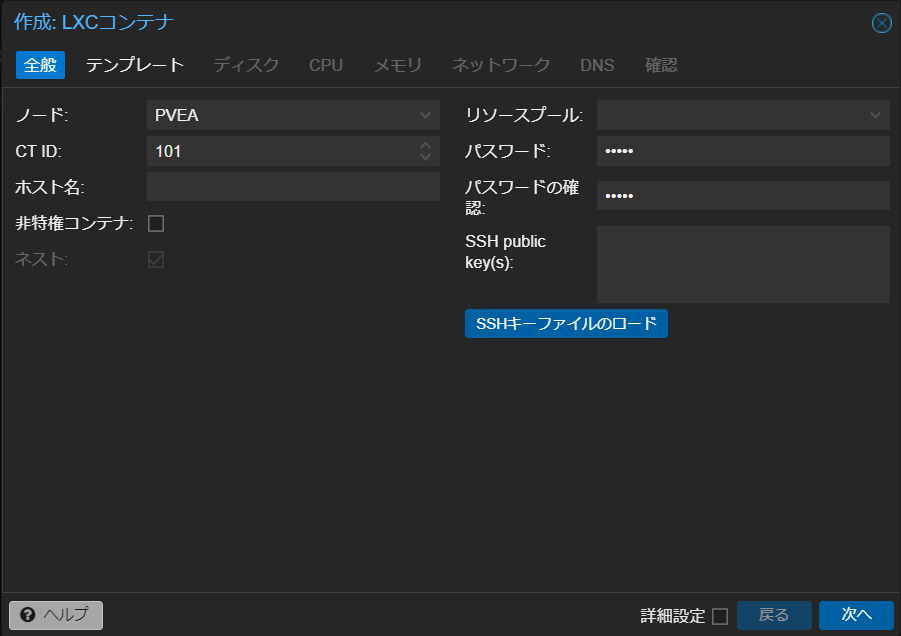
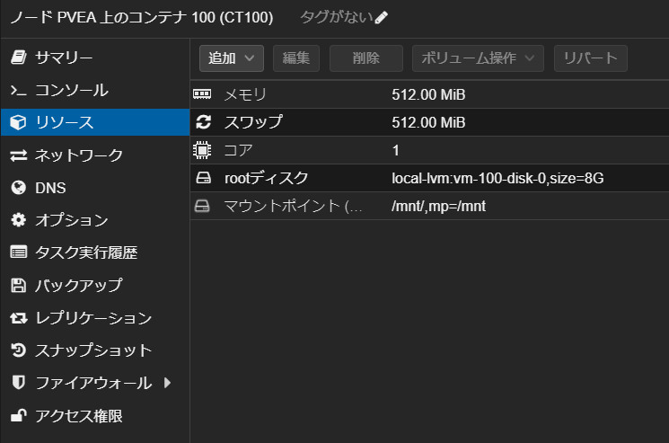
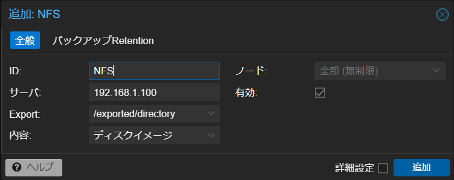

## 1. はじめに

近年，仮想化技術は急速に進化しており，多くのシステム管理者や技術者たちが日々の業務の中でそれを活用しています。中でも，Proxmox はオープンソースの仮想化プラットフォームとしてその信頼性と柔軟性から多くのユーザーに支持されています。LXC コンテナは，Proxmox 上での軽量な仮想化手段の一つとして，特にリソースの効率的な使用を求める環境において重宝されています。

しかし，コンテナ化された環境でも，データの保存や共有のためのストレージアクセスが不可欠です。NFS (Network File System) は，ネットワーク経由でファイルを共有するためのプロトコルとして広く使用されており，Proxmox 上の LXC コンテナにも対応しています。

本記事では，Proxmox 環境上で稼働する LXC コンテナに，NFS を使用して外部ストレージをマウントするための 3 つの異なる方法を詳しく解説します。これにより，ユーザーは自身の環境や要件に最も適した方法を選択し，効率的にストレージリソースを利用することができるようになります。

## 2. LXC コンテナ上で直接マウントする

1 つ目の方法は，LXC コンテナ上で直接マウントする方法です。注意点として，LXC コンテナを作成する際に**非特権コンテナ**のチェックを外す必要があります。



また，LXC コンテナを作成後，**コンテナ → オプション → 機能 → NFS** にチェックを入れる必要もあります。


ここまで設定できたら，コンテナのシェルを起動して nfs-commo をインストールします。nfs-common は,，Linux システムで NFS クライアントとして機能するためのパッケージです。このパッケージには，NFS 共有にアクセスするために必要なユーザースペースユーティリティや関連するファイルが含まれています。特に，NFS マウントや自動マウントのサポートに必要なツールやライブラリが提供され，これによりユーザーはリモートの NFS サーバからファイルを簡単に取得・共有することができます。nfs-common がインストール出来たら mount コマンドで外部ストレージをマウントして完了です。システム起動時に自動的にマウントする場合は /etc/fstab にコードを書き込みます。

```bash
# Container Shell

$ sudo apt update
$ sudo apt install nfs-common -y
$ sudo mount -t nfs 192.168.1.100:/exported/directory /mnt

# システム起動時に自動的にマウントする場合
$ echo "192.168.1.100:/exported/directory /mnt nfs defaults 0 0" >> /etc/fstab
```

LXC コンテナ上で直接マウントする方法は，マウント処理が LXC コンテナ内で操作が完結するのでシンプルです。しかし，特権コンテナ上で Docker を併用する際は，/etc/pve/lxc/[ID].conf に以下のコードを追記するなどの追加操作が必要になるので注意が必要です。

```bash
# Node Shell
# /etc/pve/lxc/[ID].conf

lxc.apparmor.profile: unconfined
lxc.cgroup.devices.allow: a
lxc.cap.drop:
```

## 3. ノードレベルでマウントする

2 つ目の方法は，ノードレベルでマウントする方法です。具体的には，ホスト (ノードレベル) に外部ストレージをマウントして，そのマウントした外部ストレージを LXC でマウントするという流れです。まず初めに，ノードレベルのシェルを立ち上げます。次に，nfs-common をインストールして，mount コマンドで外部ストレージをマウントします。マウントパスは，各環境に合わせて変更してください。

```bash
# Node Shell

$ sudo apt update
$ sudo apt install nfs-common -y
$ sudo mount -t nfs 192.168.1.100:/exported/directory /mnt

# システム起動時に自動的にマウントする場合
$ echo "192.168.1.100:/exported/directory /mnt nfs defaults 0 0" >> /etc/fstab
```

次に，LXC コンテナを作成します。ここは，1 つ目の方法とは異なり，作成する LXC コンテナは非特権コンテナで大丈夫です。


次に，ノードレベルのシェルで以下のコマンドを実行すれば作業は完了です。マウントパスと [ID] は，各環境に合わせて変更してください。また，テキストエディタで /etc/pve/lxc/[ID].conf を直接編集しても大丈夫です。

```bash
# Node Shell

$ echo "mp0: /mnt/,mp=/mnt" >> /etc/pve/lxc/[ID].conf
```

上記のコードが正常に実行されていれば LXC コンテナ → リソースに**マウントポイント**が生成されていると思います。



最後に，LXC コンテナを起動して外部ストレージがマウントされていれば成功です。上記の例では，外部ストレージ (192.168.1.100:/exported/directory) をホスト (ノードレベル) にマウントして，ホスト (ノードレベル) にマウントした外部ストレージを LXC コンテナにマウントしています。2 つ目の方法は，1 つ目の方法とは異なり，非特権コンテナ内で NFS を利用して外部ストレージをマウントすることが出来ます。一方で，複数のノードでクラスターを組んでいる場合，管理が複雑化するという欠点が考えられます。

## 4. データセンターレベルでマウントする

3 つ目の方法は，データセンターレベルでマウントする方法です。具体的には，ホスト (データセンターレベル) に外部ストレージをマウントして，そのマウントした外部ストレージを LXC でマウントするという流れです。まず初めに，**データセンター → ストレージから NFS** を追加します。



次に，ノードレベルのシェルで以下のコマンドを実行すれば作業は完了です。上記で設定した NFS ID によってマウントパスが変わるので，各環境に合わせて変更してください。また，テキストエディタで /etc/pve/lxc/[ID].conf を直接編集しても大丈夫です。

```bash
# Node Shell

$ echo "mp0: /mnt/pve/NFS,mp=/mnt" >> /etc/pve/lxc/[ID].conf
```

上記のコードが正常に実行されていれば LXC コンテナ → リソースに**マウントポイント**が生成されていると思います。

最後に，LXC コンテナを起動して外部ストレージがマウントされていれば成功です。3 つ目の方法は，2 つ目の方法と似ていますが，2 つ目の方法がノードレベルでマウントしているのに対して，3 つ目の方法はデータセンターレベルでマウントしている点が大きく異なります。3 つ目の方法の利点は，複数のノードでクラスターを組んでいても一律で外部ストレージがマウントされるので，管理が容易になります。その一方で，3 つ目の方法で外部ストレージをマウントすると強制的に template などのフォルダが生成されます。

## 5. おわりに

ここまで，Proxmox 環境下で稼働する LXC コンテナに，NFS を使用して外部ストレージをマウントするための 3 つの異なる方法について記述してきました。それぞれ，一長一短なので各自の環境や運用方法に適した方法を見つける手助けになれば幸いです。
