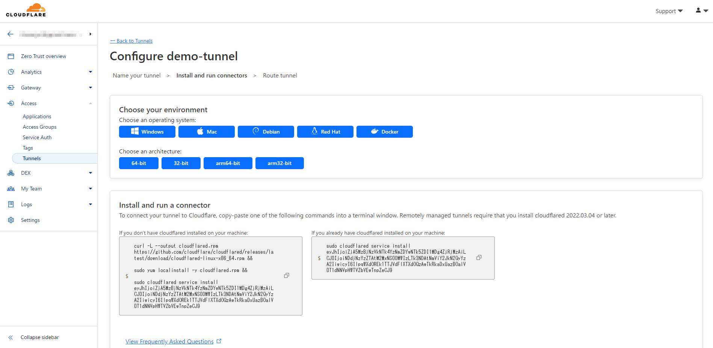
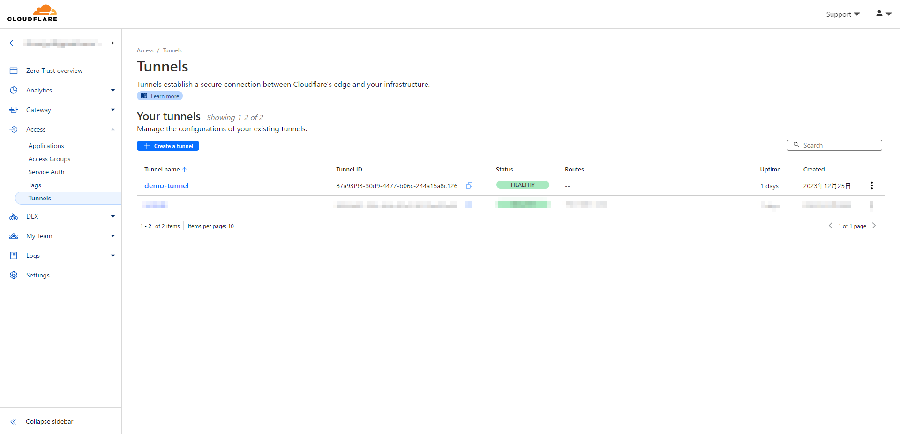
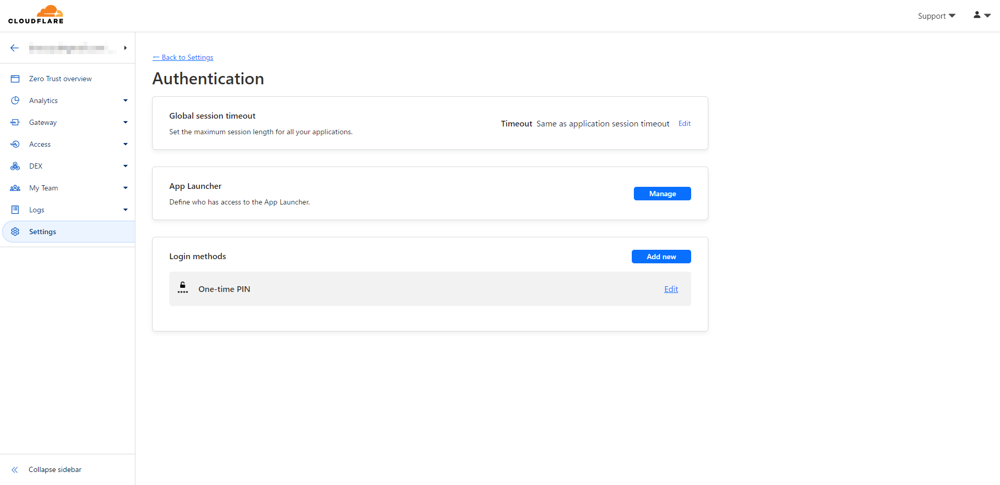
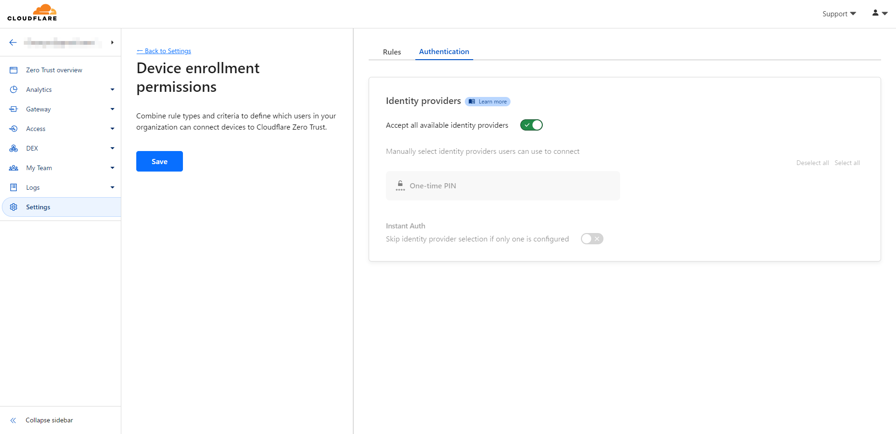
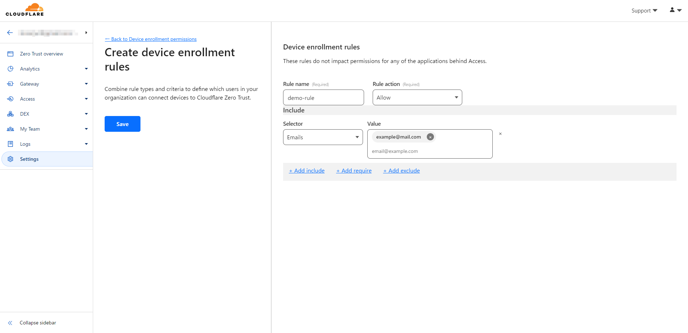
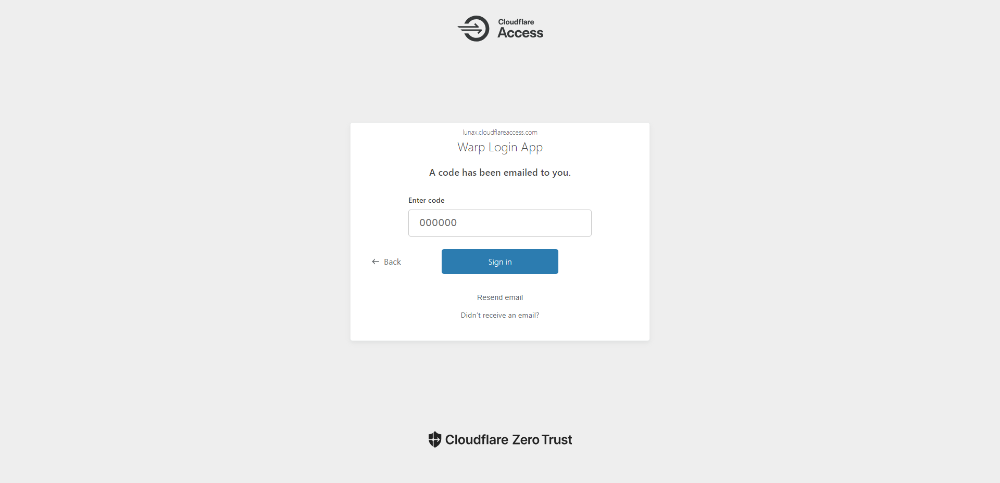
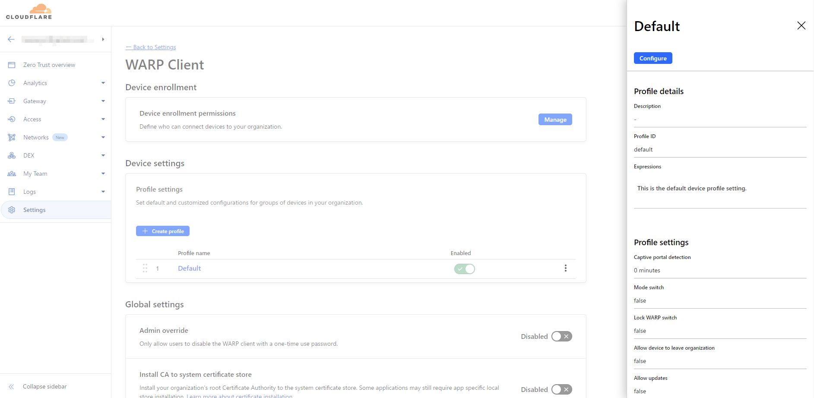

## 1. はじめに

　Cloudflare Zero Trust は、CloudFlare 社が提供するゼロトラスト・セキュリティサービスです。ゼロトラスト・セキュリティモデルに関しては CloudFlare がドキュメント [^1] を公開しているので、そちらを参照ください。本記事では、Cloudflare Zero Trust の基本的な使い方について記述します。具体的には、Cloudflare Zero Trust を利用して、外出先から自宅ネットワーク (192.168.1.0/24) にアクセスできる環境の構築を目指します。以降の作業は、Cloudflare Zero Trust のアカウントが登録済みの前提で記述しています。また、クライアント側は Windows 11、サーバー側は Ubuntu 22.04 LTS の環境で実行したものになります。

[^1]: ゼロトラストネットワークとは？ | Cloudflare：https://www.cloudflare.com/ja-jp/learning/security/glossary/what-is-zero-trust/

## 2. クライアントソフトウェアのインストール

　Cloudflare Zero Trust のクライアントソフトウェアである WAPR を[公式ドキュメント](https://developers.cloudflare.com/cloudflare-one/connections/connect-devices/warp/download-warp/)からダウンロードしてインストールします。Windows、macOS、Linux などのデスクトップ OS と iOS、Android などのモバイル OS に対応しています。

## 3. サーバーソフトウェアのインストール

　Networks → Tunnels に移動して、Create a tunnel をクリックします。Tunnel name を任意で設定して、Save Tunnel をクリックします。ここでは、Tunnel name を **demo-tunnel**  に設定しています。

※ 編集途中で UI の変更が行われ、Tunnels の場所が変更されました。以下の画像では、Access / Tunnels となっていますが、編集時点 (2024-01-28) では **Networks / Tunnels** に移動しています。


　次に、自分のサーバー環境を選択して、表示されたインストールコマンドを実行します。筆者の環境では、サーバー OS として Ubuntu 22.04 LTS を利用しているので、Debian → 64-bit を選択して表示されたインストールコマンドを実行します。



　念のため、Debian 64-bit の選択画面で表示されるインストールコマンドを記載しておきます。また、サーバーソフトウェアがインストール済みの場合は 3 行目の sudo cloudflared service install [YOUR TOKEN] を実行すれば大丈夫です。

```bash
$ curl -L --output cloudflared.deb https://github.com/cloudflare/cloudflared/releases/latest/download/cloudflared-linux-amd64.deb
$ sudo dpkg -i cloudflared.deb
$ sudo cloudflared service install [YOUR TOKEN]
```

　正常にサーバーソフトウェアがインストールされると Status が **INACTIVE** から **HEALERY** になります。上記で作成した Tunnel が以下のようになっていれば正常に完了しています。



## 4. WARP のアカウント連携

　第 2 章で、Cloudflare Zero Trust のクライアントソフトウェアである WAPR をインストールしました。しかし、初期設定のままでは、アカウントの紐付けが出来ません。本章では、インストールした WAPR と Cloudflare Zero Trust のアカウントを紐付けるまでの手順を記述します。

　まず初めに、Settings → Authentication に移動して、Login methods として **One-time PIN** が設定されていることを確認してください。設定されていない場合は、Add new をクリックすると認証方法の一覧が表示されるので、One-time PIN をクリックして追加してください。Cloudflare Zero Trust は、 Google や GitHub などの SNS 認証などに対応していますが、追加設定が必要です。そのため、本記事では最もシンプルな One-time PIN で認証することとします。その他の認証方法に関しては公式ドキュメント [^2] を参照ください。

[^2]: SSO integration · Cloudflare Zero Trust docs：https://developers.cloudflare.com/cloudflare-one/identity/idp-integration/



　次に、Setting → WARP Client に移動して、Device enrollment permissions の Manage をクリックします。Authentication タブをクリックして、**Accept all available identity providers** が有効になっていることを確認してください。



　次に、Rules タブをクリックして、Add a rule をクリックします。Rule name を任意で設定します。ここでは、demo-rule と設定しています。また、Selector で Emails を設定して、Value に有効なメールアドレスを入力します。ここで設定したメールアドレスに認証コードを送信されるため、**必ず受信可能なメールアドレス**を設定してください。ここでは、example@mail.com と入力しています。入力が完了したら Save をクリックして保存します。



　ここからは WARP を操作します。Windows の場合、WARP が起動しているとシステムトレイにアイコンが表示されていると思います。システムトレイにアイコンが存在しない場合は、WARP を検索して起動してください。表示されている WARP のアイコンをクリックして、歯車マーク → 環境設定 → アカウントに移動し、Cloudflare Zero Trust にログインをクリックします。


　画面を進めるとチーム名が要求されると思うので自分のチーム名を入力して OK をクリックします。自分のチーム名がわからない場合は、Cloudflare Zero Trust の Web ページに戻り、Setting → Custom Pages に移動すると、Team domain として表示されていると思います。


　チーム名を入力すると以下のような Web 画面が表示され、メールアドレスの入力を要求されます。入力欄に上記で設定した有効なメールアドレスを入力して、Send me a code をクリックします。入力したメールアドレスにコードが届くので、そのコードを入力して Sign in をクリックします。




　再度、WARP アイコン → 歯車マーク → 環境設定 → アカウントに移動し、以下のような画面に変化していれば WARP と Cloudflare Zero Trust のアカウント連携は完了です。


## 5. Split Tunnels の設定

　Cloudflare Zero Trust では、Cloudflare Zero Trust のサーバーがユーザーのクライアントとユーザーのサーバーを仲介することでセキュアなネットワークを構築しています。より詳細な情報に関しては、Cloudflare Zero Trust の公式ドキュメント [^3] を参照ください。

[^3]: Cloudflare Tunnel · Cloudflare Zero Trust docs：https://developers.cloudflare.com/cloudflare-one/connections/connect-networks/


　Cloudflare Zero Trust の初期設定では、自宅ネットワーク (192.168.1.0/24) 宛のパケットは、ユーザーのクライアントから Cloudflare Zero Trust のサーバーに送信されないため、外出先から自宅ネットワーク (192.168.1.0/24) にアクセス出来ません。もう少し詳細に記述すると、Cloudflare Tunnel の Split Tunnels で、192.168.0.0/16 宛のパケットは Cloudflare Zero Trust のサーバーに送信しないように除外設定されています。本章では、自宅ネットワーク (192.168.1.0/24) 宛のパケットを、ユーザーのクライアントから Cloudflare Zero Trust のサーバーに送信するように、Cloudflare Tunnel の Split Tunnels の設定を変更する手順を記述します。

　まず初めに、Setting → WARP Client に移動し、Default をクリックします。表示されたサイドバーの Configure をクリックします。



　次に、Split Tunnels の項目までスクロールし、Include IPs and domains に変更します。この際、警告が出ますが無視して Continue and delete をクリックします。Split Tunnels の設定画面に遷移したら、Selector は IP Address を選択し、Value の欄に 192.168.1.0/24 と入力し、Save destination をクリックします。

　Include IPs and domains では、設定した IP または Domain 宛のパケットをユーザーのクライアントから Cloudflare Zero Trust のサーバーに送信します。初期設定の Exclude IPs and domains では、逆に設定した IP または Domain 宛のパケットをユーザーのクライアントから Cloudflare Zero Trust のサーバーに送信しないようにします。本記事では、Include IPs and domains で設定していますが、Exclude IPs and domains で 192.168.0.0/16 を削除するという方法でも同じ結果が得られます。


　最後に、右画面に入力した設定が追加されていれば Split Tunnels の設定作業は完了です。これで、自宅ネットワーク (192.168.1.0/24) 宛のパケットが、ユーザーのクライアントから Cloudflare Zero Trust のサーバーに送信されるようになります。

## 6. Private Network の設定

　第 5 章では、自宅ネットワーク (192.168.1.0/24) 宛のパケットを、ユーザーのクライアントから Cloudflare Zero Trust のサーバーに送信するように Split Tunnels の設定を変更しました。しかし、初期設定では Cloudflare Zero Trust のサーバーから、ユーザーのサーバーにパケットが送信されないため、外出先から自宅ネットワーク (192.168.1.0/24) にアクセス出来ません。本章では、Cloudflare Zero Trust のサーバーに送信された自宅ネットワーク (192.168.1.0/24) 宛のパケットを、ユーザーのサーバーに送信するための設定手順を記述します。

　まず初めに、Networks → Tunnels に移動します。次に、第 3 章で作成した demo-tunnel をクリックし、サイドバーの Configure をクリックします。Tunnel の設定画面に遷移したら、Private Network タブをクリックし、Add a private network をクリックします。CIDR の欄に 192.168.1.0/24 と入力し、Save private network をクリックします。


　最後に、入力した設定が追加されていれば Private Network の設定作業は完了です。これで、ユーザーのクライアントから Cloudflare Zero Trust のサーバーに送信された自宅ネットワーク (192.168.1.0/24) 宛のパケットを、ユーザーのサーバーに送信するようになります。

## 7. おわりに

　以上で、全ての作業が完了です。お疲れ様でした。正しく設定されていれば、自宅ネットワーク (192.168.1.0/24) 宛のパケットが ユーザーのクライアント ↔ Cloudflare Zero Trust のサーバー ↔ ユーザーのサーバー 間で送受信されるようになり、WARP で接続している間は外出先から自宅ネットワーク (192.168.1.0/24) にアクセスできるようになっていると思います。

　ここまで、Cloudflare Zero Trust を利用して、外出先から自宅ネットワーク (192.168.1.0/24) にアクセスできる環境を構築する手順について記述してきました。Cloudflare Zero Trust の UI は結構、頻繁に変更されるので、上記の内容と異なる場合があると思います。その点はご注意ください。