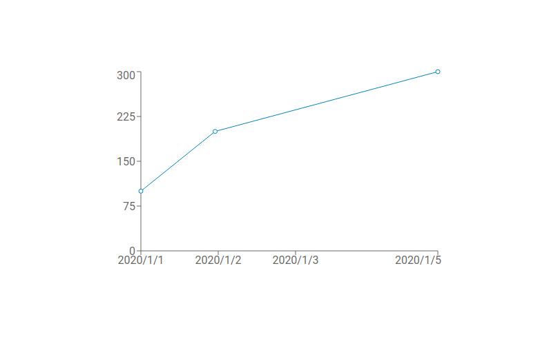

## 1. はじめに

　[Recharts](https://recharts.org/) は，[React](https://reactjs.org/) と [D3.js](https://d3js.org/) を組み合わせたグラフ描画ライブラリです。本記事では，Recharts を用いて描画したグラフの X 軸に，日時を表示させる手順について記述します。以降の章で行っている作業は以下の環境下で実行したものです。また，Node.js はインストール済みの前提で記述しており，インストール手順は割愛していることをご了承ください。

* Recharts Ver.1.8.5
* React Ver.16.13.1
* Node.js Ver.12.18.1
* Zorin OS 15.2 Core (Ubuntu 18.04 LTS)

## 2. 開発環境構築

　① [create-react-app](https://github.com/facebook/create-react-app) コマンドを用いて React の雛形を作成します   
　② 作成した *my-app* ディレクトリに移動します  
　③ Recharts をインストールします

```bash
$ npx create-react-app my-app ・・・ ①
$ cd my-app/ ・・・ ②
$ npm i -S recharts ・・・ ③
$ tree -L 2
.
├── README.md
├── node_modules
│   ├── @babel
│   ├── @cnakazawa
│   ├── @csstools
│   ├── (省略)
│   ├── yaml
│   ├── yargs
│   └── yargs-parser
├── package-lock.json
├── package.json
├── public
│   ├── favicon.ico
│   ├── index.html
│   ├── logo192.png
│   ├── logo512.png
│   ├── manifest.json
│   └── robots.txt
└── src
    ├── App.css
    ├── App.js
    ├── App.test.js
    ├── index.css
    ├── index.js
    ├── logo.svg
    ├── serviceWorker.js
    └── setupTests.js
```

## 3. 問題点

　上記で作成した雛形の *App.js* を以下のように書き換えます。Recharts が提供しているサンプルコードの [SimpleLineChart](https://recharts.org/en-US/examples/SimpleLineChart) をベースにしたソースコードであり，シンプルな線グラフが描画されます。

```js {linenos=table}
import React from 'react';
import { LineChart, Line, XAxis, YAxis } from 'recharts';

function App() {
  const data = [
    { date: '2020-01-01', sales: 100 },
    { date: '2020-01-02', sales: 200 },
    { date: '2020-01-05', sales: 300 },
  ];

  return (
    <LineChart
      width={500}
      height={300}
      data={data}
    >
      <XAxis dataKey="date" />
      <YAxis />
      <Line dataKey="sales" />
    </LineChart>
  );
}

export default App;
```

　実行結果が以下になります。X 軸に日時が表示されています。しかし，*2020-01-01* から *2020-01-02* の間隔と *2020-01-02* から *2020-01-05* の間隔が等しいため非常に不自然なグラフになっています。


## 4. 解決策

　上記の問題は既に [GitHub](https://github.com/recharts/recharts/issues/956) で議論されており，解決されています。具体的には，日時を文字列ではなく UNIX 時間として扱うことで解決しています。GitHub で示されているサンプルコードを参考に *App.js* を以下のように書き換えます。

```js {linenos=table, hl_lines=["6-8","19-21"]}
import React from 'react';
import { LineChart, Line, XAxis, YAxis } from 'recharts';

function App() {
  const data = [
    { date: new Date('2020-01-01').getTime(), sales: 100 },
    { date: new Date('2020-01-02').getTime(), sales: 200 },
    { date: new Date('2020-01-05').getTime(), sales: 300 },
  ];

  return (
    <LineChart
      width={500}
      height={300}
      data={data}
    >
      <XAxis
        dataKey="date"
        domain={['dataMin', 'dataMax']}
        tickFormatter={(unixTime) => new Date(unixTime).toLocaleDateString()}
        type='number'
      />
      <YAxis />
      <Line dataKey="sales" />
    </LineChart>
  );
}

export default App;
```

　実行結果が以下になります。*2020-01-01* から *2020-01-02* の間隔と *2020-01-02* から *2020-01-05* の間隔が異なっており，自然な線グラフとして描画されていることが確認できます。



## 5. おわりに

　Recharts を用いて描画したグラフの X 軸に，日時を表示させる手順について記述してきました。本記事では，JavaScript に組み込まれている [Date](https://developer.mozilla.org/ja/docs/Web/JavaScript/Reference/Global_Objects/Date) を用いて実装してきましたが，[Moment.js](https://momentjs.com/) や [Day.js](https://day.js.org/) などの日付操作ライブラリを活用することで，より複雑な処理を簡単に行うことが出来るのでオススメです。