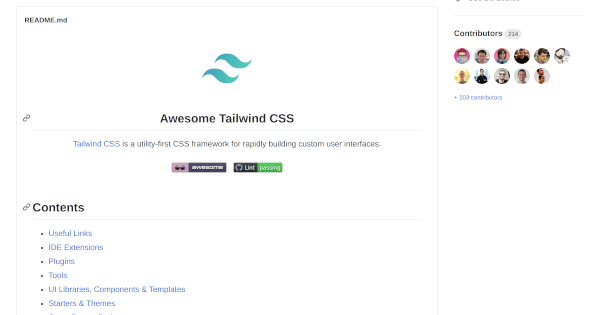
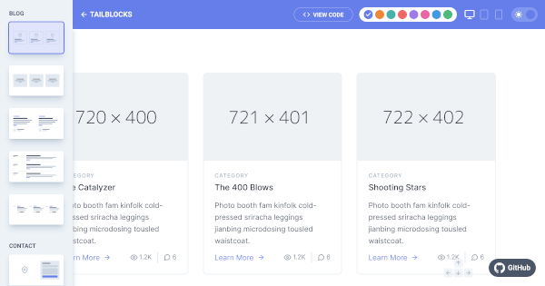
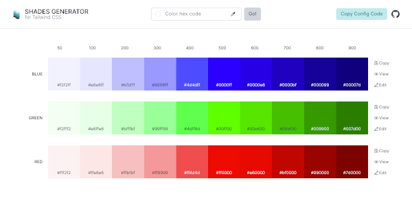
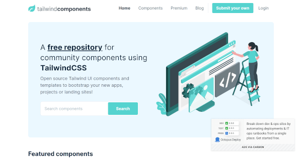
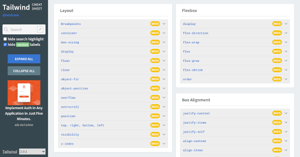
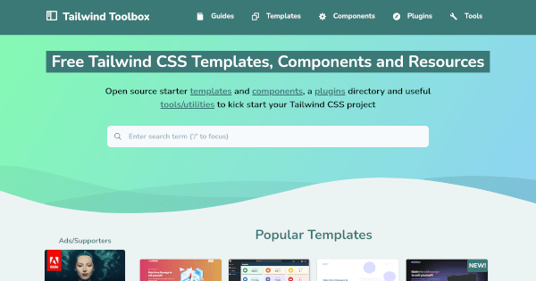
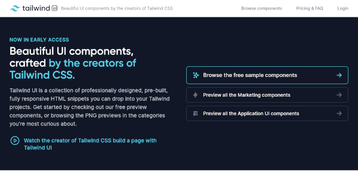
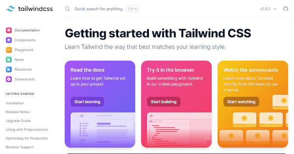
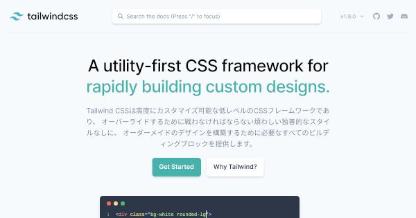

## 1. はじめに

[Tailwind CSS](https://tailwindcss.com/) は，FLOSS で開発されているユーティリティ指向の CSS フレームワークです。[Bootstrap](https://getbootstrap.com/) や [UIkit](https://getuikit.com/) などのコンポーネント指向の CSS フレームワークと比較すると知名度は高くないですが，新しいパラダイムの CSS フレームワークとして注目され初めています。本記事では，Tailwind CSS の学習と開発を支援するサイトとツールを厳選して紹介します。

## 2. Awesome Tailwind CSS

Awesome Tailwind CSS は，Tailwind CSS のプラグインやコンポーネントに関する情報を網羅的にまとめた GitHub のリポジトリです。Tailwind CSS に関する情報が網羅的にまとめられているので，Tailwind CSS の情報収集する際に重宝します。しかし，情報量が膨大なので，Tailwind CSS 初心者の人が Awesome Tailwind CSS から情報収集するのはオススメ出来ません。Tailwind CSS 中級者 〜 上級者の人が使うことをオススメします。

## 3. Meraki UI

Meraki UI は，海外の Web デザイナーによって MIT License で公開されている Tailwind CSS のコンポーネント群です。ボタンやナビゲーションバーなどの，コンポーネントがソースコードと共に公開されているため，Tailwind CSS の学習と開発にオススメです。

## 4. tailblocks

tailblocks は，海外の UI デベロッパーによって MIT License で公開されている Tailwind CSS のコンポーネント群です。ボタンやナビゲーションバーなどの，コンポーネントがソースコードと共に公開されています。また，色や表示デバイス，ダークモードを切り替えて表示できるため，様々な角度からコンポーネントを視覚的に確認することが出来ます。

## 5. Tailwind Color Shades Generator

Tailwind Color Shades Generator は，指定した色を基にカラーパレットを生成してくれる Web アプリです。また，設定コードも生成してくれるため，tailwind.config.js に生成された設定コードをコピー & ペーストするだけで生成したカラーパレットを使用することが出来ます。

## 6. Tailwind Components

Tailwind Components は，世界中の Tailwind CSS ユーザーが開発したコンポーネントが投稿されているコミュニティーベースの Web サイトです。ボタンやナビゲーションバーなどの，コンポーネントがソースコードと共に公開されているため，Tailwind CSS の学習と開発にオススメです。

## 7. Tailwind CSS Cheat Sheet

Tailwind CSS Cheat Sheet は，Tailwind CSS 使用可能なクラス名がまとめられた Web サイトです。情報量的には公式ドキュメントの方が多いですが，ある程度，学習を進めた後はチートシートを参照した方が効率的に開発することが出来ます。

## 8. Tailwind Toolbox

Tailwind Toolbox は，Tailwind CSS のテンプレートやコンポーネントが掲載されている Web サイトです。ボタンやナビゲーションバーなどのコンポーネントだけでなく，ランディングページや管理者ページなどのテンプレートもソースコードと共に公開されています。

## 9. Tailwind UI

Tailwind UI は，Tailwind CSS の開発元が公開している公式のコンポーネント群です。公式が公開しているコンポーネント群のため品質は非常に高いのですが，ソースコードの公開が有料になっているコンポーネントが多いため，使用頻度は少なめです。

## 10. 公式ドキュメント

Tailwind CSS の一次情報になるため，Tailwind CSS の学習や開発する際に最も参照する Web サイトになると思います。執筆時点では，公式の日本語訳は存在していません。

## 11. 日本語ドキュメント

株式会社エンタップによって，Tailwind CSS の日本語ドキュメントが公開されています。しかし，執筆時点では Tailwind CSS の最新版である Ver.2.0.2 には対応しておらず，Ver.1.9.0 と Ver.0.7.4 に対応しているようです。そのため，Tailwind CSS の最新情報を得るには公式ドキュメントを参照する必要があります。

## 12. おわりに

ここまで，Tailwind CSS の学習と開発を支援するサイトとツールを厳選して紹介してきました。Tailwind CSS と共に情報サイトやツールが日進月歩で進化しているので，本記事の内容は随時更新していきたいと考えています。
