## 1. はじめに

直近数年間は，ThinkPad X260 をメイン端末として使用していましたが，処理落ちが目立つようになりストレスを感じるようになりました。また，Apex Legends などの PC ゲームをプレイしたいと思ったので，予算 10 万円でミドルスペックのゲーミング PC を組むことにしました。本記事では，選別した PC パーツと選別理由，ベンチマークのスコアについて記述します。

## 2. パーツ構成

### 2.1. CPU: AMD Ryzen 5 3500

CPU は，コストパフォーマンに優れた AMD 社製の Ryzen 5 3500 を購入しました。同社の Ryzen 5 1600 AF が話題になっていましたが手に入らなかったので代用品として選択しました。また，同社の Ryzen 5 3600 も購入検討しましたが，ベンチマークのスコアと使用用途から価格差ほどの恩恵が受けられないと判断しました。

[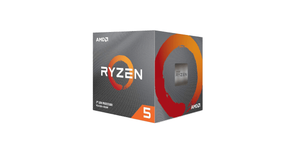](https://www.amd.com/ja/ryzen-5)

### 2.2. MB: ASRock B450M Pro4

マザーボードは，特に拘りが無かったので Amazon でオススメされた ASRock 社製の B450M Pro4 を購入しました。有線 LAN + Logicool Unifying の運用を想定していたので Wi-Fi と Bluetooth モジュールが搭載されていないマザーボードを選択しましたが，数千円で Wi-Fi と Bluetooth モジュールが搭載されているマザーボードを購入することができるので少し後悔しています。

[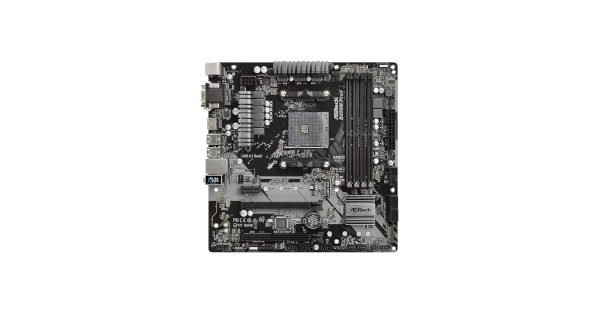](https://www.asrock.com/mb/AMD/B450M%20Pro4/index.jp.asp)

### 2.3. RAM: Kingston HyperX FURY DDR4 2666MHz 8GB × 2

メモリーも，特に拘りが無かったので Amazon でオススメされた Kingston 社製の HyperX FURY DDR4 2666MHz 8GB × 2 を購入しました。追加で約 2,000 円を支払えば 3200MHz にアップグレードすることができました，体感できるほどの差は無いと判断したため 2666MHz を選択しました。

[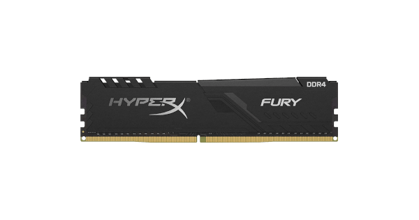](https://www.hyperxgaming.com/jp/memory/fury-ddr4)

### 2.4. SSD: Kingston A2000 NVMe PCIe SSD 250GB

SSD は，ケーブル類を極力少なくしたかったので M.2 規格の SSD である Kingston 社製 A2000 NVMe PCIe SSD 250GB を購入しました。容量に関しては，外部ストレージとして NAS を所持しているため，A2000 シリーズで最少容量の 250GB を選択しました。売れ筋の容量としては 512GB 〜 1TB の SSD が人気のようです。

[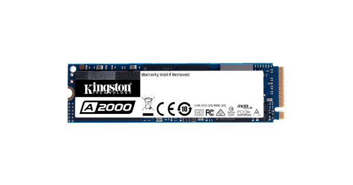](https://www.kingston.com/jp/ssd/a2000-nvme-pcie-ssd)

### 2.5. GPU: MSI GeForce GTX 1650 AERO ITX 4G OC

グラフィックボードは，購入当時の[グラフィックボード売れ筋ランキング](https://www.amazon.co.jp/gp/bestsellers/computers/2151911051/ref=pd_zg_hrsr_computers)で上位だった MSI 社製の GeForce GTX 1650 AERO ITX 4G OC を購入しました。同じ価格帯のグラフィックボードとして [MSI Radeon RX 570 8GT OC](https://jp.msi.com/Graphics-card/Radeon-RX-570-8GT-OC/Overview) の購入も検討しました。ベンチマークのスコアでは，MSI Radeon RX 570 8GT OC の方が少し上ですが，消費電力や補助電源の有無などから GeForce GTX 1650 AERO ITX 4G OC を選択しました。

※ 現在は，MSI GeForce GTX 1650 AERO ITX 4G OC と同価格で GDDR6 を搭載したグラフィックボードが発売されているので，それらのグラフィックボードをオススメします。

[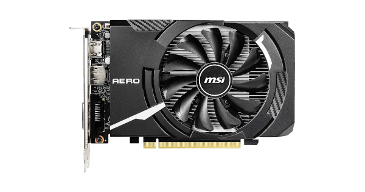](https://jp.msi.com/Graphics-card/GeForce-GTX-1650-AERO-ITX-4G-OC)

### 2.6. PSU: 玄人志向 KRPW-BK650W/85+

電源ユニットも，特に拘りが無かったので[パソコン用電源ユニット売れ筋ランキング](https://www.amazon.co.jp/gp/bestsellers/computers/2151947051/ref=pd_zg_hrsr_computers)で上位 + 安価な玄人志向社製の KRPW-BK650W/85+ を購入しました。今回のパーツ構成的に多く見積もっても消費電力は 200W 程度なので，もう少し容量の小さい電源ユニットにしても良かった気がします。

### 2.7. PCC: Thermaltake Versa H17

PC ケースは，Thermaltake 社製の Versa H17 を購入しました。microATX と Mini-ITX に対応したミニタワー型の PC ケースであり，約 3,000 円で購入できる PC ケースとして話題になりました。低価格帯の PC ケースは『I/O パネルがハマらない』や『スペーサーとマザーボードのネジ穴がズレる』などの不良が心配でしたが，そういった問題は全くありませんでした。また，ストレージとファンの拡張性も十分であり，裏配線も可能です。約 3,000 円の PC ケースとしては素晴らしいクオリティです。

[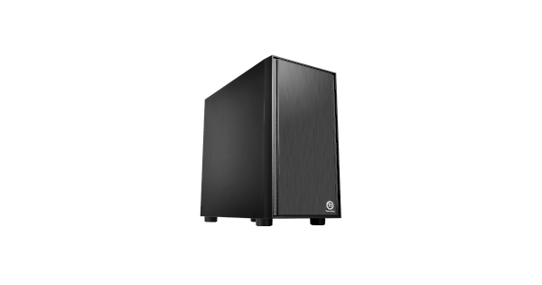](https://www.ask-corp.jp/products/thermaltake/minitower-pccase/versa-h17.html)

### 2.8. その他

パーツ選別当初はリテールクーラーで十分だと思っていましたが，予算が余ったので SCYTHE 社製の 虎徹 MarkⅡ と Thermal Grizzly を購入しました。簡易水冷と悩みましたが，今回は配線を極力少なくしたかったので空冷タイプの CPU クーラーを選択しました。

[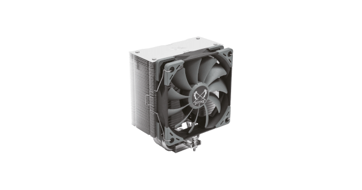](https://www.scythe.co.jp/product/cpu-cooler/scktt-2000)

[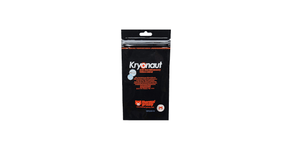](https://www.shinwa-sangyo.co.jp/thermal-grizzly)

最後に，上記で紹介したパーツの Amazon 価格 (購入当時) を以下にまとめます。パーツの価格や在庫の有無などが変化していると思いますが，ご了承ください。

| パーツ名                                  | 金額      |
| ----------------------------------------- | --------- |
| AMD Ryzen 5 3500                          | 16,309 円 |
| ASRock B450M Pro4                         | 8,236 円  |
| Kingston HyperX FURY DDR4 2666MHz 8GB × 2 | 7,838 円  |
| Kingston A2000 NVMe PCIe SSD 250GB        | 5,820 円  |
| MSI GeForce GTX 1650 AERO ITX 4G OC       | 15,181 円 |
| 玄人志向 KRPW-BK650W/85+                  | 6,522 円  |
| Thermaltake Versa H17                     | 2,709 円  |
| SCYTHE 虎徹 MarkⅡ                         | 3,636 円  |
| Thermal Grizzly                           | 719 円    |
| 合計金額                                  | 66,970 円 |

## 3. ベンチマーク

### 3.1. CINEBENCH R20

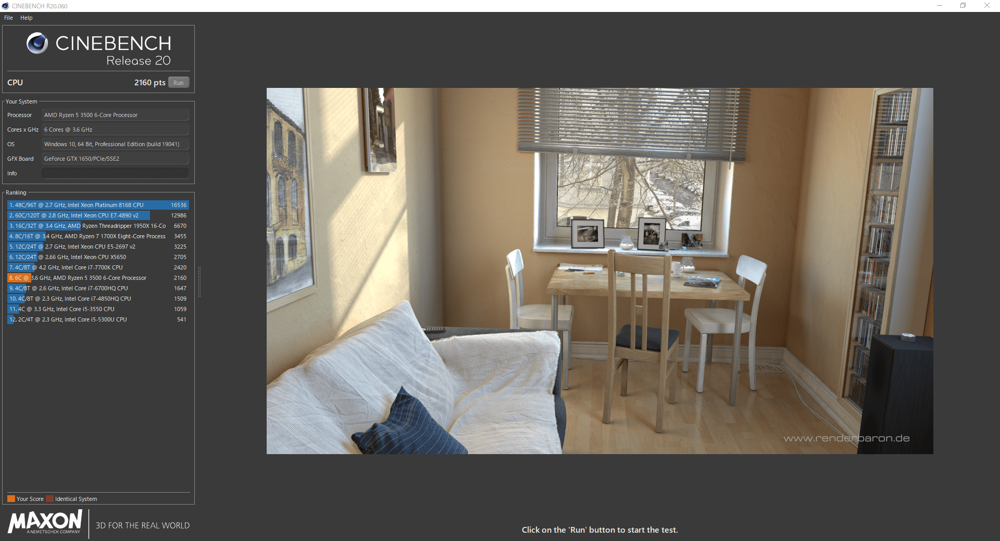

### 3.2. CrystalDiskMark

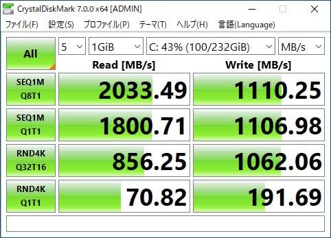

### 3.3. FINAL FANTASY XV WINDOWS EDITION ベンチマーク

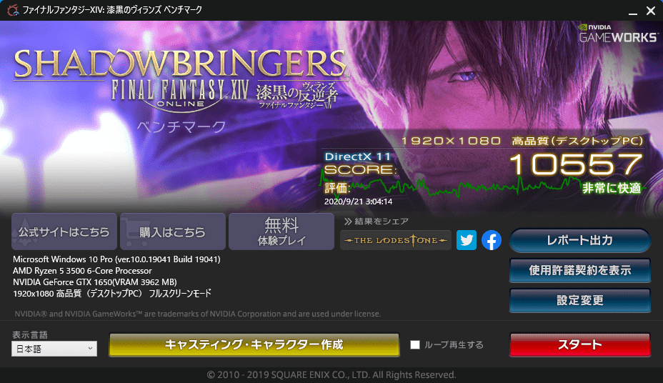

### 3.4. ファイナルファンタジーXIV: 紅蓮のリベレーター ベンチマーク

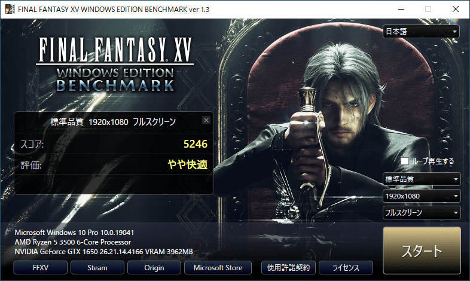

## 4. おわりに

『Apex Legends』や『Fortnite』などの競技性が高いゲームであれば非常に快適にプレイすることができます。しかし，『モンスターハンター：ワールド』や『黒い砂漠』などの高いグラフィック性能が要求されるゲームを快適にプレイする場合は，画質を少し落とす必要があります。

約 4 年ぶりに PC を組んだため，最新のパーツトレンドやベンチマークのスコアを調査するのに時間がかかりました。しかし，電源を入れたときに画面が表示される瞬間の達成感は何度やっても良いものです。最後に，本記事がパーツ選びの参考になれば幸いです。
