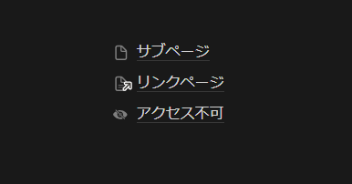
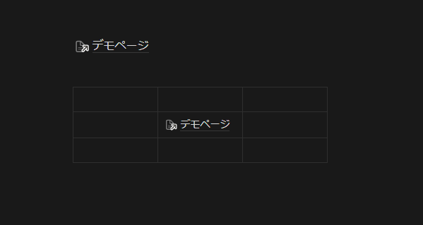

## 1. はじめに

これまで、Evernote、Google Keep、Notion、Obsidian、OneNote、Scrapbox などなど、様々なデジタルアプリを使ってきました。ここ数年は、Notion をメインで愛用しています。筆者の主な用途としては、Zettelkasten ベースのノート管理と Notion データベースを活用した ToDo リストです。サ終したら、割と頭抱えるレベルでは愛用しています。使っているからこそ、気になる部分というのが溜まってきます。本記事は、そんな細かい重箱の隅をつつくような不満を集めたものです。1 ユーザーの独り言だと思ってください。

## 2. Linux アプリ

Notion は、公式で Windows と macOS 向けのデスクトップアプリをリリースしています。執筆時点では、Linux 向けのデスクトップアプリはリリースされていません。また、公式も計画していないと FAQ [^4] で回答しています。なので、Linux 上で Notion にアクセスするには Web 版を利用するか、[Notion Enhancer](https://notion-enhancer.github.io/) を利用する必要があります。もしくは、自前で Electron を用いてラッピングするなどの方法も考えられます。まあ、筆者も最近は、ほとんど Windows なので、必要性は少ないのですが、稀に Linux 環境で作業することがあるので、同じ感覚で Notion を使えたらなと思うことがあります。

[^4]: デスクトップでNotionを使う – Notion (ノーション)ヘルプセンター：https://www.notion.so/ja-jp/help/notion-for-desktop

## 3. グラフビュー

Obsidian では、以下のようにページ間のリンクを有向グラフ [^3] で表示してくれます。バックリンクが多いノードはサイズが大きくなったり、タグで色付けしたりと色々とカスタマイズが出来ます。正直、Obsidian を使用していた時も、グラフビューが実用的に役に立ったかと言われれば、あまり実用性はなかったです。ですが、テンションが上がる (大事) ので、ぜひ Notion でも実装して欲しいです。

[^3]: Graph view - Obsidian Help：https://help.obsidian.md/Plugins/Graph+view

## 4. ゴーイングリンク

Vanilla Notion では、バックリンクはページタイトルの下に表示されますが、ゴーイングリンクは一覧表示できません。なので、任意のページが、どこにリンクを貼っているのかを一覧表示させるには、今ところマニュアルで管理するしかありません。少し大きめのページになってくると、流石にマニュアルで保守するのは骨が折れるので、Obsidian のゴーイングリンクウィジェットのような機能を、ぜひ公式機能として実装して欲しいです。

## 5. ゴミ箱内のページ (解決済み)

Vanilla Notion では、サブページ、リンクページ、完全削除されたページの 3 状態は、以下の画像のようにアイコンで可視化されます。ただし、ゴミ箱に入っているサブページとリンクページのアイコンは変化しません。ゴミ箱に入っているページが 💀 などのアイコンで可視化されると、古いページの保守作業が効率化すると思うので、ぜひ公式で実装して欲しいです。

**追記：2024年5月12日**

「ゴミ箱内」というラベルが表示されるようになりました。

## 6. シンプルテーブル

Vanilla Notion では、バックリンクはページタイトルの下に表示されます。ただし、執筆時点ではシンプルテーブル内でリンクを貼ると、バックリンクが表示されません。具体例で説明すると、画像上部のように **@デモページ** のリンクは、**デモページ** のページタイトルの下にバックリンクが表示されます。しかし、画像下部のようにシンプルテーブル内に **@デモページ** を挿入すると、バックリンクが表示されません。バグなのか仕様なのかはわかりませんが、シンプルテーブル内のリンクもバックリンクとして表示されるようにして欲しいです。

## 7. タブ移動 (解決済み)

Notion のデスクトップアプリはタブ機能が実装されていますが、このタブは移動させることが出来ません。Web ブラウザーを使用している時のように、編集中のページは右端に寄せたいとか、近しいページを軽くグルーピングしたい時があるので、タブの移動機能は、ぜひ公式で実装して欲しいです。

**追記：2024年02月21日**

デスクトップアプリケーションでタブ移動が実装されました。

## 8. バックリンク

Vanilla Notion では、バックリンクがページタイトルの下に表示されます。調査した範囲では、バックリンクをサイドバーに固定するような拡張機能は見つかりませんでした。Zettelkasten ベースの管理方法を実践していると、このバックリンクを辿ってページ間を移動したい時が多々あるので、ぜひ公式で実装して欲しいです。

## 9. 目次 (部分的に解決済み)

Vanilla Notion では、目次を表示させることが出来ます。ただし、Obsidian のようにサイドバーに固定することは出来ません。一応、[Notion Boost](https://gourav.io/notion-boost) などの拡張機能を使えば、目次をサイドバーに固定表示させることは出来ます。縦に長いページだと、見出しを辿ってページ内を移動することが多くなるので、ぜひ公式でも実装して欲しいです。

**追記：2024年06月12日**

目次が実装されました。しかし、現状はホバータイプの目次のみで、固定化することは出来ないようです。

https://www.notion.so/ja-jp/releases/2024-06-11

## 10. 乱数

Vanilla Notion では、乱数を生成する関数やランダムでページをピックアップする機能が実装されていません。個人的に、ランダムにピックアップされたページをパラパラと見る行為は、デジタルガーデンの保守という観点から非常に重要だと思っています。一応、有志の方々が Notion の数式を用いて疑似乱数を生成する関数 [^1] [^2] を開発して公開しています。筆者も今は、こういった疑似乱数を用いています。疑似乱数生成関数でも Obsidian のランダムノートのような機能でも、なんでも良いので、ひぜ公式で実装して欲しいです。

[^1]: Notionのデータベースでランダムに1件だけ表示する方法 - Notionラボ：https://notion-lab.jp/2023-08-05-database-random-filter/

[^2]: Notionで無理やり乱数(っぽい数値)を生成して記事の並び順をランダムにする方法｜ねここ：https://note.com/necoko168/n/n07355e05a35f

## 11. おわりに

ここまで、Notion に対する小さい不満を記述してきました。冒頭でも述べた通り、基本的にはサ終したら、割と頭抱えるレベルでは愛用しています。また、ここ数年で体感できるほど、実行速度が向上してユーザー体験は向上しています。なので、上記で述べた不満も、数年経てば実装済みに入ると信じています。
