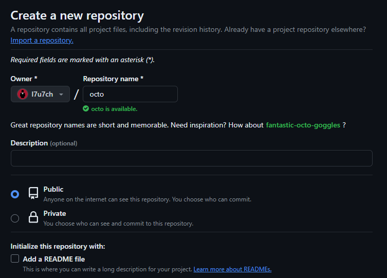
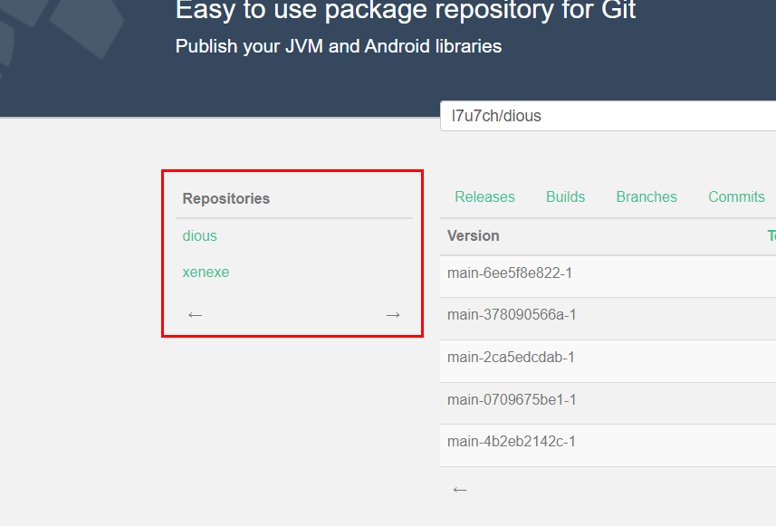
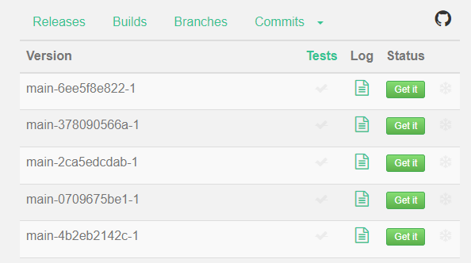

## 1. はじめに

Scala の自作ライブラリを公開する場合、最もスタンダードなのは [Maven Central Repository](https://central.sonatype.com/) に Publish することだと思います。しかし、GPG キーの生成やビルドツールの設定など、ちょっとしたライブラリを公開したい場合は、少し面倒くさいと感じることがあります。理想としては、GitHub に Push したら、自動的にビルドされるぐらいの手軽さが欲しいです。GitHub Actions と GitHub Packages を組み合わせて使う方法や JitPack を利用する方法など、色々な方法が考えられます。

本記事では、Scala で自作したライブラリを JitPack で公開する手順を記述します。[JitPack](https://jitpack.io/) は、GitHub のリポジトリを Maven や Gradle などのビルドシステムの依存関係として直接使用できるようにするサービスです。プロジェクトが GitHub 上に公開されていれば、JitPack はそのリポジトリをビルドし、生成されたアーティファクトを Maven リポジトリとして提供します。また、本記事では、以下の環境が構築済みの前提で記述しています。

- Scala の開発環境が構築済み
- Git の開発環境が構築済み
- GitHub アカウントを取得済み

## 2. GitHub にリポジトリを作成する

まず初めに、GitHub にリポジトリを作成します。リポジトリ名は、基本的に任意ですが、Java の FQDN 逆順命名規約に従うのであれば、リポジトリ名は全て小文字 + ハイフンを含まないモノにします。また、JitPackで Private Repository をビルドする場合は、有料プランに加入する必要があります [^2.1] 。そのため、無料プランで使用する場合は Public にチェックを入れてください。その他の項目は任意です。

[^2.1]: JitPack Private Repositories: https://jitpack.io/private#subscribe



## 3. Scala コードを作成する

GitHub の説明に従って、作成したリポジトリをローカル環境に Clone し、初期化します。JitPack の GUIDE TO PUBLISHING LIBRARIES [^3.1] によると、JitPack が対応しているビルドツールは以下の 4 つだそうです。残念ながら、現時点では Scala CLI と Mill は非対応のようです。本記事では、sbt を利用します。

<!-- ここでは、sbt を使います。 -->

- Gradle
- Maven
- sbt
- Leiningen

[^3.1]: GUIDE TO PUBLISHING LIBRARIES: https://docs.jitpack.io/building/

ビルドに必要な最小ファイルは、Scala ファイルと build.sbt です。ここでは、サンプルコードとして以下の Scala ファイルと build.sbt を作成します。パッケージ名を FQDN 逆順命名規約準拠にする場合は、GitHub のユーザー名 (l7u7ch) とリポジトリ名 (octo) を自分のモノに変更してください。FQDN 逆順命名規約に従わなくてもビルドするこは出来ます。

```scala title="Person.scala"
package com.github.l7u7ch.octo

case class Person(name: String, age: Int) {
  def greet(): String = {
    s"こんにちは、私の名前は $name です。年齢は $age 歳です。"
  }
}
```

```scala title=build.sbt
scalaVersion := "3.3.3"
```

## 4. JitPack でビルドする

[JitPack](https://jitpack.io/) に移動して GitHub アカウントでログインします。ログインが完了すると、画面左の Repositories に作成したリポジトリが表示されるはずです。作成した GitHub リポジトリをクリックすることで、ビルドやリリース情報が表示されます。また、中央のサーチフォームに `<GitHub User Name>/<GitHub Repository Name>` を入力して表示させることも可能です。



Status の Get it をクリックすることでビルドが開始され、ログをクリックすることでビルドの進捗や成功失敗を確認することが出来ます。また、JitPack のドキュメント [^4.1] によると、公開してから 7 日以内であれば削除することが可能です。7 日以上経過すると、Snowflake Icon が表示され、削除不可になるので注意が必要です。

[^4.1]: About Documentation for JitPack.io: https://docs.jitpack.io/intro/#immutable-artifacts



公開したライブラリを使用する場合は `build.sbt` に以下の内容を書き込むことでフェッチすることが出来ます。その他のビルドツール (Gradle, Maven, Leiningen) を使用する場合の方法は、JitPack の HOW TO に詳しく記述されているので、そちらを参照ください。

## 5. ライブラリを使用する

ライブラリを使用する場合、ビルドツールに JitPack に関する情報を記述する必要があります。sbt を使用すると仮定した場合、build.sbt に以下のようなコードを追記します。あとは、その他のライブラリを使用する場合と同じように記述することで sbt が自動的にフェッチしてくれます。その他のビルドツールに関しても、基本的に JitPack に関する情報を記述する必要があります。詳しくは JitPack のドキュメントを参照ください。

```scala title=build.sbt
resolvers += "jitpack" at "https://jitpack.io"
libraryDependencies += "com.github.l7u7ch" % "octo" % "main-SNAPSHOT"
```

```scala title="Main.scala"
import com.github.l7u7ch.octo.Person

@main def main(): Unit = {
  val person = Person("John", 24)
  val greet = person.greet()
  println(greet) // こんにちは、私の名前は John です。年齢は 24 歳です。
}
```

## 6. おわりに

ここまで、Scala で自作したライブラリを JitPack で公開する手順を記述してきました。GitHub に Push するだけで自動的にビルドしてくれる (正確には、Get it ボタンを押すか API を叩く必要あり？) 手軽さが嬉しいです。しかし、JitPack にホストしたライブラリは [Scaladex](https://index.scala-lang.org/) に表示されません。これは、Scaladex が Maven Central Repository の情報のみをクロールする仕様のため？だと思います。将来的に、Scaladex が Maven Central Repository 以外の情報をクロールするようになれば、掲載されるようになるかもしれません。
