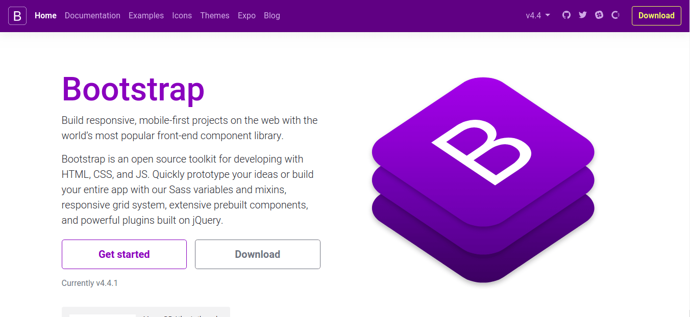

## 1. はじめに

本サイトを開設した当時は，Bootstrap を採用していました。途中から Bootstrap と UIkit を組み合わせて運用してきましたが，現在は UIkit のみを使用しています。本記事では，Bootstrap から UIkit に移行した理由について記述します。

## 2. グリッドシステムが直感的

以下に，Bootstrap と UIkit のグリッドシステムを実装したソースコードを示します。Bootstrap は，それぞれのカラムでレイアウトを設定してやらないといけませんが，UIkit は全てのカラムに同一の設定を適用することができます。[ネット記事](https://www.ivysoho.net/article.php/uikit-fan-7)に記述されているように，合理的かつ直感的な HTML 記述をすることができます。

```html
<div class="container">
  <div class="row">
    <div class="col-sm">One of three columns</div>
    <div class="col-sm">One of three columns</div>
    <div class="col-sm">One of three columns</div>
  </div>
</div>
```

```html
<div class="uk-child-width-expand@s uk-text-center" uk-grid>
  <div>
    <div class="uk-card uk-card-default uk-card-body">Item</div>
  </div>
  <div>
    <div class="uk-card uk-card-default uk-card-body">Item</div>
  </div>
  <div>
    <div class="uk-card uk-card-default uk-card-body">Item</div>
  </div>
</div>
```

## 3. デザインが被りにくい

Bootstrap は，[ネット記事](http://www.site-convert.com/archives/1093)に掲載されている Github リポジトリのスター数からもわかるとおり，最も有名な CSS ライブラリです。そのため，Bootstrap を採用している Web サイトは多くあります。Bootstrap は，少ないコード数でモダンな Web デザインを実現できますが，Bootstrap 特有のデザインが残ってしまいます。そのため，Bootstrap を用いて作成した Web サイトは似たようなデザインになる場合が多いです。勿論，CSS をオーバーライドすることでデザインを変更できます。しかし，CSS ライブラリを使用するメリットが少なくなるため本末転倒です。



## 4. 他のライブラリに依存しない

Bootstrap は，[jQuery](https://jquery.com/) と [Popper.js](https://popper.js.org/) に依存しています。[ネット記事](http://kannagi35.com/blog/bootstrap-5-removes-jquery-and-ie)によると，Bootstrap Ver.5 から依存度が低くなるそうですが詳細は不明です。また，jQuery の依存を取り除いた [Native JavaScript for Bootstrap](https://thednp.github.io/bootstrap.native/) も存在しますが Twitter 社がサポートしているわけではないので不安が残ります。



## 5. おわりに

ここまで，本サイトが Bootstrap から UIkit に移行した理由について記述してきました。本記事では，UIkit のメリットに焦点を当てて執筆しましたが，Bootstrap の方が良いと感じる部分もありました。例えば，情報量では Bootstrap の方が圧倒的に多いです。Google と Amazon で Bootstrap と UIkit を検索すれば一目瞭然です。そのため，CSS ライブラリの入門としては Bootstrap の方が良いと思います。

## 環境情報

- Bootstrap Ver.4.4.1
- UIkit Ver.3.3.0
- Google Chrome Ver.79.0.3945.130
