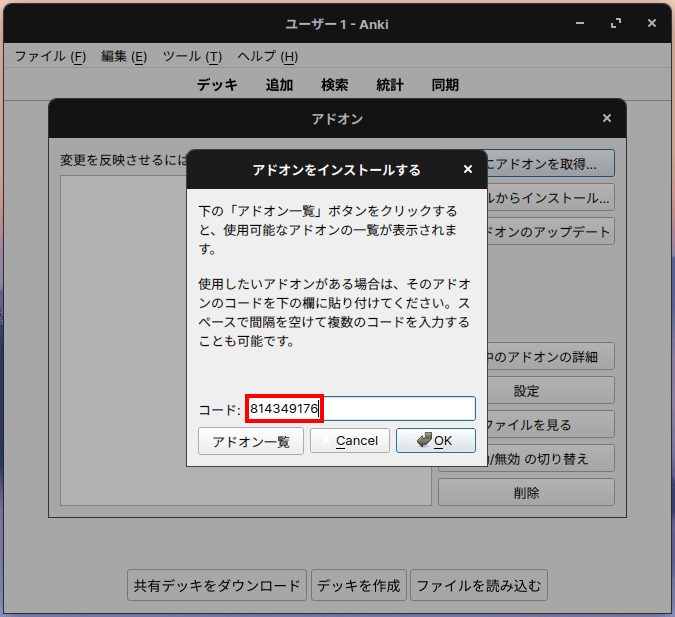

## 1. はじめに

[Anki](https://apps.ankiweb.net/) は，学習を支援するオープンソースソフトウェアであり，クロスプラットフォームに対応しています。iOS と Android のアプリでは，Text to Speech に標準的に対応していますが，Windows，macOS，Linux のアプリでは対応していません。そのため，アドオンである AwesomeTTS を用いて機能拡張する必要があります。本記事では，Anki 上で AwesomeTTS を用いて Text to Speech を実装する手順を記述します。

本記事で行っている作業は，Anki Ver.2.1.40 と Zorin OS 15 Core (Ubuntu 18.04 LTS) の環境下で実行したものです。また，Anki はインストール済みの前提で記述しており，インストール手順は割愛していることをご了承ください。

## 2. パッケージのインストール

Linux の Anki で AwesomeTTS を動作させるには，オープンソースソフトウェアのメディアプレーヤーである MPlayer が必要になります。そのため，以下のコマンドを実行し，MPlayer をインストールします。Windows と macOS では，この作業は不要と思われます。

```bash
$ sudo apt install mplayer -y
```

## 3. アドオンのインストール

以下の手順を実行し，AwesomeTTS をインストールします。

1. 「ツール」→「アドオン」をクリックし，アドオンの管理画面を開く
2. 「アドオンを取得する」をクリックし，アドオンのインストール画面を開く
3. 「814349176」 を「コード」に入力し，「OK」ボタンをクリックする
4. アドオンの管理画面を閉じ，アドオンを反映させるために Anki を再起動させる



## 4. カードのカスタマイズ

最後に，音声を再生するテキストの範囲を設定する必要があります。以下の手順を実行し，カードの設定をカスタマイズします。以下の設定では，Google Translate を利用していますが，AwesomeTTS では Google Translate 以外にも多くのサービスを利用することが出来ます。

1. 「ツール」→「ノートタイプを管理」をクリックし，ノートタイプの管理画面を開く
2. 任意のノートを選択した状態で「カードタイプ」をクリックし，カードタイプ管理画面を開く
3. 音声を再生するテキストを <tts service="google" speed="1.0" voice="en"\></tts\> で囲む
4. 「保存」をクリックし，カードの設定を保存する


## 5. おわりに

ここまで，Anki 上で AwesomeTTS を用いて Text to Speech を実装する手順を記述してきました。本記事では，翻訳サービスとして Google Translate を設定したため，オンライン状態でのみ Text to Speech が実行されます。そのため，オフライン状態で Text to Speech を実行する場合は音声データを保存するなどの作業が必要です。
