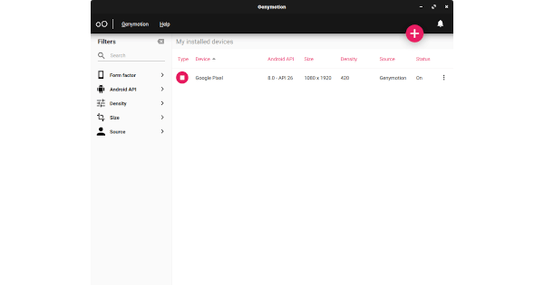
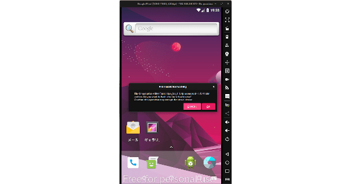

## 1. はじめに

[Genymotion](https://www.genymotion.com/) は，マルチプラットフォーム対応の Android エミュレータです。ワンクリックで [Open GApps](https://opengapps.org/) をインストールすることが可能であり，Google Play で公開されているアプリを簡単にインストールすることが出来ます。しかし，「アークナイツ」や「雀魂」などの一部ゲームは「お使いのデバイスはこのバージョンに対応していません」と表示され，インストールすることが出来ません。

これは，Genymotion の [Q&A](https://support.genymotion.com/hc/en-us/articles/360002676057-I-cannot-install-my-application-or-game-in-Genymotion-Desktop) によると，Genymotion は x86 アーキテクチャの仮想環境が提供されており，ARM アーキテクチャ対応のアプリに対応していないために発生するようです。そこで，本記事では ARM アーキテクチャ対応のアプリを x86 アーキテクチャに変換する [Genymotion ARM Translation](https://github.com/m9rco/Genymotion_ARM_Translation) (GAT) を用いてインストール出来ない問題を解決する手順について記述します。

本記事は，Genymotion のアカウント作成とインストールが完了している前提で記述しています。Genymotion のアカウント作成とインストール手順は割愛していることを，ご了承下さい。

## 2. 仮想デバイスの追加

まず初めに，仮想デバイスを追加します。GAT の関係上，Android Version は Ver.4.3 〜 8.0 のいずれかに設定する必要があります。本記事では，プリセット設定である Google Pixel を選択します。Android Version 以外の設定は任意で問題ありません。

## 3. Open GApps のインストール

仮想デバイスを起動後，サイドバーの Open GApps をクリックして Open GApps をインストールし，仮想デバイスを再起動します。再起動後，追加された Google Play Store を起動し，SIGN IN します。この時点では，「アークナイツ」や「雀魂」などの ARM アーキテクチャ対応アプリはインストールすることが出来ません。

## 4. GAT のインストール

GAT が公開されている [GitHub リポジトリ](https://github.com/m9rco/Genymotion_ARM_Translation)から，設定した Android Version の ZIP ファイルを起動している仮想デバイスにドラッグ・アンド・ドロップします。本記事では，プリセット設定である Google Pixel (Android Ver.8.0) を使用しているため，Genymotion-ARM-Translation_for_8.0.zip をドラッグ・アンド・ドロップします。メッセージボックスが表示されるので「OK」をクリックし，GAT をインストールします。インストール後，仮想デバイスを再起動すると ARM アーキテクチャ対応のアプリがインストール可能な状態になっています。

## 5. おわりに

ここまで，Genymotion で ARM アーキテクチャ対応のアプリがインストール出来ない問題を，GAT を用いて解決する手順について記述してきました。あくまでも Genymotion は Android エミュレータのため，アプリをインストール出来ても快適動作するとは限りません。その点は，ご注意下さい。
