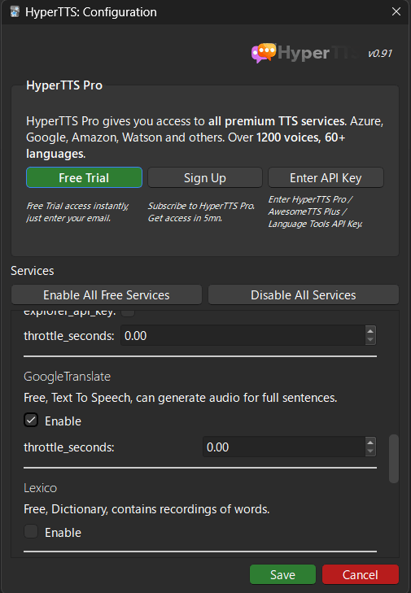
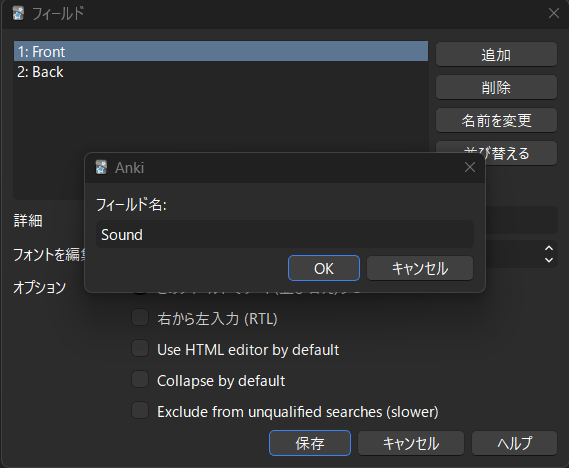
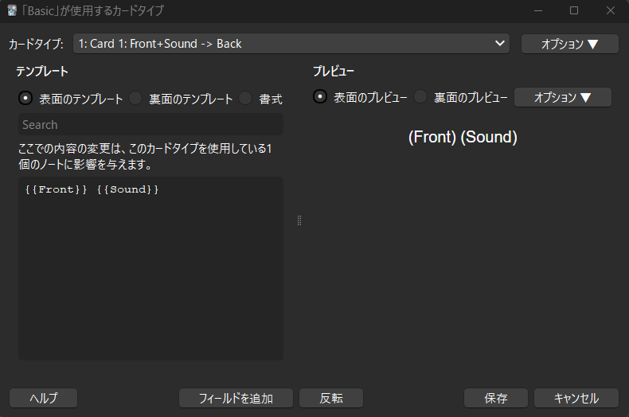
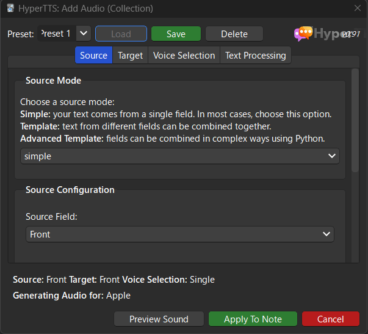
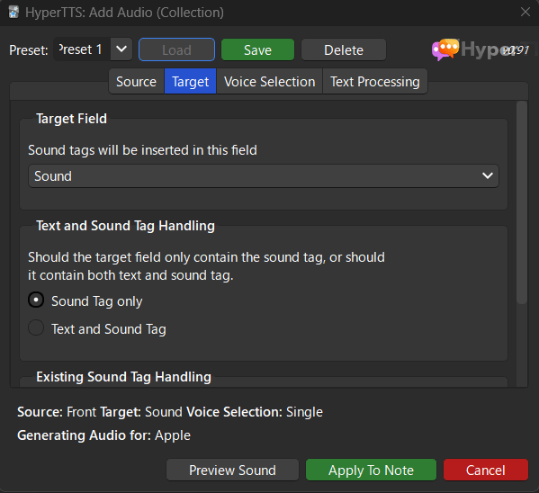
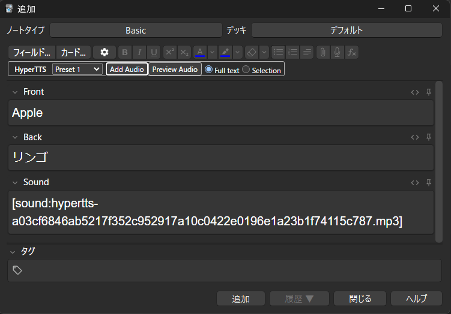

## 1. はじめに

HyperTTS は，AwesomeTTS と Language Tools のメンテナーが開発しているアドオンです [^1] 。機能的には，AwesomeTTS と変わりませんが，操作性や設定項目がシンプルなので，最近は HyperTTS を使用しています。HyperTTS の使い方に関する日本語の情報が少なかったのでインストール方法と基本設定などの使い方を共有します。

[^1]: HyperTTS - Add speech to your flashcards - AnkiWeb - https://ankiweb.net/shared/info/111623432

## 2. HyperTTS をインストールする

1. ツールバーの「ツール」をクリックする
2. 「アドオン」をクリックする
3. 「新たにアドオンを取得する」をクリックする
4. コードに「111623432」を入力する
5. 「OK」をクリックする

インストールが完了したら変更を反映させるために Anki を再起動する

## 3. HyperTTS の初期設定

1. ツールバーの「ツール」をクリックする
2. 「HyperTTS：Services Configuration」をクリックする
3. 「Google Translate」の「Enable」にチェックを入れる
4. 「Save」をクリックする

## 4. ノートタイプを追加する

1. ツールバーの「ツール」をクリックする
2. 「ノートタイプを管理」をクリックする
3. 「追加 」をクリックする
4. 「追加：Basic」を選択して「OK」をクリックする
5. 任意の名前を設定して「OK」をクリックする (今回はデフォルト名の Basic で作成)

## 5. フィールドを追加する

1. ツールバーの「ツール」をクリックする
2. 「ノートタイプを管理」をクリックする
3. 「フィールド」をクリックする
4. 「追加」をクリックする
5. フィールド名に「Sound」と入力する
6. 「OK」をクリックする
7. 「保存」をクリックする

## 6. テンプレートを変更する

1. ツールバーの「ツール」をクリックする
2. 「ノートタイプを管理」をクリックする
3. 「カードタイプ」をクリックする
4. 表面のテンプレートを以下のように変更する
5. 「保存」を選択する

## 7. 単語と音声を追加する

1. 「追加」をクリックする
2. 「Front」と「Back」に任意の文字を入力する (今回は「Apple」と「リンゴ」と入力した)
3. HyperTTS の「Add Audio」をクリックする
4. Source タブ → Source Configuration → Source Field を **Front** に設定する
5. Target タブ → Target Field を **Sound** に設定する
6. 「Apply To Note」をクリックする (Sound フィールドに mp3 が追加されていれば成功です)
7. 「追加」をクリックする

## 8. おわりに

ここまで，HyperTTS の基本的な使い方について記述してきました。本記事では，無料で利用できる Google translate を Text-to-Speech として設定していますが，その他にも Google Cloud，Microsoft Azure，AWS Polly などの Text-to-Speech に対応しているので，お好みで変更してください。
