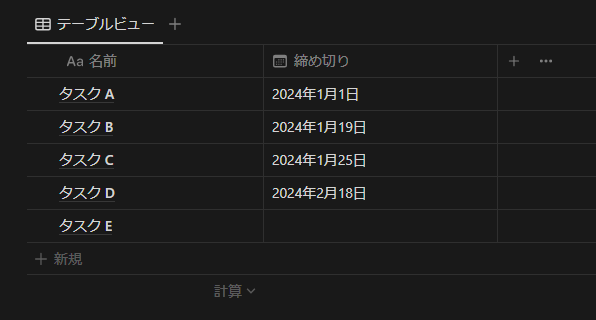
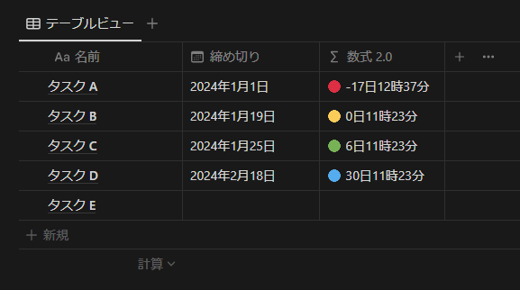

## 1. はじめに

Notion は、自由度が高くカスタマイズ性が非常に高いデジタルノートサービスです。Notion では、ユーザーがテキスト、画像、リンク、データベースなど、多種多様なブロックを組み合わせることで、自分だけのユニークな作業空間を作り出すことができます。Notion データベースでタスク管理するメリットとして、自分に必要なプロパティを追加して管理することが出来る点が挙げられます。例えば、締め切りを管理したい場合、以下の画像のように日付型プロパティを追加することで管理することが出来ます。また、Notion データベースのソート機能を使うことでタスクを締め切り順にソートすることも出来ます。



しかし、上記の例では、「締め切りを過ぎているのか？」や「締め切りは近いのか？」などの情報を視覚的に判断することは難しいです。そこで、本記事では、以下の画像のように、現在日時から相対的な情報を可視化できるような数式プロパティの実装方法について記述します。具体的には、以下のような仕様になります。

- 締め切りを過ぎているタスクには 🔴 と経過日時を付与する
- 締め切りまで 1 日未満のタスクには 🟡 と残り日時を付与する
- 締め切りまで 7 日未満のタスクには 🟢 と残り日時を付与する
- 締め切りまで 7 日以上のタスクには 🔵 と残り日時を付与する
- 締め切りが設定されてないタスクは何も付与しない



## 2. 実装方法

実装自体は、非常に簡単です。まず初めに、テーブルビューの Notion データベースを作成します。次に、日付型プロパティと数式型プロパティを追加します。日付型プロパティのプロパティ名は「締め切り」と設定します。数式型プロパティのプロパティ名は任意で大丈夫です。ここでは、「数式 2.0」と設定しています。最後に、以下の数式を入力すれば作業完了です。実際にタスクと締め切りを追加して、挙動をテストしてみてください。

```
ifs(
	dateBetween(prop("締め切り"), now(), "minutes") <= 0, "🔴 ",
	dateBetween(prop("締め切り"), now(), "days") < 1, "🟡 ",
	dateBetween(prop("締め切り"), now(), "days") < 7, "🟢 ",
	"🔵 "
) +
dateBetween(prop("締め切り"), now(), "days") + "日" +
abs(dateBetween(prop("締め切り"), now(), "hours")) % 24 + "時" +
abs(dateBetween(prop("締め切り"), now(), "minutes")) % 60 + "分"
```

ちなみに、実装とは関係ありませんが、上記の数式は 2.0 で記述しているコードです。同じ処理を数式 1.0 で記述すると以下のようなコードになります。数式 2.0 によって、保守性が格段に向上していることが直感的にわかると思います。Notion の数式について詳しく知りたい方は公式のリファレンス [^1] [^2] を参照ください。

[^1]: 数式の基本：https://www.notion.so/ja-jp/help/formulas
[^2]: 数式の構文と関数：https://www.notion.so/ja-jp/help/formula-syntax

```
if(empty(prop("締め切り")), "", (((((((if(dateBetween(prop("締め切り"), now(), "minutes") <= 0, "🔴 ", if(dateBetween(prop("締め切り"), now(), "days") < 1, "🟡 ", if(dateBetween(prop("締め切り"), now(), "days") < 7, "🟢 ", "🔵 ")))) + if(sign(dateBetween(prop("締め切り"), now(), "minutes")) < 0, "-", "")) + format(abs(dateBetween(prop("締め切り"), now(), "days")))) + "日") + format(abs(dateBetween(prop("締め切り"), now(), "hours") % 24))) + "時") + format(abs(dateBetween(prop("締め切り"), now(), "minutes") % 60))) + "分")
```

## 3. おわりに

ここまで、現在日時から相対的な情報を可視化できるような数式プロパティの実装方法について記述してきました。このように自分に必要な機能を実装できるのも Notion の大きな魅力だと思います。今後も Notion の活用例や数式を用いたカスタマイズ例などを公開していきたいと思います。
