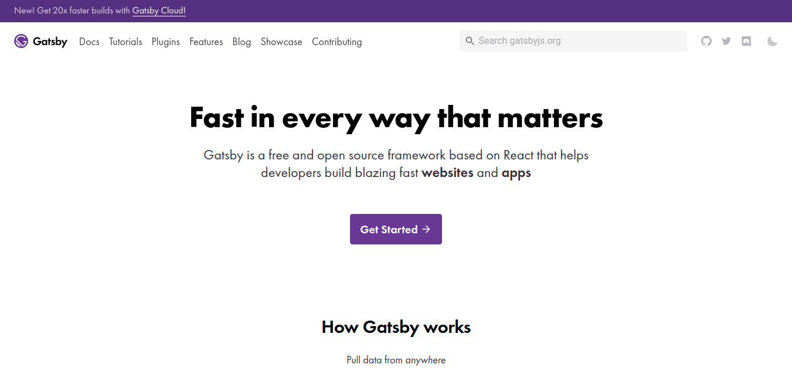
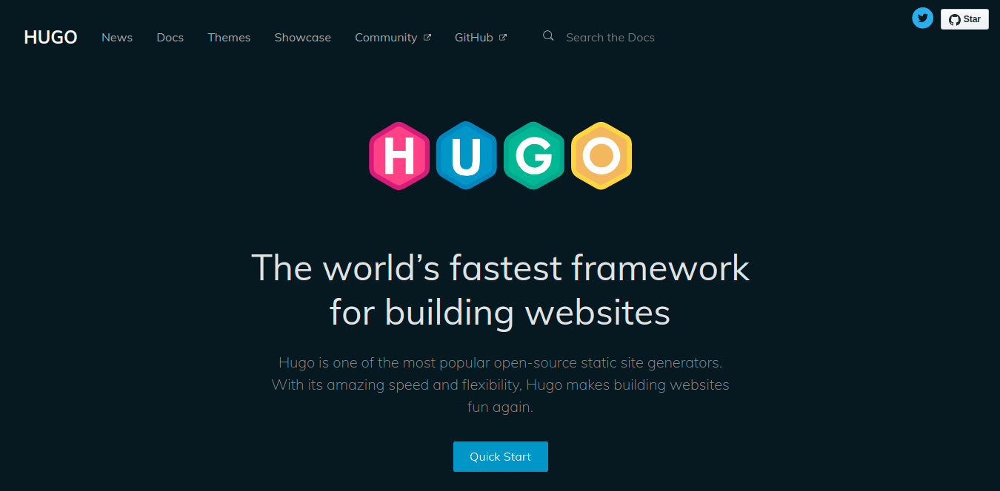

## 1. はじめに

OSS の静的ジェネレーターをランキング形式で掲載している [StaticGen](https://www.staticgen.com/) で，GatsbyJS と Hugo は常に上位にランクインしています。本サイトでは，採用しているフレームワークを WordPress から静的ジェネレーターに移行する際，GatsbyJS と Hugo のどちらを採用するかを検討しました。本記事では，ブログフレームワークとしての観点から GatsbyJS と Hugo を比較・評価し，その結果を記述します。

## 2. GatsbyJS

[GatsbyJS](https://www.gatsbyjs.org/) は，テンプレートエンジンとして [React](https://ja.reactjs.org/) を採用している静的ジェネレーターです。非常に豊富なプラグインが公開されており，プラグインを活用することで AMP[^1] や PWA[^2]，GraphQL などの最新技術を手軽に活用することができます。また，[Starter Library](https://www.gatsbyjs.org/starters/) でユーザーが作成したテーマが公開されており，ブログフレームワークとしての実績も十分にあります。しかし，Markdown ファイルから HTML ファイルに変換するページジェネレーター部分を開発者自身で実装する必要があるなど，高機能がゆえの手間も存在します。

⭕ ブログフレームワークとして実績あり  
⭕ 最新技術を活用可能  
⭕ 豊富なプラグイン  
❌ React に関する前提知識が必要  
❌ ブログに必要な機能を実装する必要あり

[^1]: Accelerated Mobile Pages の略称
[^2]: Progressive Web Apps の略称

## 3. Hugo

[Hugo](https://gohugo.io/) は，Go 言語によって実装されている静的ジェネレーターです。プラグインなどの拡張機能はないものの，ブログサイトを構築する際に必要な機能は一通り実装されています。ブログに必要な機能は [template](https://gohugo.io/templates/) という形で提供されており，宣言するだけで必要な機能な実現できます。また，[Hugo Themes](https://themes.gohugo.io/) でユーザーが作成したテーマが共有されており，ブログフレームワークとしての実績も十分にあります。しかし，提供されている機能以外を実装しようとすると非常に工数がかかります。

⭕ Go 言語の知識は特に必要なし  
⭕ template を組み合わせて簡単に構築可能  
⭕ ブログフレームワークとして実績あり  
❌ 拡張機能が乏しい  
❌ 凝った機能を実装するのが困難

## 4. 比較・評価

一般的なブログサイトを構築する場合は，Hugo を採用する方が良いと感じます。逆に，Web アプリケーションに近いサイトを構築する場合は，GatsbyJS 採用する方が良いと感じます。ここまでの検討で，Hugo はブログフレームワーク，GatsbyJS は [Next.js](https://nextjs.org/) などの Web アプリケーションフレームワークに近いと感じる場面が多かったです。

## 5. おわりに

ここまで，ブログフレームワークとしての観点から GatsbyJS と Hugo を比較・評価し，その結果を記述してきました。本記事では，Hugo と GatsbyJS を比較・評価しましたが，[Netlify CMS](https://www.netlifycms.org/docs/start-with-a-template/) では，[Middleman](https://middlemanapp.com/jp/) や [Preact](https://preactjs.com/) といったフレームワークがテンプレートとして採用されています。本記事が，開発者が作りたいサイト像に合ったフレームワークを採用できる一助になれば幸いです。
