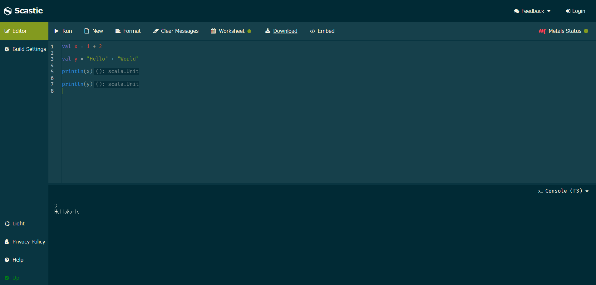
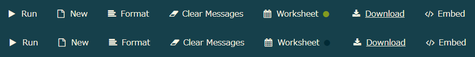
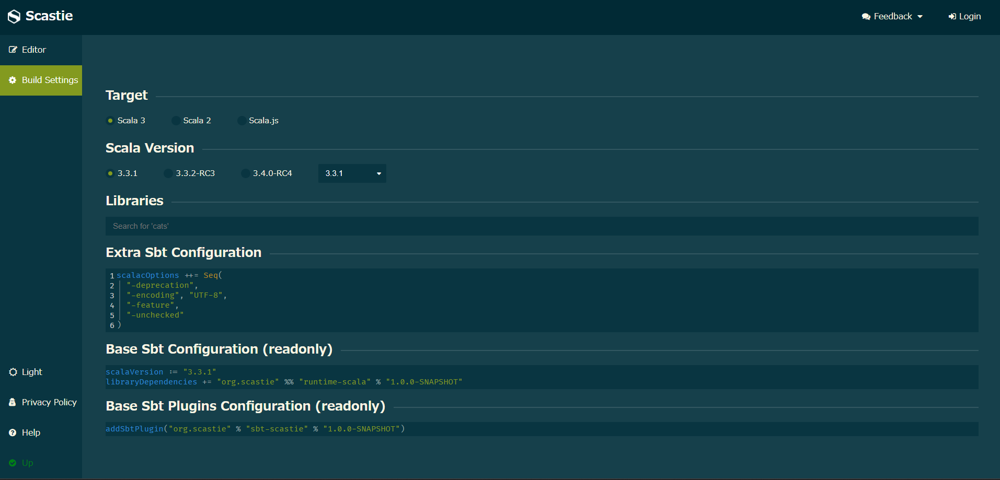

## 1. はじめに

Scastie [^1] は、プログラミング言語の Scala を Web 上で実行するためのソフトウェアです。現在は、非営利団体の Scala Center によって、開発・保守が行われています。Scastie は、Scala の学習から試験的なコードの実行など、Scala を使用する様々な場面で活躍してくれます。本記事では、Scastie の基本的な使い方について記述します。

<!-- https://scastie.scala-lang.org/ -->

[^1]: scalacenter/scastie：https://github.com/scalacenter/scastie

## 2. 基本操作

基本的には、テキストエリアに Scala コードを記述して、ツールバーの Run をクリックして実行すると、実行結果が下部の Console に表示されるというシンプルなものです。他のツールバーも以下で解説しておきます。丸括弧の中身はショートカットキーです。

- Run：コードを実行する (Ctrl + Enter または Ctrl + S)
- New：新しいコードを作成する (Ctrl + M)
  - 前のコードは復元できないので注意が必要です
  - GitHub アカウントでログインすることでコードがバックアップされます
- Format：コードをフォーマットする (F6)
- Clear Messages：メッセージをクリアする (Esc)
- Worksheet：後述
- Download：コードをダウンロードする
- Embed：埋め込みコードを取得する



## 3. Worksheet

Scala 初心者が Scastie で最も戸惑うのが、Worksheet の仕様だと思います。筆者は仕様を理解するまでに、かなりかかりました。Worksheet が ON になっている時は緑色に、OFF になっている時は濃い緑色になります。デフォルトでは、ON になっていると思います。



Worksheet を ON にすることで、以下の恩恵を受けることが出来ます。

- 評価が可視化される
- トップレベルに関数を定義できる

<!-- の大きな特徴として 2 つ挙げられます。1 つ目は、「評価が可視化される」。2 つ目は、トップレベルに関数を定義できる。 -->

### 3.1. 評価が可視化される

以下の Scala コードを Scastie 上で実行してみます。

```scala
1 + 2

"Hello" + "World"
```

すると、式の右部にテキストが表示されると思います。これは、式 (`1 + 2` と `"Hello" + "World"`) の実行結果と型が表示されています。このように、Worksheet を ON にすると、`println()` や `getClass()` を記述しなくても、 実行結果と型を確認することが出来ます。


### 3.2. トップレベルに関数を定義できる

先程から、Scala コード内でメイン関数を定義していないにも関わらず、普通に実行できていることに、お気づきだろうか。普段から Python などのインタープリター言語を使用している人にはインパクトが少ないかもしれないですが、Java などのコンパイラ言語を使用している人からすると違和感があると思います。

試しに Worksheet を OFF にして上記の Scala コードを実行してみてください。エラーが発生とすると思います。本来であれば以下のようにエントリーポイントを設定しないとコンパイルが通りません。このように、Worksheet を ON にすることでエントリーポイントを省略することが出来ます。

```scala
object Hello extends App {
  println("Hello, World!!")
}
```

ローカル環境で、エントリーポイントを省略した Scala スクリプトを実行したい場合は、[Scala CLI](https://scala-cli.virtuslab.org/) や [Ammonite](https://ammonite.io/) などのツールを活用することで実現できます。これらのツールの解説は、本記事の趣旨から外れているので割愛します。機会があれば、別記事で解説したいと思います。

## 4. Metals

Metals を ON にすることでコードを補完してくれます。試しに `pri` とテキストエリアに入力して、少し待機してみてください。`print()` や `println()` などの補完候補が表示されると思います。もしも、うまく表示されない場合は Ctrl + Space を入力すると補完してくれると思います。

Metals 自体は Scastie 独自の機能ではなく、独立したパッケージ [^2] として公開されています。そのため、VSCode などのテキストエディタにインストールすることも出来ます。

[^2]: scalameta/metals：https://github.com/scalameta/metals

## 5. Build Settings

Build Settings では、Scala のバージョンや sbt の設定をすることが出来ます。外部のパッケージを検索する際は、[Scaladex](https://index.scala-lang.org/) を活用すると便利です。各 sbt の設定項目に関しては、本記事で扱うには情報量が膨大なため割愛します。詳しくは sbt の公式ドキュメント [^3] を参照ください。

[^3]: sbt Reference Manual：https://www.scala-sbt.org/1.x/docs/



## 6. おわりに

ここまで、Scastie の基本的な使い方について記述してきました。上記でも述べた通り、Scastie は単体のソフトウェアとして公開されているので、セルフホスティングすることも可能です。興味がある方は、詳しく解説している記事 [^4] が公開されているので、そちらを参照ください。それでは、良い Scala ライフを。

[^4]: Scastie（ScalaのオンラインIDEみたいなやつ）をセルフホスティングする：https://blog.3qe.us/entry/2022/02/06/211130
