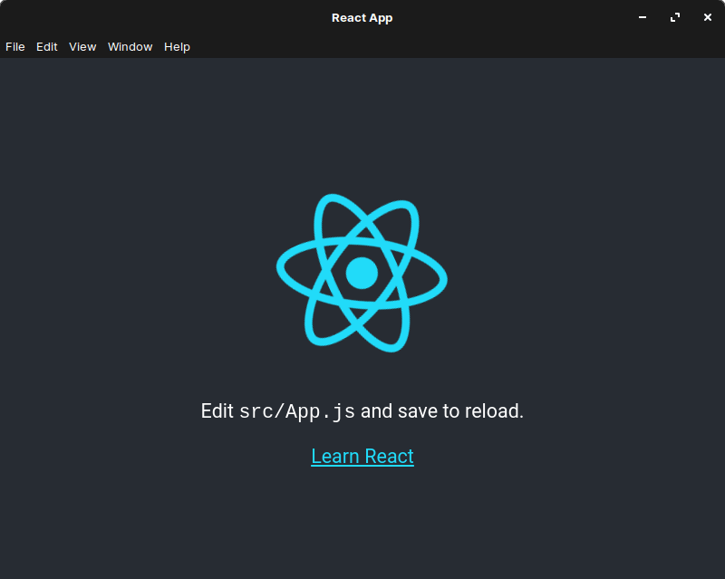

## 1. はじめに

[React](https://ja.reactjs.org/) は，Facebook 社が主導で開発している Web アプリ開発フレームワークです。また，[Electron](https://www.electronjs.org/) は GitHub 社が主導で開発しているデスクトップアプリ開発フレームワークです。これらのフレームワークを組み合わせることによって，React で開発した Web アプリを Electron でデスクトップアプリ化することが出来ます。

インターネット上で類似の記事が複数公開されているので，本記事では Qiita に投稿されている[記事](https://qiita.com/konatsu_p/items/9ac02fb637bdfaf005ac)と DEV に投稿されている[記事](https://dev.to/origamium/create-reactelectron-application-in-quickly--36nl)，GitHub に投稿されている[ソースコード](https://github.com/kitze/react-electron-example)を参考に，_ホットリロード_ + *ビルド*に対応した React + Electron の開発環境構築手順について記述します。

また，本記事内で行っている作業は，以下の環境下で実行したものです。以降，これらのツールはインストール済みの前提で記述していますが，インストール手順は割愛しているので，ご了承下さい。

- Create React App Ver.4.0.1
- npm Ver.6.14.9
- Zorin OS 15.2 Core (Ubuntu 18.04 LTS)

## 2. React App の生成

[Create React App](https://github.com/facebook/create-react-app) は，Facebook 社が主導で開発している React アプリの生成ツールです。Create React App を用いることで React アプリのテンプレートを手軽に生成することが出来るため，まず初めに Create React App の [README.md](https://github.com/facebook/create-react-app) に従って，React アプリのテンプレートを任意のフォルダ内に生成します。[tree](https://www.atmarkit.co.jp/ait/articles/1802/01/news025.html) コマンドを用いて確認すると，正常に React アプリのテンプレートが生成されていることが確認できます。

```bash
$ npx create-react-app my-app
$ ls
my-app
$ cd my-app
$ tree -L 2
.
├── README.md
├── node_modules
│   ├── @babel
│   ├── @bcoe
│   ├── @cnakazawa
│   ├── (割愛)
│   ├── yaml
│   ├── yargs
│   └── yargs-parser
├── package.json
├── public
│   ├── favicon.ico
│   ├── index.html
│   ├── logo192.png
│   ├── logo512.png
│   ├── manifest.json
│   └── robots.txt
├── src
│   ├── App.css
│   ├── App.js
│   ├── App.test.js
│   ├── index.css
│   ├── index.js
│   ├── logo.svg
│   ├── reportWebVitals.js
│   └── setupTests.js
└── yarn.lock
```

## 3. パッケージの追加

npm を用いて _electron-is-dev_ を dependencies に，_cross-env_，_electron_，_electron-builder_，_npm-run-all_，_wait-on_ を devDependencies にインストールします。各パッケージの詳細に関して，ここでは割愛します。

```bash
$ ls
README.md  node_modules  package.json  public  src  yarn.lock
$ npm i electron-is-dev
$ npm i cross-env electron electron-builder npm-run-all wait-on -D
$ ls
README.md  node_modules  package-lock.json  package.json  public  src  yarn.lock
```

## 4. JavaScript の追加

electron-quick-start の [main.js](https://github.com/electron/electron-quick-start/blob/master/main.js) を改変した以下のソースコードを，_electron.js_ というファイル名で _public_ フォルダ内に保存します。改変した箇所は，ハイライトしている 4 行目と 17 〜 21 行目になります。electronic-is-dev パッケージを用いることで開発環境と本番環境を区別し，開発環境の場合は _localhost:3000_ を，本番環境の場合は _index.html_ を読み込むように設定します。

```js {linenos=table, hl_lines=[4, "17-21"]}
// Modules to control application life and create native browser window
const { app, BrowserWindow } = require('electron')
const path = require('path')
const isDev = require('electron-is-dev')

function createWindow() {
  // Create the browser window.
  const mainWindow = new BrowserWindow({
    width: 800,
    height: 600,
    webPreferences: {
      preload: path.join(__dirname, 'preload.js'),
    },
  })

  // and load the index.html of the app.
  mainWindow.loadURL(isDev ? 'http://localhost:3000' : `file://${path.join(__dirname, '../build/index.html')}`)

  // Open the DevTools.
  // mainWindow.webContents.openDevTools()
}

// This method will be called when Electron has finished
// initialization and is ready to create browser windows.
// Some APIs can only be used after this event occurs.
app.whenReady().then(() => {
  createWindow()

  app.on('activate', function () {
    // On macOS it's common to re-create a window in the app when the
    // dock icon is clicked and there are no other windows open.
    if (BrowserWindow.getAllWindows().length === 0) createWindow()
  })
})

// Quit when all windows are closed, except on macOS. There, it's common
// for applications and their menu bar to stay active until the user quits
// explicitly with Cmd + Q.
app.on('window-all-closed', function () {
  if (process.platform !== 'darwin') app.quit()
})

// In this file you can include the rest of your app's specific main process
// code. You can also put them in separate files and require them here.
```

```bash
$ tree -L 2
.
├── README.md
├── node_modules
│   ├── 7zip-bin
│   ├── @babel
│   ├── @bcoe
│   ├── (割愛)
│   ├── yargs-parser
│   ├── yauzl
│   └── yocto-queue
├── package-lock.json
├── package.json
├── public
│   ├── electron.js ⇦ 上記のソースコード
│   ├── favicon.ico
│   ├── index.html
│   ├── logo192.png
│   ├── logo512.png
│   ├── manifest.json
│   └── robots.txt
├── src
│   ├── App.css
│   ├── App.js
│   ├── App.test.js
│   ├── index.css
│   ├── index.js
│   ├── logo.svg
│   ├── reportWebVitals.js
│   └── setupTests.js
└── yarn.lock
```

## 5. package.json の編集

Create React App によって生成された package.json を改変します。マニュアルで改変した箇所はハイライトしている 5 〜 6 行目と 18 〜 25 行目になります。5 〜 6 行目の _main_ と _homepage_ は，Electron の起動とビルドに必須のため，必ず追記します。18 〜 25 行目のキーは，任意で問題ありません。

18 〜 25 行目の値について詳しく記述します。18 行目の _cross-env_ で環境変数 BROWSER に none を設定することで，React 起動時にブラウザが立ち上がるのを無効にしています。22 行目の _wait-on_ で，React が起動してから Electron が起動するように設定しています。24 行目と 25 行目の _npm-run-all_ (run-p と run-s) で，それぞれパラレル実行とシーケンシャル実行するように設定しています。

```json {linenos=table, hl_lines=["5-6", "18-25"]}
{
  "name": "my-app",
  "version": "0.1.0",
  "private": true,
  "main": "public/electron.js",
  "homepage": "./",
  "dependencies": {
    "@testing-library/jest-dom": "^5.11.4",
    "@testing-library/react": "^11.1.0",
    "@testing-library/user-event": "^12.1.10",
    "electron-is-dev": "^1.2.0",
    "react": "^17.0.1",
    "react-dom": "^17.0.1",
    "react-scripts": "4.0.1",
    "web-vitals": "^0.2.4"
  },
  "scripts": {
    "react-start": "cross-env BROWSER=none react-scripts start",
    "react-build": "react-scripts build",
    "react-test": "react-scripts test",
    "react-eject": "react-scripts eject",
    "electron-start": "wait-on http://localhost:3000 && electron .",
    "electron-build": "electron-builder",
    "start": "run-p react-start electron-start",
    "build": "run-s react-build electron-build"
  },
  "eslintConfig": {
    "extends": ["react-app", "react-app/jest"]
  },
  "browserslist": {
    "production": [">0.2%", "not dead", "not op_mini all"],
    "development": ["last 1 chrome version", "last 1 firefox version", "last 1 safari version"]
  },
  "devDependencies": {
    "cross-env": "^7.0.3",
    "electron": "^11.1.0",
    "electron-builder": "^22.9.1",
    "npm-run-all": "^4.1.5",
    "wait-on": "^5.2.0"
  }
}
```

## 6. 動作確認

起動させる場合は，_npm start_ を，ビルドする場合は _npm run build_ をターミナルに入力します。正常に起動できた場合は，以下のようにデスクトップアプリが起動すると思います。また，正常にビルドできた場合は _dist_ フォルダ内に _AppImage_ ファイル名が生成されていると思います。生成された AppImage ファイルをダブルクリックすると起動時と同様に，デスクトップアプリが起動すると思います。



## 7. おわりに

ここまで，ホットリロード + ビルドに対応した React + Electron の開発環境構築手順について記述してきました。当初の予定通り，ホットリロード + ビルドには対応させることが出来ましたが，パッケージングに対応させることが出来ていないので，今後はパッケージングにも対応させていきたいと思います。
