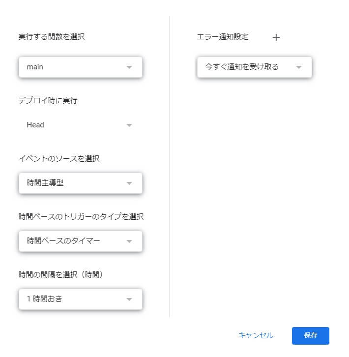

## 1. はじめに

近年，[Snapchat](https://www.snapchat.com/) や [Instagram Stories](https://business.instagram.com/blog/introducing-instagram-stories) などの一定時間が経過すると自動的に投稿が削除される，エフェメラル SNS と呼ばれるサービスが登場しています。
　本記事では，Google Apps Script を用いて Twitter に投稿されてから 7 日以上が経過したツイートを自動的に削除することで，Twitter をエフェメラル SNS 化するシステムの構築について記述します。

## 2. 事前準備

### 2.1. Twitter

[Twitter Developers](https://developer.twitter.com/) に登録して，以下の情報を取得します。

- CONSUMER_KEY
- CONSUMER_SECRET
- ACCESS_TOKEN
- ACCESS_TOKEN_SECRET

### 2.2. Google Apps Script

Google Apps Script のプロジェクトを作成し，OAuth 認証のライブラリが OSS として [Github](https://github.com/gsuitedevs/apps-script-oauth1/blob/master/LICENSE) に公開されているので，手順に従ってインストールします。

## 3. 実装

以下のスクリプトを作成した Google Apps Script のプロジェクトに追加します。大括弧の部分は各自の情報に置換してください。

```js
function main() {
  const CONSUMER_KEY = '[CONSUMER_KEY]'
  const CONSUMER_SECRET = '[CONSUMER_SECRET]'
  const ACCESS_TOKEN = '[ACCESS_TOKEN]'
  const ACCESS_TOKEN_SECRET = '[ACCESS_TOKEN_SECRET]'
  const CURRENT_TIME = new Date()

  // OAuth 認証
  const getTwitterService = function () {
    return OAuth1.createService('Twitter')
      .setAccessTokenUrl('https://api.twitter.com/oauth/access_token')
      .setRequestTokenUrl('https://api.twitter.com/oauth/request_token')
      .setAuthorizationUrl('https://api.twitter.com/oauth/authorize')
      .setConsumerKey(CONSUMER_KEY)
      .setConsumerSecret(CONSUMER_SECRET)
      .setAccessToken(ACCESS_TOKEN, ACCESS_TOKEN_SECRET)
  }

  // タイムラインを取得する
  // JSON に変換する
  const response = getTwitterService().fetch('https://api.twitter.com/1.1/statuses/user_timeline.json?count=200')
  const json = JSON.parse(response)

  // 投稿から 7 日以上経過しているツイートをフィルタリングする
  // ツイートの ID を取得する
  // ツイートを削除する
  json
    .filter(function (x) {
      const createdTime = new Date(x['created_at'])
      const diffTimeMillisec = CURRENT_TIME - createdTime
      return 1000 * 60 * 60 * 24 * 7 < diffTimeMillisec
    })
    .map(function (x) {
      return x['id_str']
    })
    .forEach(function (x) {
      getTwitterService().fetch('https://api.twitter.com/1.1/statuses/destroy/' + x + '.json', { method: 'POST' })
    })
}
```

最後に，上記で作成した main 関数を[トリガー](https://script.google.com/home/triggers)に登録します。以下のようにトリガーに登録することで main 関数が定期的に実行されるようになります。



## 4. おわりに

定期的にツイートを削除してくれるサービスとして [TweetDelete](https://www.tweetdelete.net/) が存在します。しかし，TweetDelete の削除頻度は高くなく，指定した期間以上のツイートが残ってしまいます。削除頻度が気にならない人は，TweetDelete を利用するのも有効な方法だと思います。
