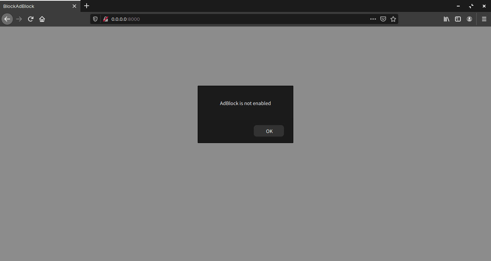

## 1. はじめに

[Adblock Plus](https://chrome.google.com/webstore/detail/adblock-plus-free-ad-bloc/cfhdojbkjhnklbpkdaibdccddilifddb?hl=ja) に代表される広告ブロックによって，ユーザーは広告を非表示にすることができるようになりました。しかし，広告ブロックをよく思わない人たちによって広告ブロックを検知する手法が提案されています。本記事では，JavaScript 製の広告ブロック検知ライブラリである [BlockAdBlock](https://github.com/sitexw/BlockAdBlock) を用いて広告ブロックを検知する手順について記述します。

## 2. 環境構築

環境構築は非常にシンプルです。[blockadblock.js](https://github.com/sitexw/BlockAdBlock/blob/master/blockadblock.js) と以下の index.html を同一ディレクトリ上に配置します。

```html
<!doctype html>
<html lang="en">
  <head>
    <meta charset="UTF-8" />
    <meta name="viewport" content="width=device-width, initial-scale=1.0" />
    <title>BlockAdBlock</title>
  </head>

  <body>
    <script src="./blockadblock.js"></script>
    <script>
      function adBlockNotDetected() {
        alert('AdBlock is not enabled')
      }
      function adBlockDetected() {
        alert('AdBlock is enabled')
      }
      if (typeof blockAdBlock === 'undefined') {
        adBlockDetected()
      } else {
        blockAdBlock.onDetected(adBlockDetected).onNotDetected(adBlockNotDetected)
      }
    </script>
  </body>
</html>
```

```bash
$ tree
.
├── blockadblock.js
└── index.html

0 directories, 2 files
```

## 3. 動作確認

ローカルの index.html をブラウザで開くだけでは正常に動作しません。そこで，[Netlify](https://www.netlify.com/) などのホスティングサービスにアップロードして動作確認する必要があります。本記事では，Python 3 の [http.server](https://docs.python.org/ja/3.7/library/http.server.html) を用いて動作確認します。

```bash
0 directories, 2 files
$ python3 -m http.server 8000
Serving HTTP on 0.0.0.0 port 8000 (http://0.0.0.0:8000/) ...
```

Python 3 が出力したアドレスに任意のブラウザでアクセスします。広告ブロックの有無によってアラートの内容が変化すれば正常に動作しています。



## 4. カスタマイズ

BlockAdBlockでは，_setOption_ メソッドを用いることでオプションを変更することができ，様々なオプションが提供されています。オプションの詳細は README.md の [Default options](https://github.com/sitexw/BlockAdBlock#default-options) を参照してください。また，setOption メソッドや onDetected メソッド，onNotDetected メソッドの他にも，様々なメソッドが提供されています。メソッドの詳細は README.md の [Method available](https://github.com/sitexw/BlockAdBlock#method-available) を参照してください。

```js
// (1)
blockAdBlock.setOption('checkOnLoad', false)
// (2)
blockAdBlock.setOption({
  debug: true,
  checkOnLoad: false,
  resetOnEnd: false,
})
// (1) と (2) のどちらでも記述可能
```

## 5. おわりに

ここまで，JavaScript 製の広告ブロック検知ライブラリ BlockAdBlock の使い方について記述してきました。広告ブロックと広告ブロック検知はイタチごっこ状態なので，本記事で紹介した手法も対策される可能性はあります。そのため，BlockAdBlock の使用は自己責任でお願いします。
