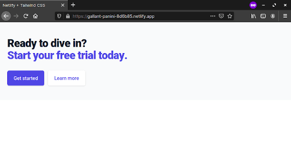

## 1. はじめに

[Tailwind CSS](https://tailwindcss.com/) では，[PurgeCSS](https://tailwindcss.com/docs/optimizing-for-production#purge-css-options) を設定することで，本番環境にデプロイした際に生成される CSS ファイルのサイズを最適化することが出来ます。本記事では，静的ウェブサイトホスティングサービスである [Netlify](https://www.netlify.com/) にデプロイした際に，Tailwind CSS を最適化した状態でビルドする手順について記述します。

また，本記事では Netlify と GitHub を活用します。そのため，Netlify と GitHub のアカウント作成し，連携する必要があります。以降，これらの作業は完了済みの前提で記述しており，手順なども割愛していることを，ご了承下さい。

## 2. 環境構築

以下のファイルを任意の同一ディレクトリ内に作成します。

- index.html：動作確認用の HTML ファイル
- package.json：npm の生成ファイル
- netlify.toml：Netlify の生成ファイル
- postcss.config.js：PostCSS の生成ファイル
- tailwind.config.js：Tailwind CSS の生成ファイル

_index.html_ は，Tailwind CSS が正常に動作しているのかを確認することが目的のファイルです。また，7 行目で _tailwind.css_ を読み込んでいますが，この CSS ファイルは Netlify にデプロイした際にビルドされるため，ローカルで index.html を開いても正常に動作しません。

```html {linenos=table,hl_lines=[7]}
<!-- index.html -->

<!doctype html>
<html lang="en">
  <head>
    <link rel="stylesheet" href="tailwind.css" />
    <meta charset="UTF-8" />
    <meta name="viewport" content="width=device-width, initial-scale=1.0" />
    <title>Netlify + Tailwind CSS</title>
  </head>

  <body>
    <!-- This example requires Tailwind CSS v2.0+ -->
    <div class="bg-gray-50">
      <div class="mx-auto max-w-7xl px-4 py-12 sm:px-6 lg:flex lg:items-center lg:justify-between lg:px-8 lg:py-16">
        <h2 class="text-3xl font-extrabold tracking-tight text-gray-900 sm:text-4xl">
          <span class="block">Ready to dive in?</span>
          <span class="block text-indigo-600">Start your free trial today.</span>
        </h2>
        <div class="mt-8 flex lg:mt-0 lg:flex-shrink-0">
          <div class="inline-flex rounded-md shadow">
            <a
              href="#"
              class="inline-flex items-center justify-center rounded-md border border-transparent bg-indigo-600 px-5 py-3 text-base font-medium text-white hover:bg-indigo-700"
            >
              Get started
            </a>
          </div>
          <div class="ml-3 inline-flex rounded-md shadow">
            <a
              href="#"
              class="inline-flex items-center justify-center rounded-md border border-transparent bg-white px-5 py-3 text-base font-medium text-indigo-600 hover:bg-indigo-50"
            >
              Learn more
            </a>
          </div>
        </div>
      </div>
    </div>
  </body>
</html>
```

_package.json_ は，npm の生成ファイルです。_npm start_ で _tailwind.css_ がビルドされるように設定しています。また，Tailwind CSS が正常に動作するために必要なパッケージである _autoprefixer_ と _postcss_，_tailwindcss_ が _npm install_ でインストールされるように設定しています。

```json
// package.json

{
  "scripts": {
    "start": "tailwindcss build -o tailwind.css"
  },
  "dependencies": {
    "autoprefixer": "^10.2.4",
    "postcss": "^8.2.4",
    "tailwindcss": "^2.0.2"
  }
}
```

_netlify.toml_ は，Netlify の生成ファイルです。Netlify にデプロイした際に，_npm start_ が実行されるように設定しています。また，Tailwind CSS の PurgeCSS が動作するように _NODE_ENV_ に _production_ を設定しています。7 行目を記述しないと Tailwind CSS の PurgeCSS が実行されず，非常に巨大な CSS ファイルが生成されるため注意が必要です。

```toml {linenos=table}
# netlify.toml

[build]
  command = "npm start"

[context.production.environment]
  NODE_ENV = "production"
```

_postcss.config.js_ は，PostCSS の生成ファイルです。Tailwind CSS は，PostCSS のプラグインとして実行されるため，PostCSS の生成ファイルである postcss.config.js が必要になります。

```js
// postcss.config.js

module.exports = {
  plugins: {
    tailwindcss: {},
    autoprefixer: {},
  },
}
```

_tailwind.config.js_ は，Tailwind CSS の生成ファイルです。PurgeCSS が実行されるように設定しています。

```js {linenos=table,hl_lines=[5]}
// tailwind.config.js

module.exports = {
  purge: ['*.html'],
  darkMode: false, // or 'media' or 'class'
  theme: {
    extend: {},
  },
  variants: {
    extend: {},
  },
  plugins: [],
}
```

## 3. 動作確認

上記のファイルを GitHub にコミットし，Netlify デプロイします。発行されたリンクにアクセスし，以下のような実行結果になれば正常に動作しています。



## 4. おわりに

ここまで，静的ウェブサイトホスティングサービスである Netlify にデプロイした際に，Tailwind CSS を最適化した状態でビルドする手順について記述してきました。本記事が Netlify と Tailwind CSS を使用するユーザーの参考になれば幸いです。
