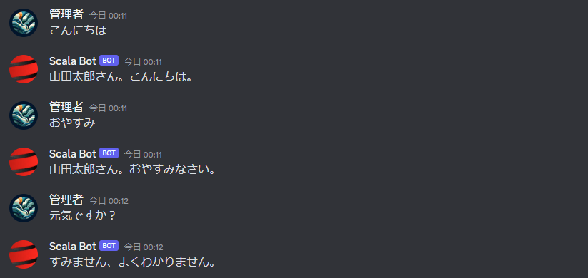

## 1. はじめに

Discord の Bot を作成する際は、ライブラリを活用することが多いと思います。Discord Developer Portal [^1] では、各プログラミング言語ごとのライブラリが公開されています。残念ながら、Scala で記述されたライブラリは掲載されていないようですが、Java で記述されたライブラリは掲載されています。本記事では、Scala と Java Discord API (JDA) を活用して簡単な Discord Bot を作成する手順について記述します。

[^1]: Community Resources：https://discord.com/developers/docs/topics/community-resources

以降の内容は、(1) Coursier を用いて Scala の開発環境が構築されている。(2) Administrator 権限が付与された Bot が追加されている。(3) トークンを取得済みという前提で記述しています。(1) ～ (3) の詳しい手順については割愛していますので、ご了承ください。また、以降の作業は、以下の環境下で実行したものになります。

```bash
$ cs version
2.1.8
$ cs java --version
openjdk 17 2021-09-14
OpenJDK Runtime Environment Temurin-17+35 (build 17+35)
OpenJDK 64-Bit Server VM Temurin-17+35 (build 17+35, mixed mode, sharing)
$ scala-cli --version
Scala CLI version: 1.1.1
Scala version (default): 3.3.1
```

## 2. 実装方法

まず初めに **MESSAGE CONTENT INTENT** が ON になっていることを確認してください。項目は、[Applications](https://discord.com/developers/applications) → Bot → Privileged Gateway Intents に存在します。


次に、ソースコードを準備します。下記のソースコードは、JDK Wiki [^2] に掲載されている Java コードを参考にした Scala コードです。仕様としては、ユーザーが入力した文字列をオウム返しします。以下のソースコードを **bot.sc** として保存し、**TOKEN** 部分を各自のトークンに書き換えてください。

[^2]: Making a Ping-Pong Bot：https://jda.wiki/using-jda/getting-started/

```scala title="bot.sc" {numberLines: true}
//> using scala 3.3.1
//> using dep net.dv8tion:JDA:5.0.0-beta.19

import net.dv8tion.jda.api.JDABuilder
import net.dv8tion.jda.api.events.message.MessageReceivedEvent
import net.dv8tion.jda.api.hooks.ListenerAdapter
import net.dv8tion.jda.api.requests.GatewayIntent

val TOKEN: String = "[TOKEN]"

JDABuilder
  .createDefault(TOKEN)
  .enableIntents(GatewayIntent.MESSAGE_CONTENT)
  .addEventListeners(new DiscordBot)
  .build()

class DiscordBot extends ListenerAdapter {
  override def onMessageReceived(event: MessageReceivedEvent): Unit = {
    if (event.getAuthor.isBot) return // このコードが無いと Bot の返信に Bot が反応して無限ループになる
    val msg: String = event.getMessage().getContentRaw()
    event.getChannel().sendMessage(msg).queue();
  }
}
```

最後に、Scala CLI で実行すれば完了です。Bot が参加しているテキストチャンネルで適当なテキストを入力して送信してみてください。同じテキストが Bot から返信されれば正常に動作しています。

```bash
$ scala-cli bot.sc
```


上記のソースコードを少し応用して、ユーザーの送信したテキストによって、Bot の返信を分岐させることも出来ます。下記のソースコードでは、「こんにちは」と送信すると「[送信者名]さん。こんにちは。」、「おやすみ」と送信すると「[送信者名]さん。おやすみなさい。」、それ以外のテキストを送信すると「すみません、よくわかりません。」と返信する仕様です。

```scala title="bot.sc" {21-25} {numberLines: true}
//> using scala 3.3.1
//> using dep net.dv8tion:JDA:5.0.0-beta.19

import net.dv8tion.jda.api.JDABuilder
import net.dv8tion.jda.api.events.message.MessageReceivedEvent
import net.dv8tion.jda.api.hooks.ListenerAdapter
import net.dv8tion.jda.api.requests.GatewayIntent

val TOKEN: String = "[TOKEN]"

JDABuilder
  .createDefault(TOKEN)
  .enableIntents(GatewayIntent.MESSAGE_CONTENT)
  .addEventListeners(new DiscordBot)
  .build()

class DiscordBot extends ListenerAdapter {
  override def onMessageReceived(event: MessageReceivedEvent): Unit = {
    if (event.getAuthor.isBot) return // このコードが無いと Bot の返信に Bot が反応して無限ループになる
    val msg: String = event.getMessage().getContentRaw()
    val res = msg match {
      case "こんにちは" => event.getAuthor().getEffectiveName() + "さん。こんにちは。"
      case "おやすみ"   => event.getAuthor().getEffectiveName() + "さん。おやすみなさい。"
      case _           => "すみません、よくわかりません。"
    }
    event.getChannel().sendMessage(res).queue();
  }
}
```



## 3. おわりに

ここまで、Scala と JDA を活用して簡単な Discord Bot を作成する手順について記述してきました。JDA を Scala で呼び出すことを想定した情報は、ほとんど無いので、基本的には JDA に関する Java コードを参照して Scala コードに変換して実装することになると思います。このコストを上回る利点は、今のところ無いので、完全にロマン実装だと思います (笑) 。同じロマンを追い求める同志の役に立てば幸いです。
