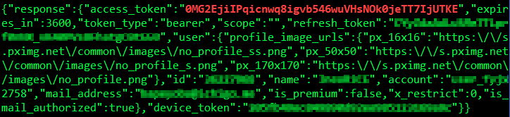
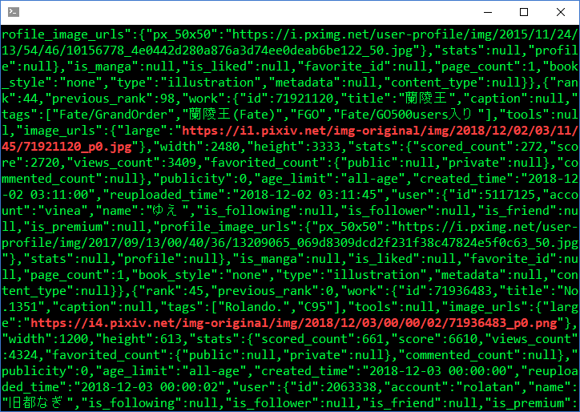

## 1. はじめに

[pixiv](https://www.pixiv.net/) を運営しているピクシブ株式会社は公式の API を公開していませんが，非公式の API が[有志のユーザー](https://github.com/upbit/pixivpy/wiki)によって解析されており，Python や Node.js などのライブラリとして公開されています。しかし，パケットレベルで解説している情報が少なく，フルスクラッチで API を呼び出すプログラムを開発する際にネックとなっていました。そこで，本記事では curl を用いて API を呼び出す方法について記述します。

## 2. アクセストークンの取得

アクセストークンを取得するためには，POST メソッドと 5 つのパラメータを設定した HTTP パケットを https://oauth.secure.pixiv.net/auth/token に送信する必要があります。アクセストークンを取得するためのコマンドと，その実行画面を以下に示します。

```bash
$ curl -X POST \
-d 'client_id=[CLIENT_ID]' \
-d 'client_secret=[CLIENT_SECRET]' \
-d 'grant_type=password' \
-d 'username=[USER_ID]' \
-d 'password=[PASSWORD]' \
https://oauth.secure.pixiv.net/auth/token
```

_client_id_ と _client_secret_ は，pixiv とモバイルデバイス間の HTTPS パケットを解析する必要がありますが，有志の方が[自身のブログ](http://blog.imaou.com/opensource/2014/10/09/pixiv_api_for_ios_update.html)で公開してくれているので，それらを活用します。_username_ と _password_ は自身の ID[^1] とパスワードを入力する。

[^1]: 設定しているメールアドレスでも可



*赤文字*の部分がアクセストークンです。取得したアクセストークンは次章で使用するため記録しておきます。

## 3. ランキング情報の取得

ランキング情報を取得するためには，GET メソッドとヘッダーに前章で取得したアクセストークンを設定した HTTP パケットを https://public-api.secure.pixiv.net/v1/ranking/all?[パラメータ] に送信する必要があります。ランキング情報を取得するためのコマンドと，その実行画面を以下に示します。

```bash
$ curl -X GET \
-H 'Authorization:Bearer [ACCESS_TOKEN]' \
https://public-api.secure.pixiv.net/v1/ranking/all?mode=daily\&image_sizes=large
```

_mode=daily_ はデイリーランキングを取得するパラメータであり，_必須_ のパラメータです。daily を weekly や monthly に変更することでウィークリーランキングやマンスリーランキング，その他のランキング情報を取得することが可能です。また，_image_sizes=large_ はオリジナルサイズの画像を取得するパラメータであり，_任意_ のパラメータです。large の他に，small や medium が設定可能であり，このパラメータを設定しない場合は small が自動的に設定されます。



*赤文字*の部分が画像データの URI です。この URI は次章で使用するため記録しておきます。

## 4. 画像データのダウンロード

画像データのダウンロードするためには，GET メソッドとヘッダーに Referer:https://app-api.pixiv.net/ を設定した HTTP パケットを，前章で取得した URI に送信する必要があります。画像データのダウンロードするためのコマンドを以下に示します。

```bash
$ curl -L -O -X GET \
-H 'Referer:https://app-api.pixiv.net/' \
[ILLUST_URI]
```

注意しなければいけないのが，前章で取得した URI は画像データを指すものではないことです。画像データの URI はレスポンスパケットに含まれているため，リダイレクトオプションを設定する必要があります。

## 5. おわりに

本記事で呼び出した API は，冒頭でも述べましたが非公式の API です。そのため，告知なしで仕様変更やアカウント停止などが行われる可能性があります。こういった不利益に対して筆者は責任を負うことができないため，API の取り扱いは自己責任で行ってください。

## 環境情報

- mintty Ver.2.8.4
- curl Ver.7.58.0
- Bash Ver.4.4.19
- Windows 10 Ver.1803
