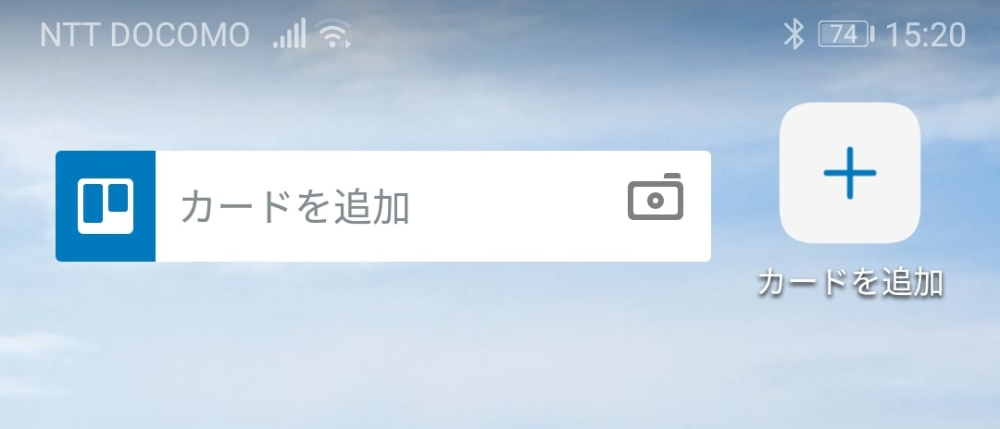
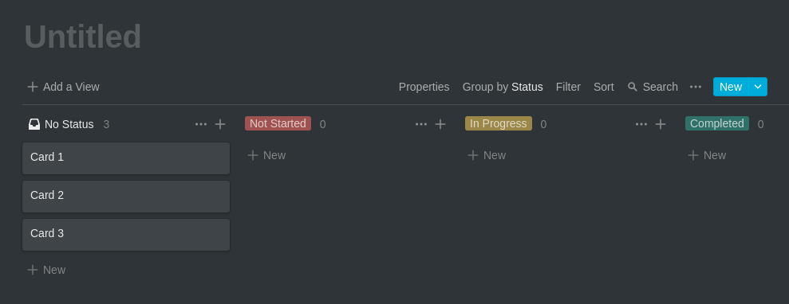
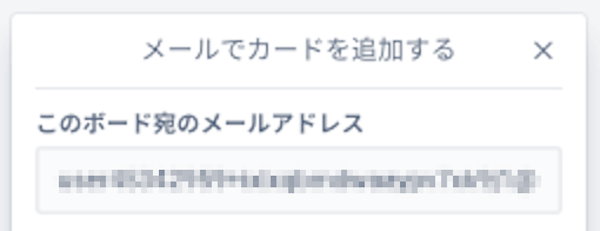

## 1. はじめに

筆者は，Trello を用いて GTD ベースのタスク管理を行っています。しかし，運用手順で不満に感じる部分が出てきたので，他ツールへの移行を検討していました。その候補の 1 つとして挙がった Notion という新しいサービスでタスク管理を試験運用しました。本記事は，試験運用中に発見したマイナスポイントについて記述します。

## 2. Android ウィジェットがない

Trello の Android アプリには，アプリを起動しなくてもホーム画面からカードを作成できるウィジェットが実装されています。しかし，Notion の Android アプリにはウィジェットが実装されていません[^1]。ウィジェットがない場合，① アプリの起動 → ② ボードの選択 → ③ カードの作成の 3 ステップが必要となります。また，他の情報が視界にノイズとして入るため記入内容を忘れる可能性があります。しかし，ウィジェットの場合は，アナログメモ帳のような感覚で瞬時にカードを作成することができます。ウィジェットの利便性に慣れている状態で，ウィジェットがない状態に戻るのはストレスになります。

[^1]: iOS アプリのウィジェットは不明

## 3. ソートがボード全体に適用される

Trello は，カンバン方式のデータ管理が可能で，Butler や [Ultimello](https://chrome.google.com/webstore/detail/ultimello-the-features-pa/hahbfgjfimnmogoinnenhheepfcphnmm) などを使用することでソート機能を実現可能です。Notion も，Trello と同様にカンバン方式のデータ管理が可能で，標準でソート機能が実装されています。しかし，Notion のソート機能は各リストではなくボード全体に適応されるため，Trello のように任意のタイミングでソートを行うことができません。期限日が付いているのタスクは期限日でソート，期限日が付いていないタスクは名前でソートするような運用ができないため運用の自由度が下がってしまいます。

## 4. メールが受信できない

Trello は，指定されたメールアドレスにメールを送信することでメールをカードとして自動変換する機能が実装されています。自動転送先のメールアドレスを Trello が指定しているメールアドレスに設定することで読み取り専用のメールクライアントとして運用することができます。これによって，複数のメールアドレスを持っている場合でもメールクライアントツールを用いることなく，メールを一括で管理することができます。しかし，Notion はメール受信機能が実装されていません。

## 5. おわりに

ここまで，Notion で行ったタスク管理の試験運用中に発見したマイナスポイントについて記述してきました。本記事で挙げたマイナスポイントは，筆者が実践しているタスク管理フローでのマイナスポイントであって，万人に当てはまるマイナスポイントではないことに注意してください。また，Notion は非常に活発にアップデートをしているため上記で挙げたマイナスポイントも，いずれは実装される可能が高いです。更に，上記で挙げたマイナスポイントを差し引いても余るほど魅力的なサービスだと感じています。今後のアップデートに伴って Trello から Notion への移行作業を引き続き行っていこうと思います。
