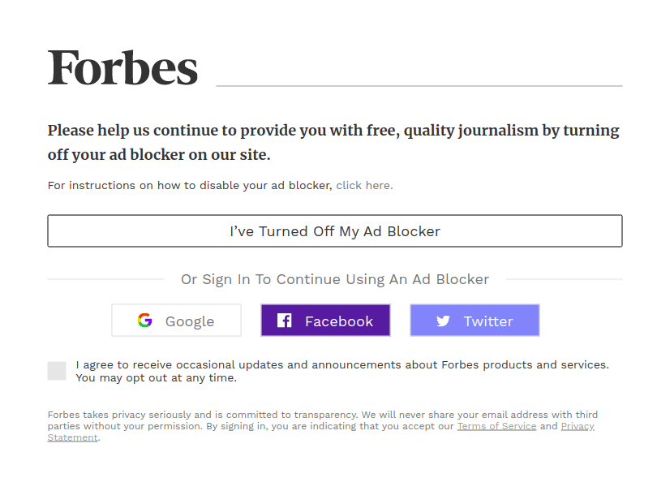
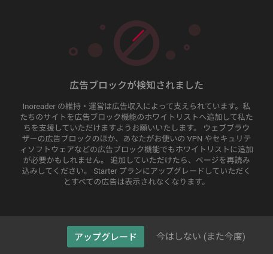

## 1. はじめに

[Adblock Plus](https://chrome.google.com/webstore/detail/adblock-plus-free-ad-bloc/cfhdojbkjhnklbpkdaibdccddilifddb?hl=ja) に代表される広告ブロックによって，ユーザーは広告を非表示にすることができるようになりました。その一方，広告によって収入を得ているサイトの運営者は，広告ブロックを使用しているユーザーを検知し，サイトを閲覧できないように対策するようになりました。本記事では，Web サイトにおける広告ブロック検知のベストプラクティスについて記述します。

## 2. 非検知型

Google AdSense などの広告を掲載している Web サイトの多くは，広告ブロックを検知を行っていません。そのため，ユーザーは通信帯域を気にすることなく快適に Web ページを閲覧することができます。しかし，広告によって収入を得ているサイトの運営者はコンテンツを完全無料で提供することになります。

## 3. 閲覧遮断型

アメリカ合衆国の経済誌である Forbes の [Web サイト](https://www.forbes.com/)では，広告ブロックを使用しているユーザーを検知し，Web ページを閲覧できないように設計されています。このような設計にすることで，広告収入が向上するように思われます。しかし，[Blockthrough](https://blockthrough.com/) の[統計データ](https://blockthrough.com/2017/02/01/adblockreport/)によると，閲覧が遮断されたユーザーの 74％ が Web サイトを去るそうです。そのため，広告ブロック検知が広告収入向上に役立つわけではないようです。

## 4. ハイブリッド型

Web サービス型の RSS リーダーである [Inoreader](https://www.inoreader.com/) では，広告ブロックを検知するポップアップは表示されますが，ポップアップを削除して Web ページを閲覧することができます。ポップアップは一定時間が経過してから再度表示されます。ユーザーとコンテンツ提供者の利益を考えた合理的な設計だと思います。

## 5. おわりに

ここまで，Web サイトにおける広告ブロック検知のベストプラクティスについて記述してきました。この記事がユーザーとコンテンツ提供者が共に広告について考える切っ掛けになれば幸いです。
