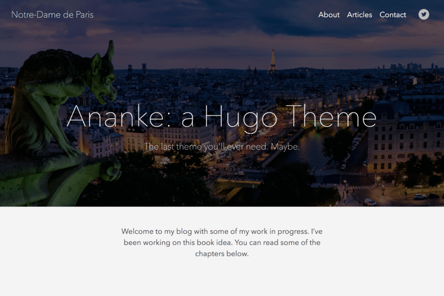
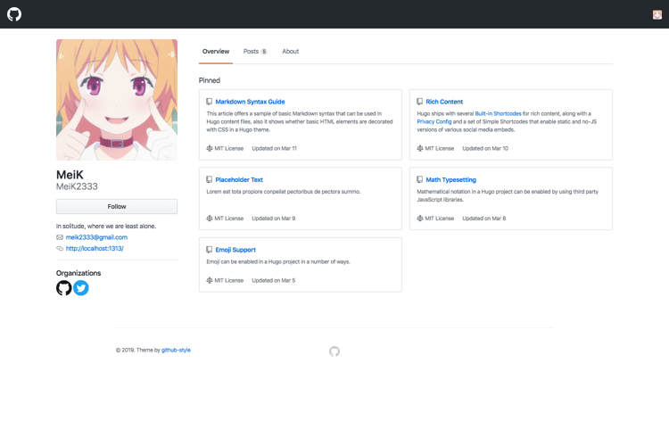
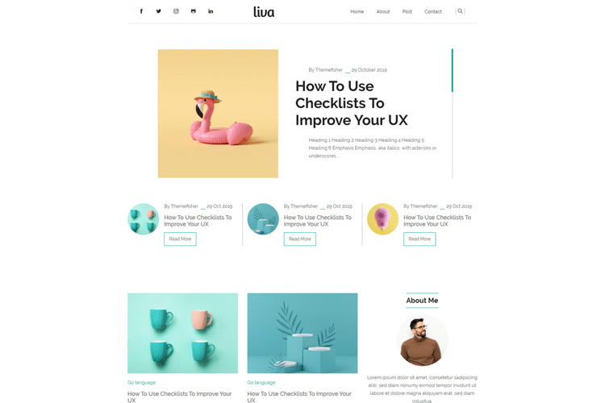
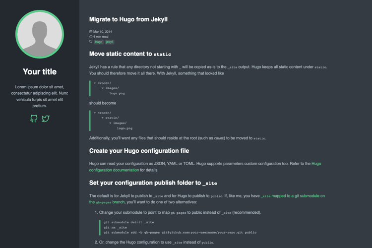
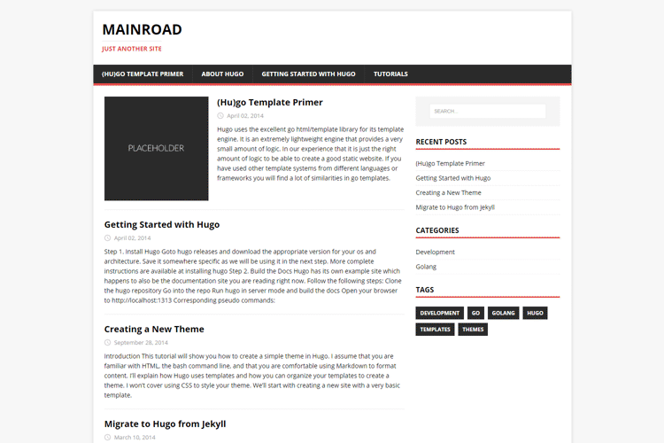
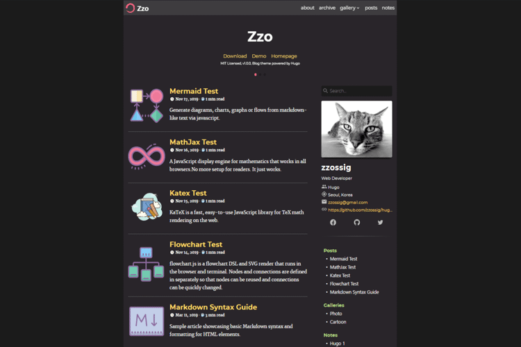

## 1. はじめに

Go 言語で実装されている静的ジェネレーターである [Hugo](https://gohugo.io/) は，ユーザーが自作したテーマを投稿することができる [
Hugo Themes](https://themes.gohugo.io/) が公式より提供されています。しかし，Hugo Themes にはレビュー機能やランキング機能が実装されていないので，自分に合ったテーマを探すのは時間がかかります。本記事では，筆者が独断と偏見で個人ブログに最適な Hugo テーマを選び，概要を記述します。

## 2. Ananke Gohugo Theme

Ananke Gohugo Theme は，シングルカラムレイアウトのテーマです。公式の[クイックスタートガイド](https://gohugo.io/getting-started/quick-start/)で採用されているベーシックな Hugo テーマでもあります。表面上は，シンプルな構成になっていますが，ブログに必要な機能は一通り実装されているので，初心者でも簡単にブログサイトを構築することができると思います。

## 3. Github Style

Github Style は，ソースコードホスティングサービスである [GitHub](https://github.com/) をオマージュした非常にユニークな Hugo テーマです。トップページは 2 カラム，記事ページはシングルカラムレイアウトで構成されています。デザインの再現度は非常に高く，GitHub に慣れているユーザーなら直感的なブラウジングができると思います。

## 4. Liva Hugo

Liva Hugo は，ホワイトとエメラルドグリーンを基調としたカラーリングで構成されている Hugo テーマです。トップページはタイルレイアウトを，記事ページはシングルカラムレイアウトを採用しています。無料で配布されているとは思えないクオリティの Hugo テーマであり，すぐにモダンなブログサイトを構築することができると思います。

## 5. m10c

m10c は，2 カラムレイアウトで左サイドバー固定を採用しているミニマムな Hugo テーマです。デフォルトでは，ダークテーマを採用していますが，_config.toml_ を書き換えることによってライトテーマにも切り替えできるそうです。初期設定もミニマリズムなデザインをされているので，初心者でも簡単にブログサイトを構築することができると思います。

## 6. Mainroad

Mainroad は，トップページと記事ページ共に 2 カラムレイアウトで構成されており，伝統的なブログデザインを採用している Hugo テーマです。見た目は伝統的なデザインですが，_config.toml_ で非常に細かい設定ができるため，初心者から上級者までカバーできる Hugo テーマになっていると思います。

## 7. Zzo

Zzo は，トップページと記事ページ共に 2 カラムレイアウトで構成されており，伝統的なブログデザインを採用している Hugo テーマです。しかし，ライトテーマとダークテーマの切り替えやダイナミックな TOC[^1] などモダンなギミックは多く実装されている Hugo テーマです。_config.toml_ も拡張性が高くデザインされているので初心者から上級者までカバーできる Hugo テーマになっていると思います。

[^1]: Table of contents の略称

## 8. おわりに

ここまで，筆者が独断と偏見で個人ブログに最適な Hugo テーマを選び，概要を記述してきました。WordPress の[テーマ](https://ja.wordpress.org/themes/browse/popular/)には質でも量でも敵いませんが，高品質なテーマが増えていると思います。また，本記事で掲載している Hugo テーマは基本的に無料で配布されていますが，商用利用など場合はライセンスに十分注意ください。
