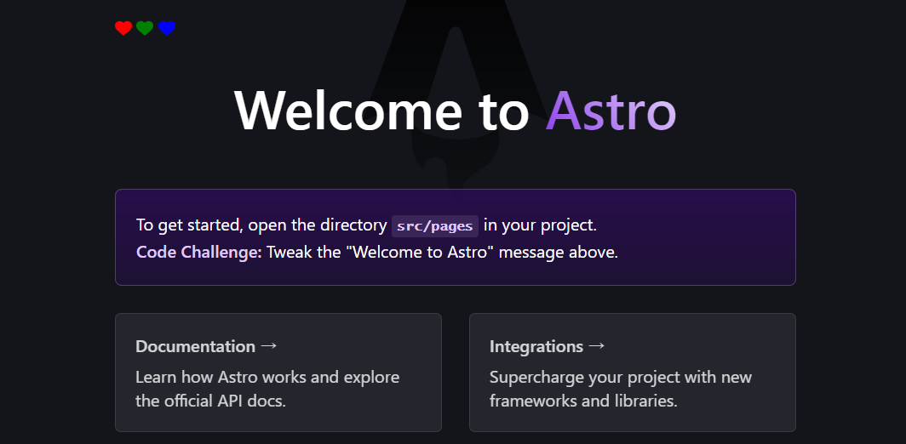

## 1. はじめに

AstroJS は、モダンな Web 開発のための Static Site Generator (SSG) です。このフレームワークは、パフォーマンスを最優先に設計されており、ページのロード時間を最小限に抑えるために、必要な JavaScript の量を削減することに焦点を当てています。AstroJS は、コンポーネントベースの開発をサポートしており、React、Vue、Svelte など、複数のフロントエンドフレームワークやライブラリで書かれたコンポーネントを 1 つのプロジェクト内で組み合わせて使用することができます。

React Icons は、React プロジェクトで使えるアイコンのライブラリです。このライブラリを使用することで、FontAwesome、Ionicons、Material Design icons などの有名なアイコンセットからアイコンを簡単にインポートして、React アプリケーション内で直接使用することができます。React Icons は、アイコンをコンポーネントとして扱うことができるため、React のコンポーネントベースのアーキテクチャにうまくフィットし、アイコンのサイズや色などのスタイリングもプロパティを通じて簡単にカスタマイズすることができます。

実現したいこととしては、AstroJS プロジェクト内で React Icons を使用することです。AstroJS は、React を公式で統合する仕組み [^1] が準備されています。そのため、統合手順に従って React を統合した後、React Icons パッケージをインストールすることで、AstroJS プロジェクト内で React Icons を使用することが出来ます。本記事では、その手順について記述します。

[^1]: @astrojs/react | Docs：https://docs.astro.build/ja/guides/integrations-guide/react/

## 2. ベースプロジェクトを準備する

以降、Node.js と Yarn がインストールされている前提で記述します。もしも、開発環境が整っていない場合は各自で準備をお願いします。Node.js に関しては AstroJS の要求 [^2] に従って、Ver.18.14.1 以上をインストールしておきます。パッケージマネージャーに関しては、npm でも pnpm でも、なんでも大丈夫です。

[^2]: Astroを自動CLIでインストール | Docs：https://docs.astro.build/ja/install/auto/

```bash
$ node -v
v20.11.0
$ yarn -v
1.22.21
```

まず初めに、ベースとなるプロジェクトを生成します。`yarn create astro` を実行すればベースプロジェクトを生成してくれます。Git Initialization だけ不要なので外していますが、基本的に Recommend を選択しています。`cd mad-magnitude/` → `yarn run dev` ベースプロジェクトを起動して http://localhost:4321/ にアクセス出来れば、ひとまず完了です。

```bash
$ yarn create astro
yarn create v1.22.21
[1/4] Resolving packages...
[2/4] Fetching packages...
[3/4] Linking dependencies...
[4/4] Building fresh packages...

success Installed "create-astro@4.7.2" with binaries:
      - create-astro
[########################################] 40/40
 astro   Launch sequence initiated.

   dir   Where should we create your new project?
         ./mad-magnitude

  tmpl   How would you like to start your new project?
         Include sample files

    ts   Do you plan to write TypeScript?
         Yes

   use   How strict should TypeScript be?
         Strict

  deps   Install dependencies?
         Yes

   git   Initialize a new git repository?
         No
      ◼  Sounds good! You can always run git init manually.

      ✔  Project initialized!
         ■ Template copied
         ■ TypeScript customized
         ■ Dependencies installed

  next   Liftoff confirmed. Explore your project!

         Enter your project directory using cd ./mad-magnitude
         Run yarn dev to start the dev server. CTRL+C to stop.
         Add frameworks like react or tailwind using astro add.

         Stuck? Join us at https://astro.build/chat

╭─────╮  Houston:
│ ◠ ◡ ◠  Good luck out there, astronaut! 🚀
╰─────╯
$ cd mad-magnitude/
$ yarn run dev
```

## 3. AstroJS と React を統合する

AstroJS と React を統合する方法は簡単です。以下のコードを実行すれば自動的にパッケージのインストールから `astro.config.mjs` の書き換えまでやってくれます。もしもマニュアルでインストールしたい場合は公式ドキュメント [^1] に掲載されているので、そちらを参照ください。

```bash
$ yarn astro add react
yarn run v1.22.21
warning package.json: No license field
$ astro add react
✔ Resolving packages...
22:52:55
  Astro will run the following command:
  If you skip this step, you can always run it yourself later

 ╭─────────────────────────────────────────────────────────────────────────────────────────────────────────────────╮
 │ yarn add @astrojs/react@^3.0.9 @types/react@^18.2.54 @types/react-dom@^18.2.18 react@^18.2.0 react-dom@^18.2.0  │
 ╰─────────────────────────────────────────────────────────────────────────────────────────────────────────────────╯

✔ Continue? … yes
✔ Installing dependencies...
22:53:07
  Astro will make the following changes to your config file:

 ╭ astro.config.mjs ─────────────────────────────╮
 │ import { defineConfig } from 'astro/config';  │
 │                                               │
 │ import react from "@astrojs/react";           │
 │                                               │
 │ // https://astro.build/config                 │
 │ export default defineConfig({                 │
 │   integrations: [react()]                     │
 │ });                                           │
 ╰───────────────────────────────────────────────╯

✔ Continue? … yes
22:53:08
   success  Added the following integration to your project:
  - @astrojs/react
22:53:08
  Astro will make the following changes to your tsconfig.json:

 ╭ tsconfig.json ──────────────────────────╮
 │ {                                       │
 │   "extends": "astro/tsconfigs/strict",  │
 │   "compilerOptions": {                  │
 │     "jsx": "react-jsx",                 │
 │     "jsxImportSource": "react"          │
 │   }                                     │
 │ }                                       │
 ╰─────────────────────────────────────────╯

✔ Continue? … yes
22:53:09
   success  Successfully updated TypeScript settings
```

## 4. React Icons をインストールする

以下のコマンドで React Icons をインストールします。

```bash
$ yarn add react-icons
```

実際に動作するか検証します。ここでは、`src/pages/index.astro` の 4 行目と 9 行目に React Icons のコードを追加して、起動します。

```js title="index.astro" {4,9}
---
import Layout from '../layouts/Layout.astro';
import Card from '../components/Card.astro';
import { FaHeart } from "react-icons/fa6";
---

<Layout title="Welcome to Astro.">
	<main>
		<FaHeart />
		<svg
			class="astro-a"
			width="495"
			height="623"
			viewBox="0 0 495 623"
			fill="none"
			xmlns="http://www.w3.org/2000/svg"
			aria-hidden="true"
		>
			<path
				fill-rule="evenodd"
```

左上にハートのアイコンが表示されれば正常に動作しています。


`<FaHeart />` は React コンポーネントなので、React プロジェクト内のコンポーネントと同じような操作が可能です。例えば、以下のようにスタイリングすることも可能です。

```jsx
<FaHeart style={{ color: 'red' }} />
<FaHeart style={{ color: 'green' }} />
<FaHeart style={{ color: 'blue' }} />
```



## 5. おわりに

ここまで、AstroJS プロジェクト内で React Icons を使用する方法について記述してきました。筆者の開発環境や上記の組み合わせでは問題なく実行することが出来ましたが、使用する環境や組み合わせによってはエラーが発生する場合があるようです。その場合は、以下のようなコードを `astro.config.mjs` に追加することで回避できるようです [^3] [^4] 。

```js title="astro.config.mjs"
import { defineConfig } from "astro/config";

// https://astro.build/config
export default defineConfig({
  ...,
  vite: {
    ssr: {
      noExternal: ["react-icons"],
    },
  },
});

```

[^3]: Build fails when using a React component with react-icons within an astro file · Issue #7629 · withastro/astro：https://github.com/withastro/astro/issues/7629
[^4]: Astroでreact-iconsを使う方法 #astro - Qiita：https://qiita.com/Ahoxa/items/fac0ca129aeb1e5dd7f2
