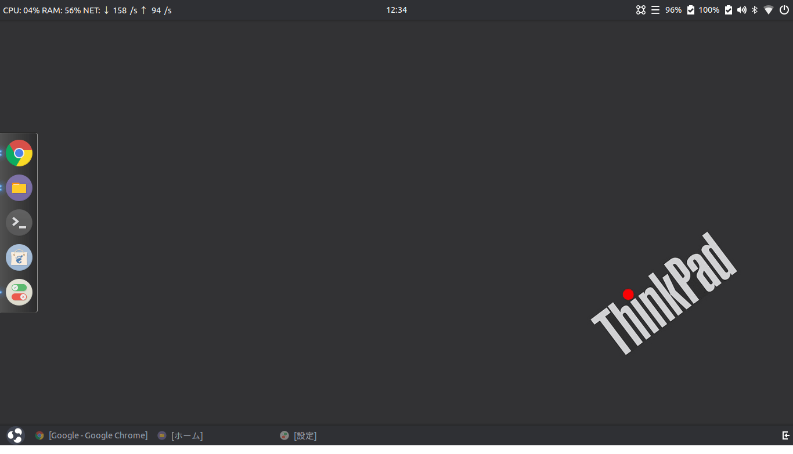
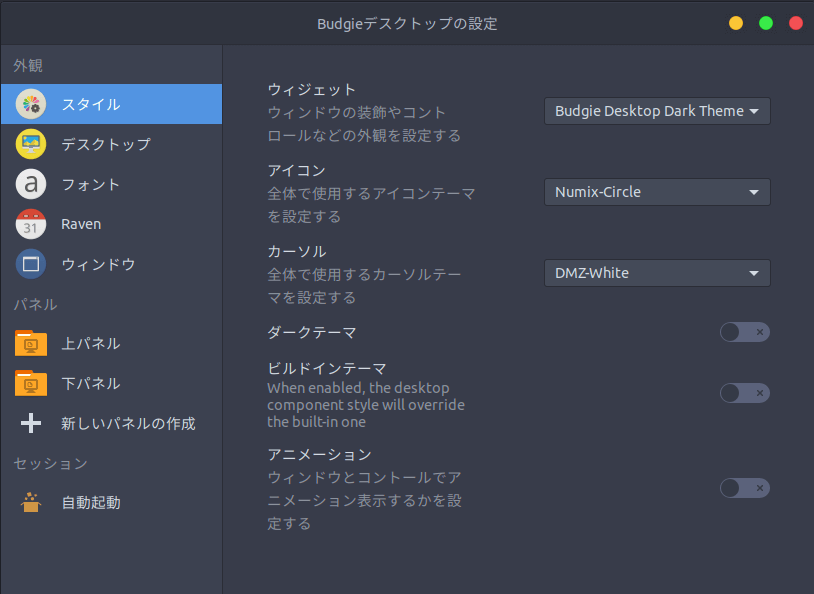
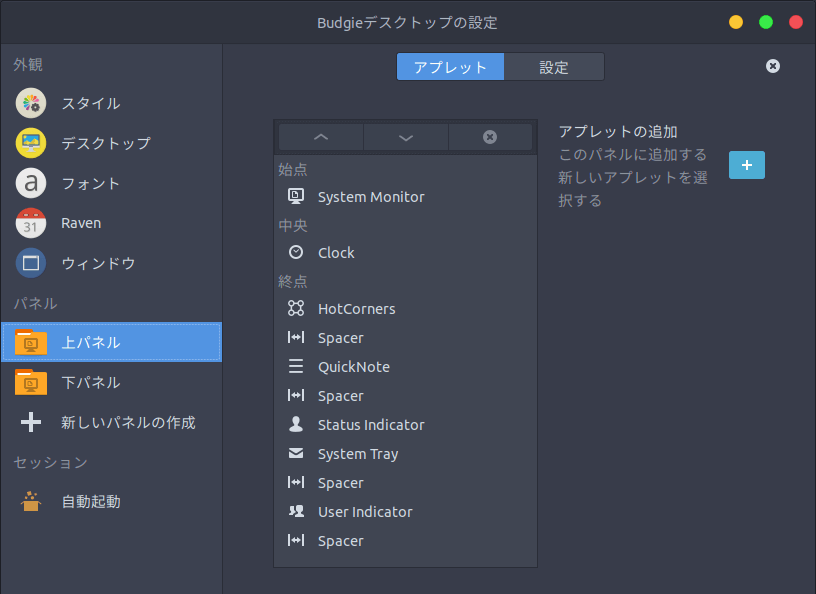

## 1. はじめに

現在，Linux のデスクトップ環境は [GNOME](https://www.gnome.org/) と [KDE](https://kde.org/) を筆頭に，GNOME から派生した [MATE](https://mate-desktop.org/) や [Cinnamon](https://cinnamon-spices.linuxmint.com/)，独立系の [Xfce](https://www.xfce.org/) や [Pantheon](https://elementary.io/) など，多種多様なものが存在しています。

その中で，筆者は Budgie Desktop を愛用していました。Budgie Desktop は，[Solus Project](https://getsol.us/) によって FLOSS で開発されているデスクトップ環境です。本記事では，Budgie Desktop の魅力と欠点を，筆者がこれまでに使用してきたデスクトップ環境と比較しながら記述していきます。

## 2. Budgie Desktop の魅力

### 2.1. デザイン性

GNOME と KDE がデスクトップ環境の二大巨頭なら，Budgie Desktop と Pantheon がデザイン性の二大巨頭だと筆者は考えています。Ubuntu Budgie の公式サイトで[スクリーンショット](https://ubuntubudgie.org/portfolio/screenshots)が公開されています。

### 2.2. ミニマム思考

Budgie Desktop の設定画面では無駄な項目は無く，必要十分な項目のみがピックアップされています。Budgie Desktop と Windows 10 の設定画面を比較すれば一目瞭然です。

### 2.3. カスタマイズ性

Cinnamon のように，パネルと Applet を組み合わせることによって表示情報を自由自在にカスタマイズすることができます。

## 3. Budgie Desktop の欠点

### 3.1. 成熟度

GNOME や KDE などに比べると，Budgie Desktop は新しいデスクトップ環境なので，少なからずバグが残っています。また，開発を行っている Solus Project は，小規模なチームです。そのため，枯れきるまでに時間がかかることが予想されます。

### 3.2. 拡張性

GNOME Shell Extensions や Cinnamon Spices のように，ユーザーが開発した Applet を配布・インストールする手段が無いので拡張性は限られている。

※ Budgie Desktop Applets という snap アプリを用いることで非公式の Applet をインストール出来るが，ユーザーが配布できる機能は無い

## 4. おわりに

ここまで，Budgie Desktop の魅力と欠点について記述してきました。非常に魅力的なデスクトップ環境ではあるものの，最近は Solus Project の前リーダーが消息不明になった影響が大きく，コミュニティ全体が停滞している印象を受けます。FLOSS にとって開発コミュニティの停滞は致命的な要因のため，現在は Zorin OS に移行しています。
