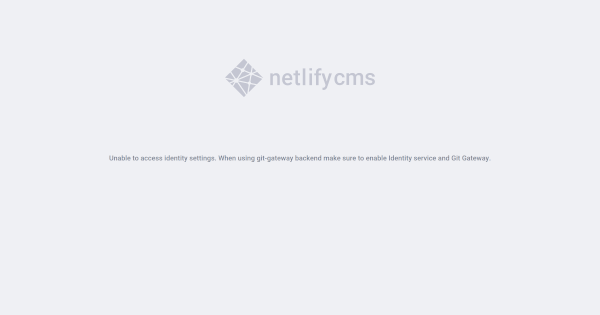
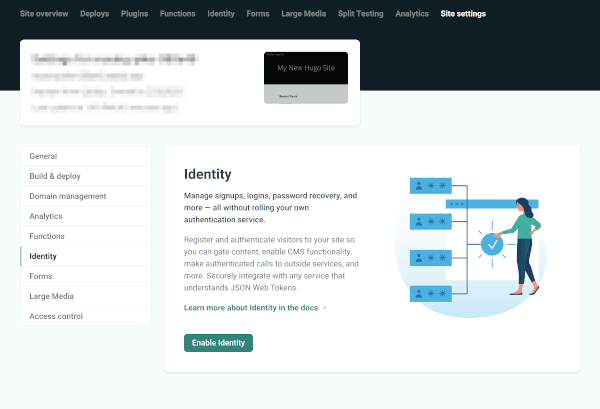
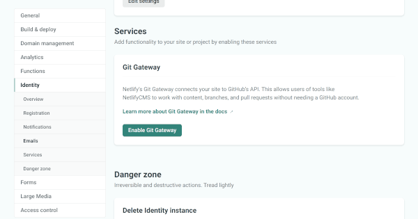
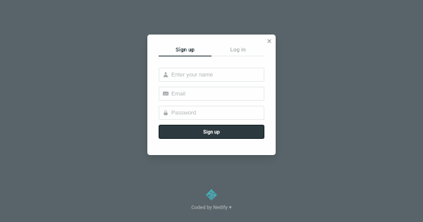
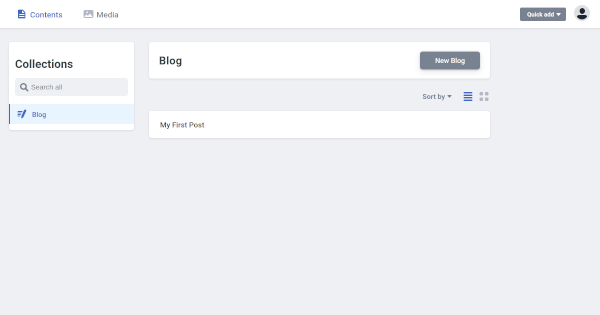
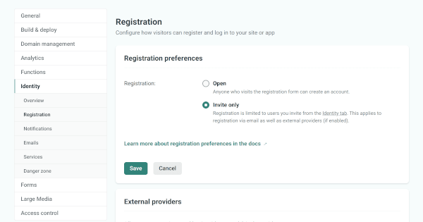

## 1. はじめに

[Netlify CMS](https://www.netlifycms.org/) は，Netlify 社が提供する Headless CMS です。Netlify CMS を用いることで，Gatsby や Hugo などの静的サイトジェネレーターを WordPress ような CMS で運用することが出来ます。本記事では，Netlify CMS の[ドキュメント](https://www.netlifycms.org/docs/hugo/)に従って，既存の Hugo テーマを Netlify CMS に対応させる手順を記述します。

本記事で行う作業は，Hugo Ver.0.80.0 と Zorin OS 15 Core (Ubuntu 18.04 LTS) の環境下で実行したものです。また，Netlify と GitHub を活用します。これらのソフトやサービスの初期設定は完了済みの前提で記述しており，設定手順などは割愛していることを，ご了承下さい。

## 2. 雛形作成

まず初めに，(1) Hugo の[クイックスタートガイド](https://gohugo.io/getting-started/quick-start/)に従って Netlify CMS に対応させる Hugo テーマを作成します。(2) [Host on Netlify](https://gohugo.io/hosting-and-deployment/hosting-on-netlify) を参考に，Netlify の設定ファイルである _netlify.toml_ を作成します。 (3) (1) と (2) で作成した Hugo テーマを GitHub にコミットし，[Host on Netlify](https://gohugo.io/hosting-and-deployment/hosting-on-netlify) を参考に GitHub と Netlify の連携，Hugo テーマのビルドを行います。

```bash
# (1)
$ hugo new site quickstart
$ cd quickstart
$ git init
$ git submodule add https://github.com/budparr/gohugo-theme-ananke.git themes/ananke
$ echo 'theme = "ananke"' >> config.toml
$ hugo new posts/my-first-post.md

# (2)
$ touch netlify.toml

$ tree -L 3
.
├── README.md
├── archetypes
│   └── default.md
├── config.toml
├── content
│   └── posts
│       └── my-first-post.md
├── data
├── layouts
├── netlify.toml
├── static
└── themes
    └── ananke
        ├── CHANGELOG.md
        ├── (省略)
        └── theme.toml
```

上記の手順を行うことで，Hugo テーマが Netlify 上でビルドされます。しかし，2 点ほど注意することがあります。

1 つ目は，_my-first-post.md_ の draft を false に設定する点です。Hugo の[クイックスタートガイド](https://gohugo.io/getting-started/quick-start/) では，my-first-post.md の draft が true に設定されているため，この状態ではビルドされないので注意が必要です。

2 つ目は，_config.toml_ の baseURL を Netlify が発行する URL に置換する点です。デフォルトの状態では http://example.org/ が設定されていますが，この状態ではファイルの読み込みエラーが発生するため，置換が必要です。

```markdown {hl_lines=[6]}
<!-- my-first-post.md -->

---

title: "My First Post"
date: 2019-03-26T08:47:11+01:00
draft: false

---
```

```toml {hl_lines=[3]}
# config.toml

baseURL = "https://xxx.netlify.app/"
languageCode = "en-us"
title = "My New Hugo Site"
theme = "ananke"
```

```toml
# netlify.toml

[build]
publish = "public"
command = "hugo --gc --minify"

[context.production.environment]
HUGO_VERSION = "0.80.0"
HUGO_ENV = "production"
HUGO_ENABLEGITINFO = "true"

[context.split1]
command = "hugo --gc --minify --enableGitInfo"

[context.split1.environment]
HUGO_VERSION = "0.80.0"
HUGO_ENV = "production"

[context.deploy-preview]
command = "hugo --gc --minify --buildFuture -b $DEPLOY_PRIME_URL"

[context.deploy-preview.environment]
HUGO_VERSION = "0.80.0"

[context.branch-deploy]
command = "hugo --gc --minify -b $DEPLOY_PRIME_URL"

[context.branch-deploy.environment]
HUGO_VERSION = "0.80.0"

[context.next.environment]
HUGO_ENABLEGITINFO = "true"
```

## 3. ファイル追加

Netlify CMS の[ドキュメント](https://www.netlifycms.org/docs/hugo/)に従って，上記の 2 章で作成した Hugo テーマ (Ananke) を Netlify CMS に対応させる手順について記述します。まず初めに，_static_ ディレクトリの直下に _admin_ ディレクトリを作成します。作成した admin ディレクトリの直下に，_index.html_ と _config.yml_ を作成します。

```bash {hl_lines=[19,20]}
$ mkdir static/admin
$ touch static/admin/index.html
$ touch static/admin/config.yml

$ tree -L 3
.
├── README.md
├── archetypes
│   └── default.md
├── config.toml
├── content
│   └── posts
│       └── my-first-post.md
├── data
├── layouts
├── netlify.toml
├── static
│   └── admin
│       ├── config.yml
│       └── index.html
└── themes
    └── ananke
        ├── CHANGELOG.md
        ├── (省略)
        └── theme.toml
```

本記事で採用している Hugo テーマである Ananke は，_content/posts_ 直下の Markdown を記事としてビルドします。しかし，Netlify CMS の[ドキュメント](https://www.netlifycms.org/docs/hugo/)に記載されている _config.yml_ は，_content/blog_ を読み込む設定になっています。そのため，_content/blog_ を _content/posts_ に変更します。

```html
<!-- index.html -->

<!doctype html>
<html>
  <head>
    <meta charset="utf-8" />
    <meta name="viewport" content="width=device-width, initial-scale=1.0" />
    <title>Content Manager</title>
    <!-- Include the script that enables Netlify Identity on this page. -->
    <script src="https://identity.netlify.com/v1/netlify-identity-widget.js"></script>
  </head>
  <body>
    <!-- Include the script that builds the page and powers Netlify CMS -->
    <script src="https://unpkg.com/netlify-cms@^2.0.0/dist/netlify-cms.js"></script>
  </body>
</html>
```

```yml {hl_lines=[11]}
# config.yml

backend:
  name: git-gateway
  branch: master # Branch to update (optional; defaults to master)
media_folder: static/img
public_folder: /img
collections:
  - name: 'blog'
    label: 'Blog'
    folder: 'content/posts'
    create: true
    slug: '{{year}}-{{month}}-{{day}}-{{slug}}'
    editor:
      preview: false
    fields:
      - { label: 'Title', name: 'title', widget: 'string' }
      - { label: 'Publish Date', name: 'date', widget: 'datetime' }
      - { label: 'Description', name: 'description', widget: 'string' }
      - { label: 'Body', name: 'body', widget: 'markdown' }
```

デプロイした後，https://xxx.netlify.app/admin/ にアクセスすると _Login with Netlify Identity_ というボタンが表示されます。しかし，ログインしようとすると _Unable to access identity settings. When using git-gateway backend make sure to enable Identity service and Git Gateway._ というエラーメッセージが表示されます。このエラーメッセージは，次章で解決します。



## 4. 設定変更

Netlify の設定を変更します。まず初めに，_Site settings_ → _Identity_ に移動し，_Enable Identity_ をクリックします。



次に，_Site settings_ → _Identity_ → _Services_ → _Git Gateway_ に移動し，_Enable Git Gateway_ をクリックします。



## 5. 動作確認

<!-- #confirmation_token=5YPVbl1jbcMNhk-4mkZqNA -->

上記の設定完了後，https://xxx.netlify.app/admin/ にアクセスし，_Login with Netlify Identity_ をクリックすると，_Sign up_ と _Log in_ モーダルが表示されます。名前，メールアドレス，パスワードを入力し，Netlify CMS 用のアカウントを作成します。注意ですが，Netlify と Netlify CMS は異なるため，Netlify のアカウント情報を入力してもログインは出来ません。



確認メールのメール内に *https://xxx.netlify.app/#confirmation_token=xxx* と記述されていると思います。しかし，メールに記述されている URL を叩いても認証が完了しません。認証を完了させるには，*https://xxx.netlify.app/admin/#confirmation_token=xxx* にアクセスする必要があります。認証完了後，*https://xxx.netlify.app/admin/* にアクセスし，ログインすると以下な管理画面が表示されます。



## 6. セキュリティ強化

ここまでの作業で，既存の Hugo テーマ (Ananke) を Netlify CMS に対応させることが出来ました。しかし，現状の設定では誰でも Sign up 可能な状態であり，セキュリティの側面から好ましくありません。そのため，_Site settings_ → _Identity_ → _Registration_ → _Registration preferences_ の設定を _Invite only_ に設定します。この設定よって，Sign up モダールが表示されなくなります。



## 7. おわりに

ここまで，既存の Hugo テーマを Netlify CMS に対応させる手順を記述してきました。本記事では，[Platform Guides Hugo](https://www.netlifycms.org/docs/hugo/) に記載されている _config.yml_ を，ほぼデフォルトと状態で使用しました。非常に細かくカスタマイズすることが可能です。詳しくは [Configuration Options](https://www.netlifycms.org/docs/configuration-options/) を参照してみてください。
