## 1. はじめに

みなさんは、どのようなパソコン環境を構築しているでしょうか。人それぞれ、作業の種類や作業する場所によって、様々な組み合わせがあると思います。例えば、ブラウザを使った調べ物や Microsoft Office を使った資料作りなど、負荷が低い作業が多く、外出先でも作業することが多い人なら、ノートパソコンをメインで使うことが多いと思います。一方で、負荷が高いパソコンゲームやメディアクリエイトが主な作業で、基本的に自宅で作業する人なら、デスクトップパソコンをメインで使うことが多いと思います。また、最近だと自宅ではデスクトップパソコンを使って、外出先ではノートパソコンを使うハイブリッドな組み合わせも増えていると思います。

筆者は、研究でデータ分析 + シミュレーションを、プライベートでパソコンゲーム (最近は FINAL FANTASY XIV と Monster Hunter: World が多い) をプレイするので、そこそこ高負荷な作業が多いです。また、作業場所の制約でいうと、大半は自宅と研究室の往復で、年に数回程度、出張と帰省があるというな状況です。そのため、要求としては色々な場所で、そこそこ高負荷な作業が出来るという環境構築を目指しています。本記事では、そんな筆者がこれまでに試してきたパソコンの構成内容と執筆時点の最適解について記述しています。

## 2. デスクトップパソコン

最もシンプルな解決策は、デスクトップパソコンを導入することでした。当たり前ですが、デスクトップパソコンは現実的に持ち運べないので、外出先で作業することが出来ませんでした。そこで、少々力業ではありますが、自宅と研究室にデスクトップパソコンを導入しました。この構成で、大体の問題は解決するのですが、2 点ほど問題が残っていました。1 点目は、年に数回、出張や帰省する際に作業が出来ない。2 点目は、データの同期が面倒くさい。普通のファイルであれば、Google Drive などのクラウドサービスを介して同期すれば問題ないのですが、ソフトウェアの設定は、そうはいきません。Google Chrome や Visual Studio Code などであれば設定の同期機能が搭載されていますが、研究で使うようなソフトウェアは、そのような気の利いた機能はありません。マニュアルで設定を同期するか、Git などを使って設定を同期するなどの工夫が必要になり、非常に面倒くさいです。

## 3. ノートパソコン

デスクトップパソコンの欠点である、ポータビリティとデータの同期を解決するために、ハイエンドなノートパソコンで統一する方法も試しました。これによって、どこにでも持ち運びが可能になり、データはノートパソコン内で統一されるので、データの同期について考えなく良くなりました。その一方で、ハイエンドなノートパソコンは、本体と充電器が巨大な傾向があり、デスクトップパソコンと比較すると持ち運びは現実的ですが、一般的なノートパソコンと比較すると快適とは言えませんでした。

## 4. ノートパソコン + eGPU

ノートパソコン + eGPU の組み合わせも検討してみました。Razer Core X などのデスクトップ向け GPU を使うタイプの eGPU だと、外出先で高負荷な作業が行えないので除外します。検討対象としては、GPD G1 などの内蔵型 eGPU です。GPD G1 は、本体重量が約 920g なので持ち運びも現実的です。また、NVIDIA GeForce RTX 3070 相当のパフォーマンスを得ることが出来います。懸念点としては、USB4 に対応したパソコンが必要な点と将来性です。特に、将来性という点では、eGPU 自体が Thunderbolt の登場によって開拓された新しい技術なので、まだまだ種類は少なく価格は高いという状況です。今後に期待したい技術ではありますが、投資するには懸念点が多い技術であるというのが個人的な評価です。

## 5. デスクトップパソコン + ノートパソコン

自宅ではデスクトップパソコンを使い、外出先ではノートパソコンを使うハイブリッドな組み合わせも考えられます。しかし、この組み合わせも、外出先では高負荷な作業が行えない問題とデータの同期が面倒くさい問題は解決されません。ハイエンドなノートパソコンを導入すれば、外出先で高負荷な作業が行えないという問題は解決できるように見えますが、上記で述べたハイエンドなノートパソコンに対する欠点にデータの同期問題が追加されるだけなのでナンセンスです。

## 6. リモートデスクトップ

ここまでは、ハードウェアの組み合わせで問題を解決しようとしてきました。しかし、それでは限界があると感じたので、ある時点からソフトウェアも考慮した環境構築を行うようになりました。その 1 つとして、様々なリモートデスクトップソフトウェアを試してきました。代表的なものとしては、Virtual Network Computing や Microsoft Remote Desktop、Chrome Remote Desktop などが挙げられます。

ハードウェアの構成で説明すると、デスクトップパソコンをサーバーとして自宅ネットワーク内に配置します。データの保管や処理は、このデスクトップパソコン上で行います。そのため、ノートパソコンにスペックやストレージは最低限で良く、シンクライアント状態で運用します。あとは、外部ネットワークからアクセス可能な状態にしておけば、自宅でも外出先でも同じ状態で高負荷な作業が行える環境が構築出来るという寸法です

しかし、上記で挙げたようなリモートデスクトップソフトウェアではラグが大きく、ゲームはおろかプログラミングのような作業でも使い続けるのは難しいと感じました。しかし、2023 年に [Parsec](https://parsec.app/) と出会ったことで、リモートデスクトップソフトウェアに対する評価が大きく変わることとなりました。Parsec は、元々ゲームをリモートプレイするために開発されたソフトウェアであり、非常に低遅延です。ローカルネットワーク環境だと、レイテンシーが 10～20ms 程度です。60FPS ≒ 0.0166sec = 16.6ms で考えると 1F 程度の遅延です。外出先でも 20～40ms 程度であり、2F 程度の遅延です。競技レベルのゲームは厳しいですが、大体の作業はストレスなく出来るレベルだと思います。この Parsec を導入したことによって、かなり理想的なパソコン環境に近づきました。もちろん、まだまだ課題が残されています。

- [ ] Linux をホストにすることが出来ない
- [ ] Windows の再起動でスタートアップがコケるとアクセス出来ない
- [ ] アクセスにインターネット環境が必須である
- [ ] デスクトップパソコンはサーバー運用なので電気代がかかる
- [ ] ホスト OS の Windows がスリープするとアクセス出来ない
- [ ] 低遅延だが遅延はある

## 7. Proxmox VE

Parsec を使った運用でも、細かい課題が残っています。例えば、Parsec 自体は Windows 上で動くソフトウェアなので、Windows 自体がスリープ状態に移行するとアクセスすることが出来ません。また、Windows 11 Home では強制アップデートなどで再起動がかかります。その際に Parsec が正常にスタートアップしないと、これもアクセス出来ません。ここまで記述したように、サーバー運用に慣れていないと Parsec が立ち上がらずリモートからアクセス出来ない状況が多々あります。解決策として、[SwitchBot Plug Mini](https://www.switchbot.jp/products/switchbot-plug-mini) を導入しておいて、リモートで接続出来なくなった場合は強制シャットダウンをかけるという力業もあったりします。流石にハードウェアに負担がかかるので、この方法は、あまり使いたくはないです。

そこで、筆者は [Proxmox VE](https://pve.proxmox.com/) という仮想化ソフトウェアを導入しています。Proxmox VE を導入することで、Web 上で Windows を操作することが可能になり、以下のようなトラブルシューティングが簡単になります。

- [x] Windows の再起動でスタートアップがコケるとアクセス出来ない
- [x] ホスト OS の Windows がスリープするとアクセス出来ない

また、Parsec では Linux のホスト化は対応していませんが、Proxmox VE 上に Linux をインストールしてやることで、リモートアクセスすることが出来ます。流石に、Proxmox VE が対応しているプロトコルが VNC と SPICE なので、遅延は大きいです。

## 8. おわりに

ここまで、理想のパソコン環境を追求してきた軌跡について記述してきました。簡単にまとめると、現在は Parsec + Proxmox VE を中心とした環境に落ち着いているという報告です。もちろん、この構成は現在の最適解であるため、数年後に eGPU を中心とした構成に移行している可能性もあります。

また、リモートデスクトップソフトウェアである以上、物理的な接続と比較すると低遅延とはいえ遅延がある点と、アクセスにインターネット環境が必須である点は避けては通れませが、筆者が行う作業程度だとストレスフリーです。また、筆者が訪れる場所も基本的にインターネット環境があるので問題になりません。また、この辺りは NTT の [IOWN](https://www.rd.ntt/iown/) 構想などが普及してくれば徐々に解決されるだろうと思っています。

国内では、このような構成で運用している人が少ないと感じているので、1 運用サンプルとして、本記事が誰かの役に立てば幸いです。
