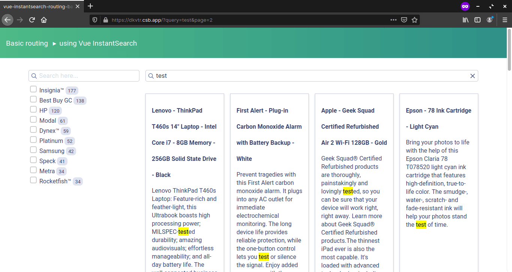

## 1. はじめに

Algolia の Vue InstantSearch は，1 文字入力するたびに画面遷移を行うリアルタイム検索を簡単に実現することができます。しかし，日本語の場合はリアルタイム検索がユーザーのストレスになる場合があります。そこで，本記事ではリアルタイム検索から文字を入力し終わってからクリックする任意検索に切り替える方法について記述します。

## 2. 開発環境構築

本記事では，CodeSandbox に公開されている[サンプルコード](https://codesandbox.io/embed/github/algolia/doc-code-samples/tree/master/Vue+InstantSearch/getting-started)を使用します。ローカルに開発環境を構築する場合は，[Getting Started](https://www.algolia.com/doc/guides/building-search-ui/getting-started/vue/) に記述されている手順に従って開発環境を構築します。以下のような画面が表示されれば正常に実行されています。



## 3. 実装作業

_App.vue_ の 24 行目が検索を担当しているコンポーネントです。ais-search-box の [Customize the UI](https://www.algolia.com/doc/api-reference/widgets/search-box/vue/#customize-the-ui) より，以下のコードに置き換えることができます。重要なのは，ハイライトしている部分です。_refine_ メソッドが検索を担当するメソッドです。その，_refine_ メソッドが _input_ イベントと紐付けることでリアルタイム検索を実装しています。

```html {hl_lines=[10]}
<ais-search-box placeholder="Search here…" class="searchbox" />

↓

<ais-search-box>
  <div slot-scope="{ currentRefinement, isSearchStalled, refine }">
    <input type="search" v-model="currentRefinement" @input="refine($event.currentTarget.value)" />
    <span :hidden="!isSearchStalled">Loading...</span>
  </div>
</ais-search-box>
```

そのため，リアルタイム検索から任意検索に切り替えるためには _input_ イベントから _change_ イベントに書き換えることで実現できます。_v-model_ と _change_ イベントを同一のタグに含めるのはアンチパターンとされていますが，本記事では保留とします。

```html
@input="refine($event.currentTarget.value)" ↓ @change="refine($event.currentTarget.value)"
```

## 4. おわりに

ここまで，Algolia の Vue InstantSearch においてリアルタイム検索から任意検索に切り替える方法について記述してきました。任意検索は UX の改善には繋がる可能性があります。しかし，Algolia Analytics の精度は落ちることが予想されるので注意が必要です。
