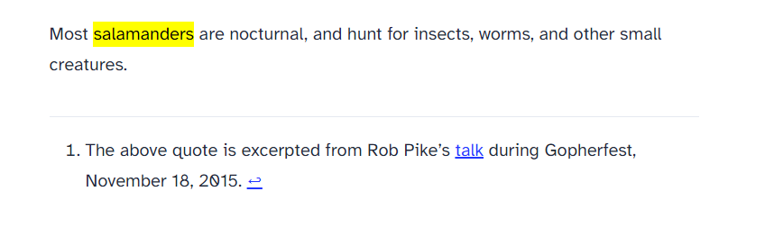

## 1. はじめに

AstroJS では、標準で remark-gfm が組み込まれています [^3] 。そのため、Markdown 内に Footnote を定義することが出来ます。しかし、標準設定だと `h2` タグや`Footnotes` テキストが出力されたりと、扱いにくい部分があります。そこで、本記事では AstroJS で生成される Footnote をカスタマイズする方法について記述します。また、本記事は Node.js と Yarn がインストール済みの前提で記述しています。

[^3]: Astro Docs, Markdown & MDX, Configuring Markdown and MDX：https://docs.astro.build/en/guides/markdown-content/#configuring-markdown-and-mdx

```bash
$ node -v
v20.11.0
$ yarn -v
1.22.21
```

## 2. テンプレート

本記事では、検証用として AstroJS 公式が配布している **blog template** を使用します。`yarn create astro` でインストールして、`yarn run dev` で起動します。ローカルササーバーが起動したら、Footnote が定義されている http://localhost:4321/blog/markdown-style-guide/ に移動します。

```bash
$ yarn create astro
yarn create v1.22.21
[1/4] Resolving packages...
[2/4] Fetching packages...
[3/4] Linking dependencies...
[4/4] Building fresh packages...
success Installed "create-astro@4.7.2" with binaries:
      - create-astro
[########################################] 40/40
 astro   Launch sequence initiated.

   dir   Where should we create your new project?
         ./tender-trappist

  tmpl   How would you like to start your new project?
         Use blog template

    ts   Do you plan to write TypeScript?
         Yes

   use   How strict should TypeScript be?
         Strict

  deps   Install dependencies?
         Yes

   git   Initialize a new git repository?
         No
      ◼  Sounds good! You can always run git init manually.

      ✔  Project initialized!
         ■ Template copied
         ■ TypeScript customized
         ■ Dependencies installed

  next   Liftoff confirmed. Explore your project!

         Enter your project directory using cd ./tender-trappist
         Run yarn dev to start the dev server. CTRL+C to stop.
         Add frameworks like react or tailwind using astro add.

         Stuck? Join us at https://astro.build/chat

╭─────╮  Houston:
│ ◠ ◡ ◠  Good luck out there, astronaut! 🚀
╰─────╯
$ cd tender-trappist
$ yarn run dev
```

http://localhost:4322/blog/markdown-style-guide/ の HTML を確認すると、以下のような Footnote が出力されていると思います。

```html
<section data-footnotes="" class="footnotes">
  <h2 class="sr-only" id="footnote-label">Footnotes</h2>
  <ol>
    <li id="user-content-fn-1">
      <p>
        The above quote is excerpted from Rob Pike’s
        <a href="https://www.youtube.com/watch?v=PAAkCSZUG1c">talk</a> during Gopherfest, November 18, 2015.
        <a
          href="#user-content-fnref-1"
          data-footnote-backref=""
          aria-label="Back to reference 1"
          class="data-footnote-backref"
          >↩</a
        >
      </p>
    </li>
  </ol>
</section>
```

## 3. カスタマイズ

Footnote は、`astro.config.mjs` の markdown.remarkRehype [^1] を編集することで、カスタマイズすることが出来ます。代表的な設定項目のデフォルト値を明記すると、以下のようなコードになります。

[^1]: Astro Docs,Configuration Reference,markdown.remarkRehype：https://docs.astro.build/ja/reference/configuration-reference/#markdownremarkrehype

```js title="astro.config.mjs" {4-12}
export default defineConfig({
  site: 'https://example.com',
  integrations: [],
  markdown: {
    remarkRehype: {
      footnoteBackContent: '↩',
      footnoteBackLabel: 'Back to reference 1',
      footnoteLabel: 'Footnotes',
      footnoteLabelProperties: { className: ['sr-only'] },
      footnoteLabelTagName: 'h2',
    },
  },
})
```

`Footnotes` と `sr-only` を削除し、`h2` タグから `hr` タグに変更するようなカスタマイズをすると、以下のようなコードになります。

```js title="astro.config.mjs" {8-10}
export default defineConfig({
  site: 'https://example.com',
  integrations: [],
  markdown: {
    remarkRehype: {
      footnoteBackContent: '↩',
      footnoteBackLabel: 'Back to reference 1',
      footnoteLabel: ' ',
      footnoteLabelProperties: { className: [''] },
      footnoteLabelTagName: 'hr',
    },
  },
})
```

Web ブラウザで確認すると、以下のように出力されると思います。



上記では、代表的な設定項目のみを明記しています。他の設定項目について詳しく知りたい場合は、remark-rehype の公式ドキュメント [^2] を参照ください。

[^2]: Github, remarkjs/remark-rehype：https://github.com/remarkjs/remark-rehype

## 4. おわりに

ここまで、AstroJS で生成される Footnote をカスタマイズする方法について記述してきました。筆者が、unified (remark, rehype) について勉強不足だったので、思いの外、時間を費やしてしまいました。GatsbJS を採用していた頃に、キチンと勉強しておくべきだったと反省しています。
