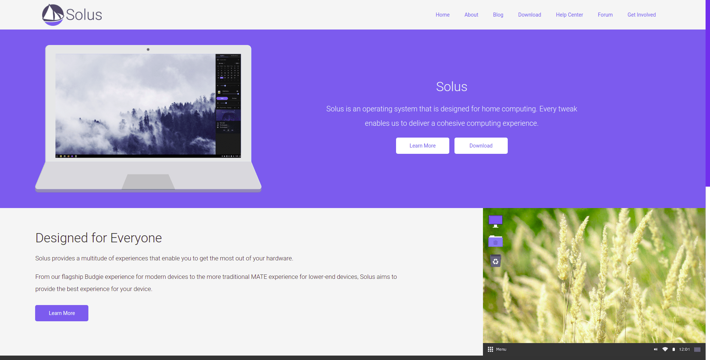
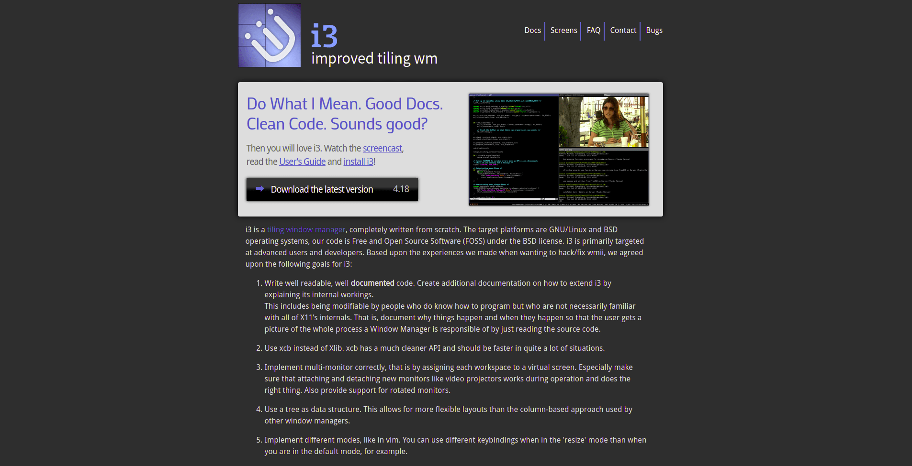
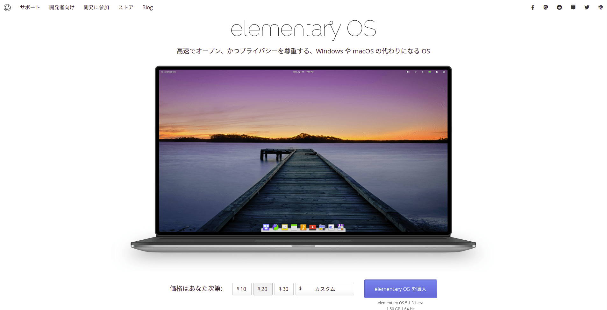
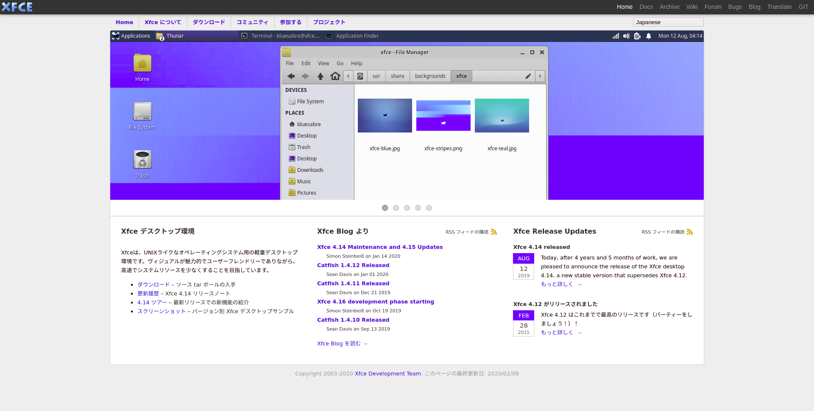
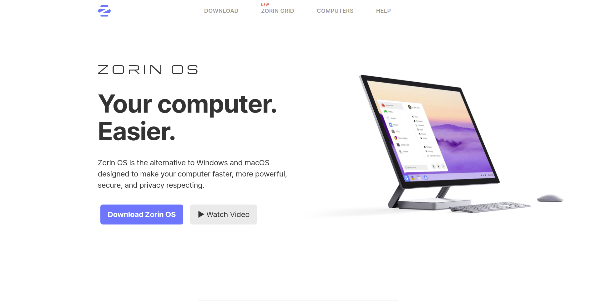

## 1. はじめに

Linux の魅力として，ユーザーが好きなデスクトップ環境を選べる点が挙げられます。代表的な Linux のデスクトップ環境として GNOME と KDE が挙げられます。GNOME と KDE 以外にも，様々な[デスクトップ環境](https://wiki.archlinux.jp/index.php/%E3%83%87%E3%82%B9%E3%82%AF%E3%83%88%E3%83%83%E3%83%97%E7%92%B0%E5%A2%83)が開発されています。数多くのデスクトップ環境が存在するため，その中から自分に合ったデスクトップ環境を見つけるには時間がかかります。そこで，本記事では筆者がこれまでに試してきた Linux デスクトップ環境の中から，エレガントで美しいと感じたオススメの Linux デスクトップ環境を 5 つに厳選して紹介します。

## 2. Budgie Desktop

Budgie Desktop は，Solus Project が主導で開発，保守しているデスクトップ環境です。シンプルかつエレガントなデザインに，適度なカスタマイズ性を兼ね備えたデスクトップ環境です。元々は，独自系の Linux である Solus のデスクトップ環境として開発されていましたが，Ubuntu に Budgie Desktop を移植した [Ubuntu Budgie](https://ubuntubudgie.org/) なども登場しています。

## 3. i3wm

i3wm は， FLOSS で開発されているタイル型ウィンドウマネージャです。スタック型ウィンドウマネージャに慣れているユーザーは，タイル型ウィンドウマネージャ独特の操作に慣れるまで時間がかかりますが，慣れてくるとスタック型ウィンドウマネージャでは味わえない操作感を味わえます。また，本記事で紹介するデスクトップ環境の中で最も軽量であり，低スペックなマシンでも快適に動作します。しかし，外部出力 (モニターやプロジェクター) する際に不具合が発生する場合があるため，頻繁に外部出力するマシンにインストールすることはオススメできません。

## 4. Pantheon

Pantheon は，elementary OS に組み込まれているデスクトップ環境です。macOS ライクなデザイン設計になっており，Windows や macOS の代用を謳っています。デフォルト設定で，すぐに使用できる設計になっており，初心者にも優しいデスクトップ環境だと思います。しかし，カスタマイズ性が非常に低いため，カスタマイズを楽しみたいユーザーにはオススメできません。

## 5. Xfce

Xfce は，FLOSS で開発されている軽量なデスクトップ環境です。本記事で紹介するスタック型ウィンドウマネージャの中では最も軽量なデスクトップです。Ubuntu や Arch Linux を始めとした様々な Linux ディストリビューションに移植されており，軽量デスクトップ環境の中ではトップクラスに愛用ユーザーが多いデスクトップ環境でもあります。

## 6. Zorin OS

Zorin OS は，正確には Ubuntu ベースの Linux ディストリビューションを指す言葉であり，デスクトップ環境を指す言葉ではありません。Zorin OS Core に組み込まれているデスクトップ環境は GNOME をカスタマイズしたデスクトップ環境であり，非常にクオリティの高いデスクトップ環境です。カスタマイズ性は Budgie Desktop と Pantheon の中間ほどであり，カスタマイズ性が高いとは言えませんが，ユーザーフレンドリーなデザイン設計は万人にオススメできるデスクトップ環境です。

## 7. おわりに

ここまで，筆者がこれまでに試してきた Linux デスクトップ環境の中から，エレガントで美しいと感じたオススメの Linux デスクトップ環境を 5 つに厳選して紹介してきました。冒頭でも述べましたが，ユーザーが好きなデスクトップ環境を選べるのは，Linux を使用する醍醐味の一つだと思います。本記事で紹介した Linux のデスクトップ環境で，使用したことがないものがあれば，ぜひ試してみて下さい。
