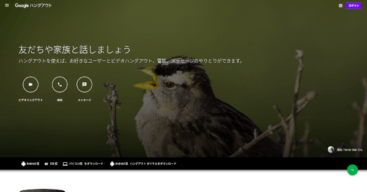
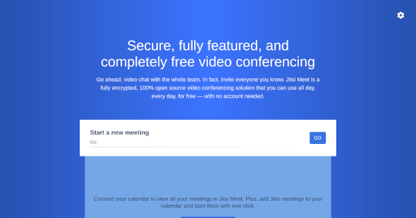
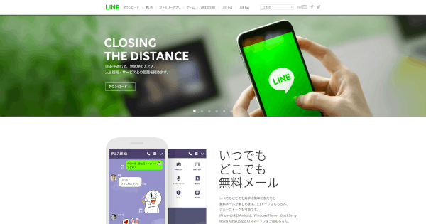
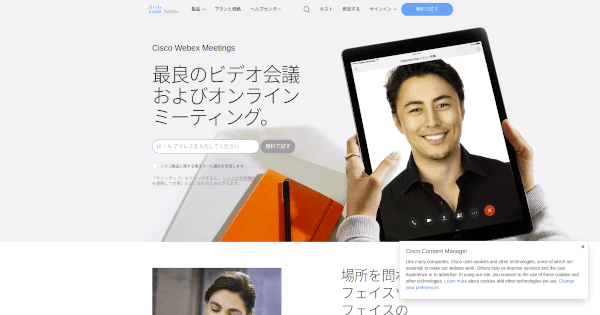
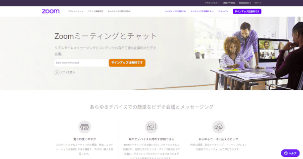

## 1. はじめに

COVID-19 の影響によって，ミーティングから飲み会まで，様々なイベントがオンラインで行われるようになりました。しかし，使用するツールの選択を間違えると，音質が悪かったり，開催までの手順が複雑になったりします。そこで，本記事では，オンラインのミーティングや飲み会を快適にするオススメのビデオ通話ツールを 5 つに厳選して紹介します。

## 2. Google ハングアウト

| 項目                 | 内容                                |
| -------------------- | ----------------------------------- |
| 開発元               | Google                              |
| 料金体系             | 無料                                |
| 対応プラットフォーム | Windows，macOS，Linux，iOS，Android |
| 音質・画質           | 高品質かつ安定                      |
| 時間制限             | 無制限                              |
| 人数制限             | ビデオ電話は最大 10 人              |
| ゲスト参加           | 不可                                |

Google ハングアウト は，Google が提供している統合メッセージングサービスです。無料で時間無制限かつ高音質・高画質なビデオ通話が可能です。また，クロスプラットフォーム対応に対応しているのでブラウザやモバイルアプリから通話することができます。ホスト以外の人も Google アカウントを所持している必要がありますが，ほとんど人は Google アカウントを所持しているので問題ないと思います。しかし，2020 年に Google ハングアウトを分割する[発表](https://9to5google.com/2018/12/02/google-hangouts-shutting-down/)がなされているため，今後も同様の条件でビデオ通話ができるかは不明です。

## 3. Jitsi

| 項目                 | 内容                                                                                                |
| -------------------- | --------------------------------------------------------------------------------------------------- |
| 開発元               | Emil Ivov + コミュニティ                                                                            |
| 料金体系             | 無料                                                                                                |
| 対応プラットフォーム | Windows，macOS，Linux，iOS，Android                                                                 |
| 音質・画質           | 高品質かつ安定                                                                                      |
| 時間制限             | 無制限                                                                                              |
| 人数制限             | Jitsi Meet を利用した場合は 最大 50 人，セルフホスティングした場合は無制限 (サーバースペックに依存) |
| ゲスト参加           | 可能                                                                                                |

Jitsi は，Emil Ivov が主導で開発，保守している FLOSS のビデオカンファレンスツール群です。無料で公開されている [Jitsi Meet](https://meet.jit.si/) を用いることによって，時間無制限かつ高音質・高画質なビデオ通話が可能です。また，クロスプラットフォーム対応に対応しているため，デスクトップ OS やモバイルアプリからビデオ通話が可能です。更に，クライアントツールやバックエンドエンジンも Apache License 2.0 で公開されているため，プライベート環境下で使用することも可能です。欠点らしい欠点が現状では見つかりません。強いて上げるならば，Jitsi Meet の URL を短くすると知らない人が入る可能性が上がる点です。

## 4. LINE

| 項目                 | 内容                         |
| -------------------- | ---------------------------- |
| 開発元               | LINE 株式会社                |
| 料金体系             | 無料                         |
| 対応プラットフォーム | Windows，macOS，iOS，Android |
| 音質・画質           | 低品質かつ不安定             |
| 時間制限             | 無制限                       |
| 人数制限             | ビデオ電話は最大 200 人      |
| ゲスト参加           | 不可                         |

LINE は，LINE 株式会社が提供するコミュニケーションサービスです。無料で時間無制限のビデオ通話が可能です。また，クロスプラットフォーム対応に対応しているため，デスクトップ OS やモバイルアプリからビデオ通話が可能です。しかし，Linux 版のクライアントツールが公式から提供されておらず，Google Chrome 版の拡張機能もビデオ通話に対応していないため，Linux からはビデオ通話することができません。また，音質・画質共に安定しているとは言えず，ビデオ通話に LINE アカウントが必須なのもマイナスポイントです。

## 5. Webex

| 項目                 | 内容                                                                           |
| -------------------- | ------------------------------------------------------------------------------ |
| 開発元               | Cisco                                                                          |
| 料金体系             | 基本無料 + [一部機能有料](https://www.webex.com/ja/pricing/index.html?r=ja_JP) |
| 対応プラットフォーム | Windows，macOS，Linux，iOS，Android                                            |
| 音質・画質           | 高品質かつ安定                                                                 |
| 時間制限             | 無料プランは最大 50 分                                                         |
| 人数制限             | ビデオ電話は最大 100 人                                                        |
| ゲスト参加           | 可能                                                                           |

Webex は，Cisco が提供しているビデオ会議アプリケーションです。無料で高音質・高画質なビデオ通話が可能です。また，クロスプラットフォーム対応に対応しているのでブラウザやモバイルアプリから通話することができます。ホスト以外の人は，アカウントが必要ないため (メールアドレスは必須) スムーズに導入することができます。しかし，無料プランでは 50 分の時間制限があるため，長時間の通話には向きません。

## 6. Zoom

| 項目                 | 内容                                               |
| -------------------- | -------------------------------------------------- |
| 開発元               | Zoom Video Communications                          |
| 料金体系             | 基本無料 + [一部機能有料](https://zoom.us/pricing) |
| 対応プラットフォーム | Windows，macOS，Linux，iOS，Android                |
| 音質・画質           | 高品質かつ安定                                     |
| 時間制限             | 無料プランは最大 40 分                             |
| 人数制限             | ビデオ電話は最大 100 人                            |
| ゲスト参加           | 可能                                               |

Zoom は，Zoom Video Communications が提供している Web 会議サービスです。無料で高音質・高画質なビデオ通話が可能です。また，クロスプラットフォーム対応に対応しているのでブラウザやモバイルアプリから通話することができます。ホスト以外の人は，アカウントが必要ないためスムーズに導入することができます。しかし，無料プランでは 40 分で通話が切れてしまうためストレスに感じました。また，セキュリティ問題が発覚するなど，不安に感じる箇所も多々あります。

## 7. おわりに

ここまで，オンラインのミーティングや飲み会を快適にするオススメのビデオ通話ツールを 5 つに厳選して紹介してきました。総合的には，無料 + クロスプラットフォーム対応 + 高音質・画質 + 時間無制限 + ゲスト参加可能の Jitsi が最有力のビデオ通話ツールだと思います。
