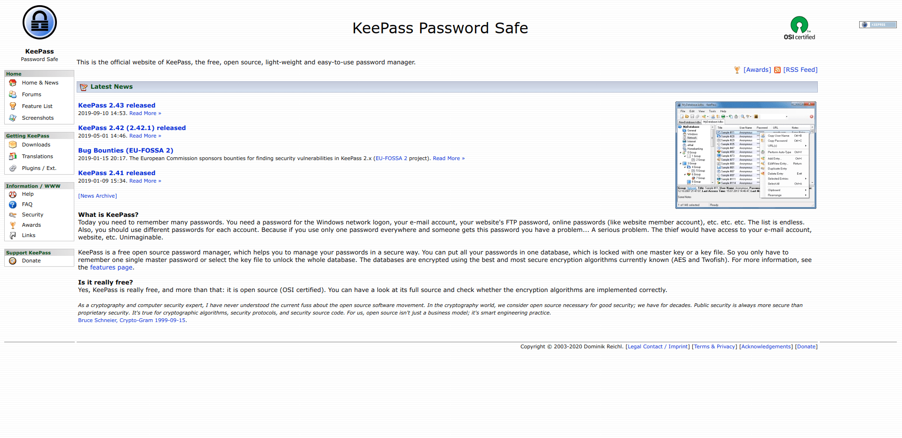
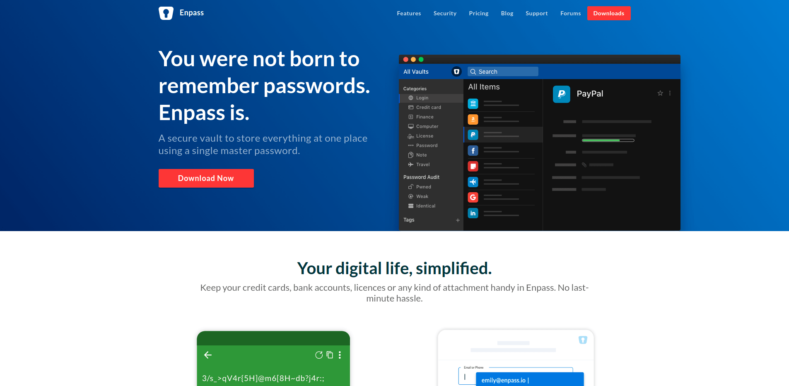
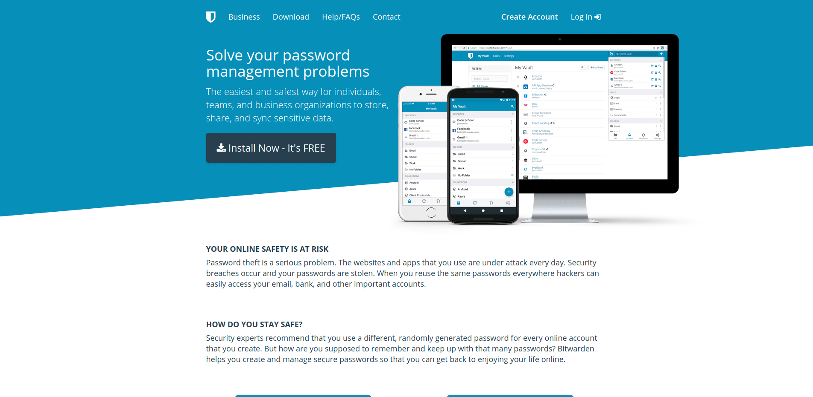

## 1. はじめに

近年，様々なサービスが登場したことによって個人が管理するアカウント数は増え続けています。それと共に，不正アクセスなどのセキュリティ問題も増え続けています。セキュアな状態を保ちつつ，アカウントを管理するには ID・パスワード管理ツールが必要不可欠になりつつあります。本記事では，有名な ID・パスワード管理ツールを 3 つに厳選して紹介します。

## 2. KeePass

| 項目                 | 内容                                |
| -------------------- | ----------------------------------- |
| 開発者               | Dominik Reichl                      |
| 料金体系             | 無料                                |
| ライセンス           | GNU GPLv2                           |
| 対応プラットフォーム | Windows，macOS，Linux，iOS，Android |
| 自動同期機能         | プラグイン対応 + 公式サーバー無し   |

KeePass は，Dominik Reichl 氏が主導で開発，保守しているオープンソースかつクロスプラットフォーム対応の ID・パスワード管理ツールです。自動入力やパスワード生成などの基本機能の他，プラグインによる機能拡張も可能です。しかし，自動同期機能が実装されていないため，複数の端末でデータを同期する場合はプラグインと Dropbox や Google Drive などのクラウドストレージサービスを利用する必要があります。

## 3. Enpass

| 項目                 | 内容                                                      |
| -------------------- | --------------------------------------------------------- |
| 開発元               | Sinew Software Systems                                    |
| 料金体系             | 基本無料 + [一部機能有料](https://www.enpass.io/pricing/) |
| ライセンス           | プロプライエタリ                                          |
| 対応プラットフォーム | Windows，macOS，Linux，iOS，Android                       |
| 自動同期機能         | 標準搭載 + 公式サーバー無し                               |

Enpass は，Sinew Software Systems が開発，保守しているクロスプラットフォーム対応の ID・パスワード管理ツールです。自動入力やパスワード生成などの ID・パスワード管理ツールに必要な機能は網羅的に実装されています。しかし，Sinew Software Systems は同期サーバーを提供していないため，Dropbox や Google Drive などの外部クラウドストレージサービスやユーザー自身の WebDAV サーバーを介した同期しか出来ません。また，デスクトップ版のアプリは全ての機能を無制限に使用することが出来ますが，モバイル版のアプリでは登録できるデータが 25 個などの制限が設けられています。そのため，25 個以上のデータを管理する場合は有料版の登録が必要です。

## 4. Bitwarden

| 項目                 | 内容                                                      |
| -------------------- | --------------------------------------------------------- |
| 開発元               | 8bit Solutions LLC                                        |
| 料金体系             | 基本無料 + [一部機能有料](https://bitwarden.com/pricing/) |
| ライセンス           | GNU GPLv3 + AGPLv3                                        |
| 対応プラットフォーム | Windows，macOS，Linux，iOS，Android                       |
| 自動同期機能         | 標準搭載 + 公式サーバー有り                               |

Bitwarden は，8bit Solutions LLC が開発，保守しているオープンソースかつクロスプラットフォーム対応の ID・パスワード管理ツールです。現在のところ，デメリットとして挙げる点が見つからないほど洗練されている ID・パスワード管理ツールです。有料版が存在しますが個人で使用する分には無料版で問題ありません。

## 5. おわりに

ここまで，有名な ID・パスワード管理ツールを 3 つに厳選して紹介してきました。現状，Bitwarden 以外の ID・パスワード管理ツールを使用するメリットが少ないと思われます。8bit Solutions LLC が提供するパスワード管理サーバーが信用できない場合は，セルフホスティングするための Docker も用意されています。特別な理由がない限りは Bitwarden を利用することをオススメします。
