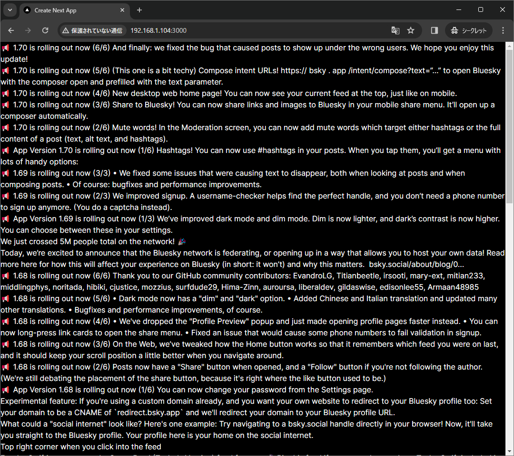

## 1. はじめに

本記事では、Next.js で Bluesky ユーザーのポストを表示する方法について記述します。具体的には、Bluesky API の `app.bsky.feed.getAuthorFeed` [^app-bsky-feed-get-author-feed] を利用して取得したユーザーのポストを表示します。また、本記事では、Node.js と pnpm がインストールされている前提で記述しています。Node.js は、Ver.18.17 以上が必要です。パッケージは npm や yarn でも代用可能です。

[^app-bsky-feed-get-author-feed]: Bluesky, app.bsky.feed.getAuthorFeed: https://docs.bsky.app/docs/api/app-bsky-feed-get-author-feed

```bash
$ node -v
v20.11.0
$ pnpm -v
8.15.4
```

## 2. テンプレートの生成

まずは、Next.js の公式ドキュメント [^next.js-docs] に従って、テンプレートを生成します。次に、Blyesky の公式ドキュメント [^bluesky-docs] に従って `@atproto/api` パッケージをインストールします。以上で、テンプレートの生成作業は完了です。

[^next.js-docs]: Next.js, Getting Started: Installation: https://nextjs.org/docs/getting-started/installation
[^bluesky-docs]: Bluesky, Get Started: https://docs.bsky.app/docs/get-started

```bash
$ pnpm create create-next-app
.../share/pnpm/store/v3/tmp/dlx-56317    |   +1 +
.../share/pnpm/store/v3/tmp/dlx-56317    | Progress: resolved 1, reused 1, downloaded 0, added 1, done
✔ What is your project named? … my-app
✔ Would you like to use TypeScript? … No / Yes
✔ Would you like to use ESLint? … No / Yes
✔ Would you like to use Tailwind CSS? … No / Yes
✔ Would you like to use `src/` directory? … No / Yes
✔ Would you like to use App Router? (recommended) … No / Yes
✔ Would you like to customize the default import alias (@/*)? … No / Yes
Creating a new Next.js app in /my-app.

Using pnpm.

# 省略

Done in 4s
Initialized a git repository.

Success! Created my-app at /my-app

$ cd my-app
$ pnpm add @atproto/api
```

## 3. ソースコードの書き換え

次に、`/src/app/page.tsx` を以下のコードに書き換えます。`<IDENTIFIER>` の部分は、取得したいユーザーの識別子に置き換えてください。本記事では、Bluesky 公式アカウント (bsky.app) のポストを取得します。

```tsx title="/src/app/page.tsx" del={9} ins={10}
import { BskyAgent } from '@atproto/api'

const agent = new BskyAgent({
  service: 'https://api.bsky.app',
})

export default async function Home() {
  const authorFeed = await agent.app.bsky.feed.getAuthorFeed({
    actor: '<IDENTIFIER>',
    actor: 'bsky.app',
  })

  return (
    <ul>
      {authorFeed.data.feed.map(({ post }) => (
        <li>{post.record.text}</li>
      ))}
    </ul>
  )
}
```

使用しているエディターによっては **プロパティ 'text' は型 '{}' に存在しません。** と表示されると思います。これは、record の Lexicon が unknown 型として定義されている [^defs.json] ために発生していると考えられます。ユーザーのポストは問題なく取得できるので、本記事では無視します。気になる人は、`{(post.record as any).text}` と書き換えればエラーが消えると思います。

[^defs.json]: GitHub, bluesky-social/atproto: https://github.com/bluesky-social/atproto/blob/main/lexicons/app/bsky/feed/defs.json

## 4. 動作確認

最後に、動作を確認します。`pnpm run dev` で Next.js を起動し、http://localhost:3000/ にアクセスします。正常に動作していれば、以下のようにユーザーのポスト (ここでは bsky.app のポスト) が 50 件、表示されると思います。



## 5. おわりに

本記事では、認証不要な `api.bsky.app` を設定しています。認証が必要な場合は `bsky.social` を設定してください。また、Bluesky は開発途中なので、API の破壊的変更が起こる可能性があります。実装する際は、公式のドキュメントやソースコードを参照してください。
