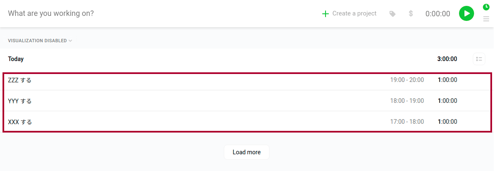
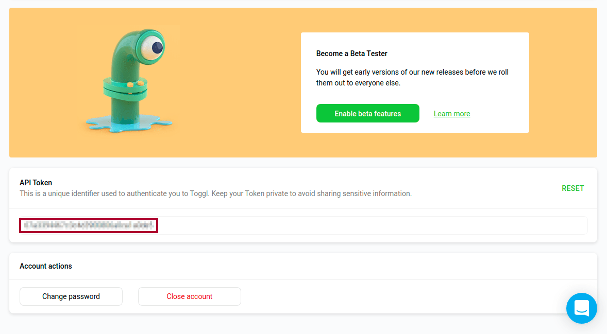
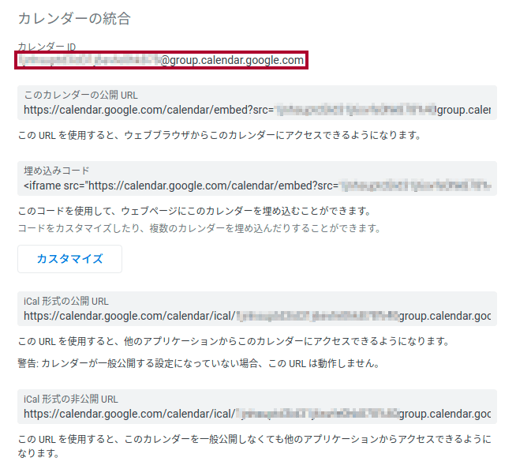

## 1. はじめに

筆者は，タイムトラッキングアプリである [Toggl](https://toggl.com/) を日常的に愛用しています。しかし，記録データはワークフローの関係上 Google カレンダーで一括管理したい。そこで，本記事では Google Apps Script を用いて Toggl に記録されているデータを Google カレンダーに一括移行するスクリプトについて記述する。

## 2. 要件定義

実現したい要件として，以下の 2 つが挙げられます。

1. Toggl に記録されている Time Entrys を Google カレンダーに移行する
2. Toggl に記録されている Time Entrys を削除する



## 3. 事前準備

事前準備として，以下の 2 つを取得する必要があります。

- TOGGL_API_TOKEN
- GOOGLE_CALENDAR_ID

TOGGL*API_TOKEN は，\_Profile settings* に表示されているので記録しておきます。



GOOGLE*CALENDAR_ID は，*設定と共有\_ に表示されているので記録しておきます。



## 4. 実装

[先行記事](https://m-kawaguchi.hatenablog.jp/entry/2017/11/12/Toggl%E3%81%AE%E3%83%AD%E3%82%B0%E3%82%92Google%E3%82%AB%E3%83%AC%E3%83%B3%E3%83%80%E3%83%BC%E3%81%AB%E8%87%AA%E5%8B%95%E8%A8%98%E9%8C%B2%E3%81%99%E3%82%8B%E3%82%B9%E3%82%AF%E3%83%AA%E3%83%97)と [Toggl API doc](https://github.com/toggl/toggl_api_docs/blob/master/toggl_api.md) を参考に実装したソースコードを以下に示します。_[TOGGL_API_TOKEN]_ と _[GOOGLE_CALENDAR_ID]_ は，上記で取得した _TOGGL_API_TOKEN_ と _GOOGLE_CALENDAR_ID_ に置換します。

```js
function main() {
  const TOGGL_API_TOKEN = '[TOGGL_API_TOKEN]'
  const GOOGLE_CALENDAR_ID = '[GOOGLE_CALENDAR_ID]'

  // 終了時刻が設定されている + タグが付いていない Time Entrys を取得する
  const timeEntrys = JSON.parse(
    UrlFetchApp.fetch(
      (url = 'https://www.toggl.com/api/v8/time_entries'),
      (params = {
        method: 'GET',
        headers: { Authorization: 'Basic ' + Utilities.base64Encode(TOGGL_API_TOKEN + ':api_token') },
        muteHttpExceptions: true,
      }),
    ),
  ).filter(function (x) {
    return x.stop && !x.tags
  })

  const calApp = CalendarApp.getCalendarById(GOOGLE_CALENDAR_ID)

  timeEntrys.forEach(function (x) {
    // Google Calendar にイベントを追加する
    calApp.createEvent((title = x.description), (startTime = new Date(x.start)), (endTime = new Date(x.stop)))
    // Time Entrys にタグを追加する
    UrlFetchApp.fetch(
      (url = 'https://www.toggl.com/api/v8/time_entries/' + x.id),
      (params = {
        method: 'PUT',
        headers: { Authorization: 'Basic ' + Utilities.base64Encode(TOGGL_API_TOKEN + ':api_token') },
        contentType: 'application/json',
        payload: JSON.stringify({ time_entry: { tags: ['Logged'], tag_action: 'add' } }),
        muteHttpExceptions: true,
      }),
    )
  })
}
```

Toggl の Free プランでは，Time Entrys を Delete する API が叩けないため，要件の「② Toggl に記録されている Time Entrys を削除する」を満たすことができません。そこで，Google カレンダーに移行した Time Entrys には _Logged_ タグを付与し，_Logged_ タグが付いている Time Entrys は Google カレンダー に移行しない仕様としました。

## 5. 運用

新しい Google Apps Script のプロジェクトを作成し，上記のソースコードをコピー&ペーストします。初回実行時は認証手続きが必要になるので，[認証手順記事](https://www.virment.com/step-allow-google-apps-script/)を参考に認証します。また，[トリガー](https://tonari-it.com/gas-trigger-set/)を設定しておくことで，Toggl に記録されている Time Entrys を自動的に Google カレンダーへ移行することができます。

## 6. おわりに

ここまで，本記事では Google Apps Script を用いて Toggl に記録されているデータを Google カレンダーに一括移行するスクリプトについて記述してきました。Google Apps Script と Google が提供しているサービスを組み合わせると様々なことができるので，Google Apps Script を触ったことない方は Google Apps Script で遊んでみてほしいです。
