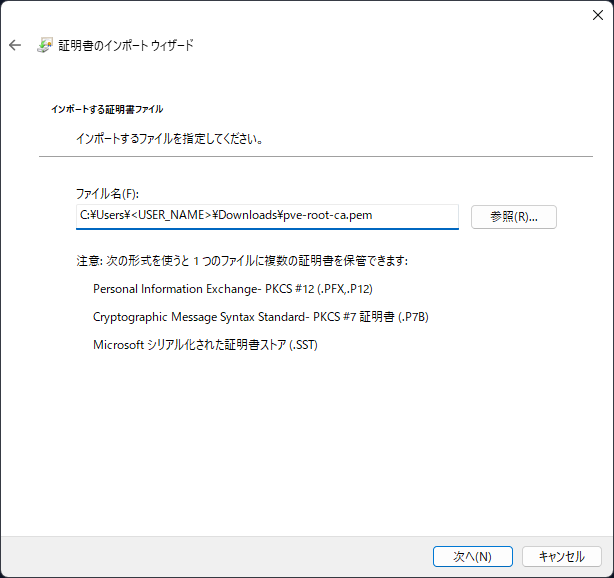

## 1. はじめに

Proxmox は、標準で HTTPS 通信をサポートしていますが、初期設定では自己署名証明書を使用しています。この自己署名証明書は信頼される認証機関 (CA) によって発行されたものではないため、ブラウザはその証明書を信頼できないと判断し、「「この接続ではプライバシーが保護されません」」という警告を表示します。この問題を解決するために、Let's Encrypt などを使用して信頼性のある証明書を取得する方法が挙げられますが、外部からアクセス可能な環境を整えてやる必要があり、少し手間です。そこで、本記事ではシンプルに、自己署名証明書をマニュアルでインポートする方法について記述します。また、以降の章で記述している内容は、以下の環境下で実行したものです。

- Proxmox Ver.8.2.2 (Server)
- Windows 11 Home 23H2 (Client)
- PowerShell Ver.7.4.2 (Client)

## 2. 証明書を取得する

まず初めに、Proxmox サーバーから証明書ファイルを取得します。ファイルは、`/etc/pve/pve-root-ca.pem` に存在します。このファイルをローカルマシンにコピーします。コピーする方法は何でも大丈夫ですが、ここでは以下の SCP コマンドを用いてローカルマシンにファイルをコピーします。

```ps
PS > scp root@<Proxmox サーバーの IP アドレス>:/etc/pve/pve-root-ca.pem pve-root-ca.pem
```

例えば、Proxmox サーバーの IP アドレスが `192.168.1.100`であれば、以下のようにコマンドを実行します。

```ps
PS > scp root@192.168.1.100:/etc/pve/pve-root-ca.pem pve-root-ca.pem
```

**注意**：`/etc/pve/local/pve-ssl.pem` と混同しないように注意してください。必ず `/etc/pve/pve-root-ca.pem` を取得してください。

## 3. 証明書のインポートする

次に、取得した証明書を Windows11 にインポートします。手順は以下の通りです。

1. 「スタート」メニューから「ファイル名を指定して実行」メニューを選択し、`certmgr.msc` と入力します
2. 「証明書ストアの選択」で「信頼されたルート証明機関」を選択します
3. 右クリックし「すべてのタスク」から「インポート」を選択します
4. 「証明書のインポートウィザード」が表示されたら進んで、取得した証明書を選択して進みます
   ※ 証明書が表示されない場合は右下で「すべてのファイル」を選択してください
5. 証明書ストアが「**信頼されたルート証明機関**」に設定されていることを確認して進みます
6. 「完了」をクリックして作業は終了です




## 4. おわりに

以上の手順で、Proxmox のオレオレ証明書を Windows11 にインポートすることができます。これにより、証明書警告も表示されなくなり、Web インターフェースへのアクセスがスムーズになります。ここまでの作業は、Proxmox のドキュメント [^1] を参考にしています。

[^1]: Import certificate in browser, https://pve.proxmox.com/wiki/Import_certificate_in_browser
