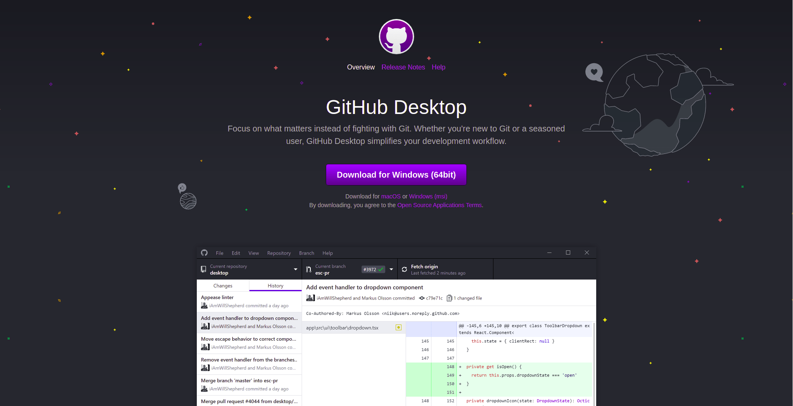
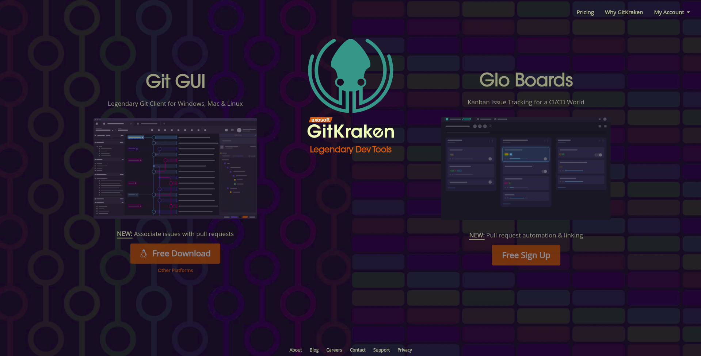
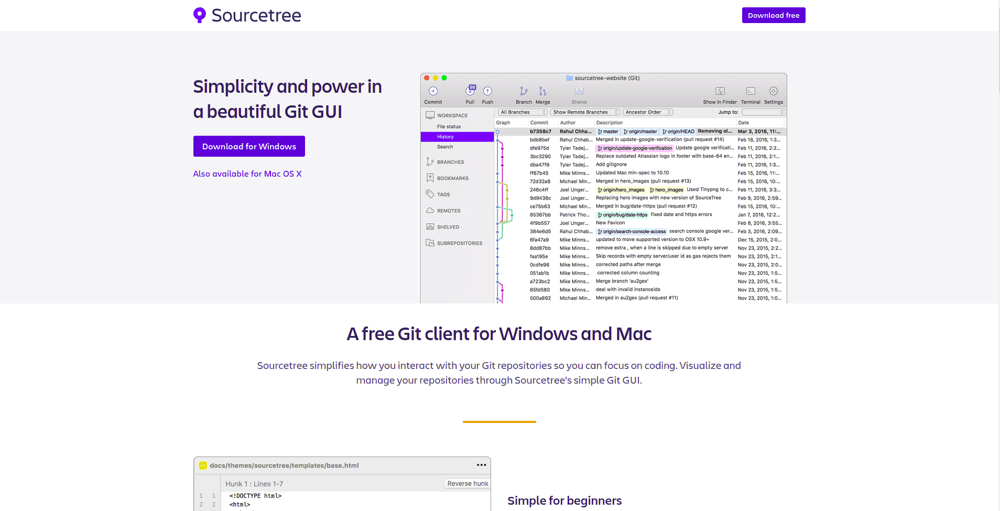

+++
slug = "recommended-gui-clients-to-make-working-with-git-easier"
image = "8a13a2a7c8480acf77d8b7f414070bdd.png"
title =
publishDate =
lastmod =
keywords = ["Tech", "Git"]
aliases = ["/c801f9f5894052fbd1531f2fafd4cebc"]
+++

## 1. はじめに

Git クライアントは，Git で使用できる機能を制限する代わりに，より直感的な操作を出来るようにしたソフトウェアです。Git の初心者だけではなく，中級者・上級者の人も作業の効率化や操作ミスを減らすために使用することがあります。本記事では，Git の操作を快適にするオススメの GUI クライアントを 3 つ紹介します。

## 2. GitHub Desktop

| 項目                       | 内容                                            |
| -------------------------- | ----------------------------------------------- |
| 開発元                     | [GitHub, Inc.](https://github.co.jp/about.html) |
| 料金体系                   | 無料                                            |
| ライセンス                 | MIT License                                     |
| 対応プラットフォーム       | Windows と macOS                                |
| 対応バージョン管理システム | Git                                             |
| 対応サービス               | GitHub                                          |

GitHub Desktop は，GitHub 社が Electron をベースに開発，保守している Git の GUI クライアントです。最低限の機能のみが実装されており，初心者が入門で使用するのにオススメです。また，GitHub との強力な連携機能が実装されており，GitHub をメインホスティングサービスとして利用しているユーザーにもオススメです。執筆時点で対応している OS は Windows と macOS のみですが，Electron ベースのソフトウェアなので Linux に対応する可能性はあります。

## 3. GitKraken

| 項目                       | 内容                                                                          |
| -------------------------- | ----------------------------------------------------------------------------- |
| 開発元                     | [Axosoft](https://www.axosoft.com/)                                           |
| 料金体系                   | 基本無料 + [一部機能有料](https://www.gitkraken.com/pricing#git-gui-features) |
| ライセンス                 | プロプライエタリ                                                              |
| 対応プラットフォーム       | Windows，macOS，Linux                                                         |
| 対応バージョン管理システム | Git                                                                           |
| 対応サービス               | GitHub，GitLab，Bitbucket など                                                |

GitKraken は，Axosoft 社が Electron をベースに開発，保守している Git の GUI クライアントです。よく使われるコマンドをバランス良く実装しており，ヘビーユーザーでも満足できる仕様になっています。また， 本記事で紹介している Git の GUI クライアントの中で唯一，Windows，macOS，Linux に対応しています。しかし，無料版ではパブリックリポジトリのみ操作可能であり，プライベートリポジトリを操作するには有料ライセンスが必要になります。また，執筆時点では日本語にローカライズされていないため英語が苦手な人は注意が必要です。

## 4. SourceTree

| 項目                       | 内容                                    |
| -------------------------- | --------------------------------------- |
| 開発元                     | [Atlassian](https://www.atlassian.com/) |
| 料金体系                   | 無料                                    |
| ライセンス                 | プロプライエタリ                        |
| 対応プラットフォーム       | Windows と macOS                        |
| 対応バージョン管理システム | Git，Mercurial，Subversion[^1]          |
| 対応サービス               | GitHub，GitLab，Bitbucket など          |

[^1]: 公式サポートされているのは Git と Mercurial

SourceTree は，Atlassian 社が開発，保守している Git の GUI クライアントです。非常に多機能な重量級の Git クライアントです。また，本記事で紹介している Git クライアントの中で唯一，Git 以外のバージョン管理システムに対応しています。しかし，多機能が故に初心者が Git の操作を覚える用途には向きません。

## 5. おわりに

ここまで，Git の操作を快適にするオススメの GUI クライアントを 3 つ紹介してきました。最後に，ユーザーの状況に応じたオススメの GUI クライアントを以下に示します。

- GitHub をメインに使用しているユーザー → GitHub Desktop
- Atlassian 製品をメインに使用ユーザー → SourceTree
- Linux をメインに使用しているユーザー → GitKraken
- Git 以外のバージョン管理システムを使用するユーザー → SourceTree
