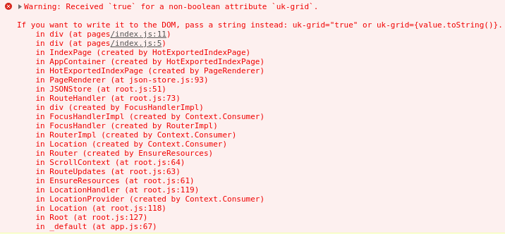

## 1. はじめに

[GatsbyJS](https://www.gatsbyjs.com/) は，テンプレートエンジンとして React を採用している静的サイトジェネレータであり，[UIkit](https://getuikit.com/) はコンポーネント指向の CSS フレームワークです。GatsbyJS と UIkit を組み合わせた際，GatsbyJS を用いて生成した静的サイト上で UIkit が動作しない問題が発生します。本記事では，この問題を解決する手順について記述します。また，本記事内で行っている作業は，以下の環境下で実行したものです。

- GatsbyJS Ver.2.17.7
- React Ver.16.11.0
- UIkit Ver.3.2.2
- Google Chrome Ver.77.0.3865.75

## 2. 環境構築

本記事では，実験環境として公式テーマの [gatsby-starter-default](https://www.gatsbyjs.org/starters/gatsbyjs/gatsby-starter-default/) を使用します。公式サイトに記述されているインストール方法に従って任意の場所にインストールした後，`gatsby-starter-default/src/pages/index.js` を以下のように書き換えます。

```jsx title="gatsby-starter-default/src/pages/index.js"
import React from 'react'
import Helmet from 'react-helmet'

const IndexPage = () => (
  <div>
    <Helmet>
      <link rel="stylesheet" href="https://cdn.jsdelivr.net/npm/uikit@3.2.2/dist/css/uikit.min.css" />
      <script src="https://cdn.jsdelivr.net/npm/uikit@3.2.2/dist/js/uikit.min.js"></script>
      <script src="https://cdn.jsdelivr.net/npm/uikit@3.2.2/dist/js/uikit-icons.min.js"></script>
    </Helmet>
    <div className="uk-child-width-expand@s uk-text-center" uk-grid>
      <div>
        <div className="uk-card uk-card-secondary uk-card-body">Item</div>
      </div>
      <div>
        <div className="uk-card uk-card-secondary uk-card-body">Item</div>
      </div>
      <div>
        <div className="uk-card uk-card-secondary uk-card-body">Item</div>
      </div>
    </div>
  </div>
)

export default IndexPage
```

## 3. 動作確認

上記のソースコードを実行した結果を以下に示します。正常に実行された場合，1 行 3 列で表示されます。しかし，実行結果では 3 行 1 列で表示されてしまっています。


## 4. 問題解決

Chrome DevTools を用いてデバックすると以下のようなエラーが見つかりました。どうやら 11 行目の uk-grid タグが JSX の記法にそぐわないようです。



上記のエラーを解決するために，11 行目を以下のように書き換えます。

```jsx ins="="true""
import React from 'react'
import Helmet from 'react-helmet'

const IndexPage = () => (
  <div>
    <Helmet>
      <link rel="stylesheet" href="https://cdn.jsdelivr.net/npm/uikit@3.2.2/dist/css/uikit.min.css" />
      <script src="https://cdn.jsdelivr.net/npm/uikit@3.2.2/dist/js/uikit.min.js"></script>
      <script src="https://cdn.jsdelivr.net/npm/uikit@3.2.2/dist/js/uikit-icons.min.js"></script>
    </Helmet>
    <div className="uk-child-width-expand@s uk-text-center" uk-grid="true">
      <div>
        <div className="uk-card uk-card-secondary uk-card-body">Item</div>
      </div>
      <div>
        <div className="uk-card uk-card-secondary uk-card-body">Item</div>
      </div>
      <div>
        <div className="uk-card uk-card-secondary uk-card-body">Item</div>
      </div>
    </div>
  </div>
)

export default IndexPage
```

修正したソースコードを実行した結果を以下に示します。すると，正常に 3 行 1 列で表示されていることが確認できました。


## 5. おわりに

ここまで，GatsbyJS (React) を用いて生成した静的サイト上で UIkit が動作しない問題を解決する手順について記述してきました。UIkit の[公式サイト](https://getuikit.com/)に掲載されているサンプルコードで正常に動作しないものは，本記事で記述した方法で解決することが可能です。また，本記事では CDN 版の UIkit について記述してきましたが，Less 版や Sass 版でも同様の方法で解決可能です。
