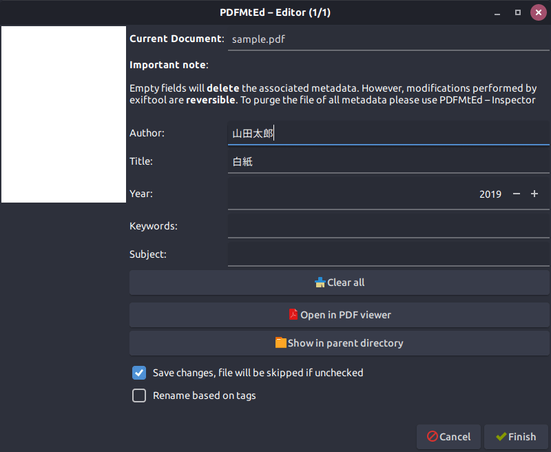

## 1. はじめに

Windows において PDF のメタデータを編集する場合は，Adobe Acrobat Reader 以外にも多種多様なソフトウェアが存在しているため，ユーザーには多くの選択肢が与えられます。しかし，Linux において同様の作業を行う場合は，非常に選択肢が限られます。本記事では，Linux 上で動作する PDF のメタデータを編集可能な数少ない GUI ソフトウェアである PDFMtEd を用いて Linux で PDF のメタデータを編集する手順について記述します。また，本記事内で行っている作業は，Zorin OS 15 Core (Ubuntu 18.04 LTS) の環境下で実行したものです。

## 2. インストール

Github の [README.md](https://github.com/glutanimate/PDFMtEd) によると以下のパッケージに依存しているため，事前にインストールが必要です。

- YAD: Zenity からフォークされた bash スクリプトのグラフィカルフロントエンドであり，Webupd8 PPA より提供されています
- ExifTool: 汎用的なメタデータ編集アプリケーションライブラリ
- qpdf: PDF ファイルの内容を維持したまま構造的な変換を行うコマンドラインプログラム
- Python 2.7: サムネラーとサムネイルプレビューを機能させるのに必要

上記のパッケージをインストールするために以下のコマンドを実行します。

```bash
$ sudo add-apt-repository ppa:webupd8team/y-ppa-manager
$ sudo apt-get update
$ sudo apt-get install yad libimage-exiftool-perl qpdf
```

次に，以下のコマンドを実行して PDFMtEd をインストールします。

```bash
$ git clone https://github.com/glutanimate/PDFMtEd
$ cd PDFMtEd
$ sudo ./install.sh
```

インストール時にエラーメッセージが表示される場合は，上記のコマンドを実行する前に以下のコマンドを実行します。

```bash
$ sudo mkdir -p {/usr/local/share/applications,/usr/local/share/icons/hicolor/scalable/apps,/usr/local/bin}
```

正常にインストールされれば以下のように PDFMtEd が表示されます。


## 3. 使用方法

使用方法は非常にシンプルです。必要な項目に情報を記入した後，「Save changes, file will be skipped if unchecked」にチェックが入っていることを確認して「Finish」をクリックします。また，「Rename based on tags」にチェックを入れて「Finish」をクリックするとメタデータを基にファイルネームを編集してくれます。



## 4. おわりに

ここまで，PDFMtEd を用いて Linux で PDF のメタデータを編集する手順について記述してきました。PDFMtEd は，高速かつシンプルに PDF のメタデータを編集可能である反面，以下の欠点が存在します。

(1) Python の 2 系に依存している
(2) 最終更新が 2016 年 1 月 3 日で止まっている
(3) 編集可能なメタデータが少ない

(1) と (2) は，PDFMtEd が OSS であるため解決可能な問題です。また，(3) に関しては [Master PDF Editor](https://code-industry.net/masterpdfeditor/) や [ExifTool](https://www.sno.phy.queensu.ca/~phil/exiftool/) などのソフトウェアで代用するなどの方法が考えられます。
